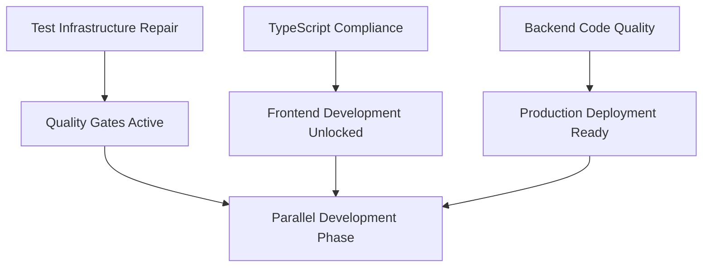

# 🚀 Cohesive Development Plan - Auterity Unified AI Platform

**Generated**: August 26, 2025
**Version**: 1.0
**Status**: Ready for Execution
**Project Phase**: Foundation Stabilization → Strategic Expansion

---

## 📋 EXECUTIVE SUMMARY

This comprehensive development plan consolidates all remaining work across the Auterity Unified AI Platform, organizing tasks by priority and dependency chains to maximize development velocity while ensuring enterprise-grade quality.

**Key Insights:**

- **90% of core functionality is complete** - strong foundation exists
- **Critical blockers must be resolved first** to unlock parallel development
- **Strategic expansion features are well-specified** and ready for implementation
- **Three-system integration architecture** is designed but needs completion

**Success Metrics:**

- Resolve critical blockers within 48 hours
- Achieve 3x development velocity through parallel execution
- Maintain zero security vulnerabilities and high code quality
- Complete strategic expansion within 12 weeks

---

## 🎯 CRITICAL PATH ANALYSIS

### **Phase 0: Emergency Foundation Fixes (Week 1 - IMMEDIATE)**

#### **🔴 CRITICAL BLOCKERS - Must Fix First**

**1. Test Infrastructure Emergency Repair**

- **Issue**: 22 vitest module resolution errors blocking ALL testing
- **Impact**: Complete testing failure, CI/CD pipeline broken, quality gates offline
- **Root Cause**: `pretty-format/build/index.js` dependency chain conflicts
- **Assigned Tool**: Amazon Q (debugging expertise required)
- **Timeline**: 2-3 days
- **Success Criteria**: 100% test execution capability restored

**2. TypeScript Compliance Crisis**

- **Issue**: 108 TypeScript linting errors preventing clean development
- **Impact**: Frontend expansion blocked, poor developer experience
- **Priority Files**: WorkflowErrorDisplay.test.tsx (19 errors), WorkflowExecutionInterface.test.tsx (16 errors)
- **Assigned Tool**: Cursor IDE (TypeScript expertise)
- **Timeline**: 4-6 hours
- **Success Criteria**: 0 TypeScript errors, proper type definitions

**3. Backend Code Quality Emergency**

- **Issue**: 500+ backend linting violations affecting maintainability
- **Impact**: Production deployment blocked, technical debt accumulation
- **Critical Issues**: 2 undefined name references (F821), 118 unused imports (F401)
- **Assigned Tool**: Amazon Q + backend cleanup automation
- **Timeline**: 6-8 hours
- **Success Criteria**: <50 total violations, zero critical issues

#### **Dependencies & Execution Order**



---

## 🏗️ PHASE 1: FOUNDATION STABILIZATION (Weeks 1-2)

### **Week 1: Critical Infrastructure**

#### **Amazon Q Tasks (Security & Infrastructure)**

- **AMAZON-Q-CRITICAL-001**: Test infrastructure dependency repair
- **AMAZON-Q-HIGH-001**: Backend code quality emergency fix
- **AMAZON-Q-HIGH-002**: Security vulnerability final sweep and monitoring setup
- **AMAZON-Q-HIGH-003**: Database optimization and performance monitoring

#### **Cursor IDE Tasks (Frontend Excellence)**

- **CURSOR-CRITICAL-001**: TypeScript compliance cleanup
- **CURSOR-HIGH-001**: Shared component library enhancements
- **CURSOR-HIGH-002**: Frontend error handling and user experience improvements

### **Week 2: Integration Foundation**

#### **Integration Layer Development**

- **Cross-System Communication**: Complete three-system integration protocols
- **Real-time WebSocket Monitoring**: Live execution updates across all systems
- **Unified Authentication**: SSO-ready authentication system with enterprise features
- **Error Correlation**: Cross-system error handling and recovery mechanisms

#### **Quality Assurance Framework**

- **Automated Quality Gates**: CI/CD pipeline with blocking quality checks
- **Performance Monitoring**: Real-time system health and performance metrics
- **Security Hardening**: Continuous security scanning and compliance monitoring

---

## 🚀 PHASE 2: CORE SYSTEM COMPLETION (Weeks 3-6)

### **Three-System Integration Architecture**

#### **AutoMatrix (Core Engine) - Port 8000**

- **Status**: 95% Complete ✅
- **Remaining**: Enhanced error handling, WebSocket integration, performance optimization
- **Key Features**: Workflow automation, template system, dashboard analytics

#### **RelayCore (AI Router) - Port 3001**

- **Status**: 70% Complete 🟡
- **Priority Tasks**:
  - **RelayCore Admin Interface**: Real-time metrics dashboard, cost analytics, steering rules management
  - **Multi-Model Routing**: LiteLLM integration for intelligent AI request routing
  - **Cost Optimization**: Dynamic pricing, budget management, usage analytics
  - **Performance Monitoring**: Model performance tracking and automatic switching

#### **NeuroWeaver (Model Management) - Port 3002**

- **Status**: 85% Complete 🟡
- **Priority Tasks**:
  - **Training Pipeline**: Automated fine-tuning with QLoRA and RLAIF
  - **Model Registry**: Deployment service with health checks and versioning
  - **Performance Analytics**: Model accuracy tracking and optimization
  - **Integration Layer**: Automatic model registration with RelayCore

### **Integration Points Matrix**

| Integration Path          | Current Status | Priority | Timeline |
| ------------------------- | -------------- | -------- | -------- |
| AutoMatrix ↔ RelayCore   | 60% Complete   | HIGH     | Week 3-4 |
| RelayCore ↔ NeuroWeaver  | 40% Complete   | HIGH     | Week 4-5 |
| AutoMatrix ↔ NeuroWeaver | 30% Complete   | MEDIUM   | Week 5-6 |
| Cross-System Monitoring   | 20% Complete   | HIGH     | Week 3   |

---

## 🤖 PHASE 3: STRATEGIC AI EXPANSION (Weeks 7-12)

### **Multi-Model AI Infrastructure**

#### **LiteLLM Integration (Weeks 7-8)**

- **Objective**: Replace OpenAI-only integration with intelligent multi-model routing
- **Components**: Dynamic model selection, cost optimization, performance-based routing
- **Success Criteria**: Support for OpenAI, Anthropic, Google, local models with cost optimization

#### **Advanced Prompt Engineering (Week 9)**

- **Monaco Editor Integration**: Rich text editor with syntax highlighting and validation
- **Prompt Optimization Engine**: Cost tracking, caching, and optimization suggestions
- **Version Control**: Prompt versioning, rollback, and A/B testing capabilities

### **Visual Agent Creation System (Weeks 10-11)**

#### **Agent Builder Interface**

- **React Flow Integration**: Visual node-based agent workflow designer
- **Multi-Protocol Support**: MCP servers, Agent-to-Agent communication, OpenAI API
- **Real-time Collaboration**: Multiple users editing workflows simultaneously

#### **Agent Orchestration Engine**

- **LangGraph Integration**: Advanced agent coordination and workflow management
- **Context Management**: Shared memory and state across agent interactions
- **Performance Optimization**: Parallel execution, caching, and result optimization

### **Enterprise Features (Week 12)**

#### **SSO Implementation**

- **AWS Cognito Integration**: Enterprise identity provider support
- **SAML 2.0 & OIDC**: Industry-standard authentication protocols
- **Role-Based Access Control**: Fine-grained permissions and user management

#### **White-Label Platform**

- **Tenant Isolation**: Multi-tenant architecture with data separation
- **Branding Customization**: Customer-specific theming and UI customization
- **Partner API Kit**: Complete deployment and integration toolkit

---

## 📊 PHASE 4: PRODUCTION OPTIMIZATION (Weeks 13-16)

### **Performance & Scalability**

#### **Infrastructure Optimization**

- **Load Testing**: Comprehensive performance validation under production load
- **Auto-Scaling**: Dynamic resource allocation based on usage patterns
- **CDN Integration**: Global content delivery and edge caching
- **Database Optimization**: Query optimization, connection pooling, read replicas

#### **Monitoring & Observability**

- **Distributed Tracing**: Request tracking across all three systems
- **Advanced Analytics**: Usage patterns, cost optimization, performance trends
- **Predictive Monitoring**: AI-powered anomaly detection and automated responses
- **Compliance Reporting**: Automated audit trails and compliance validation

### **Market Readiness**

#### **Documentation & Training**

- **API Documentation**: Complete OpenAPI specifications for all systems
- **User Guides**: Comprehensive documentation for all user types
- **Developer Portal**: Integration guides, SDK documentation, code examples
- **Video Training**: Screen-recorded tutorials for key workflows

#### **Go-to-Market Preparation**

- **Partner Integration Kit**: Terraform templates, Docker configurations, API access
- **Automotive Prompt Library**: Industry-specific templates and use cases
- **Sales Demo Environment**: Polished demonstration environment with sample data
- **Support Infrastructure**: Help desk integration, user feedback systems

---

## 🛠️ IMPLEMENTATION STRATEGY

### **Tool Specialization & Autonomy**

#### **Amazon Q - Security & Infrastructure Expert**

- **Full Authority**: Security remediation, debugging, performance optimization
- **Autonomous Tasks**: Dependency management, infrastructure setup, quality assurance
- **Escalation**: Only for architectural decisions requiring human input

#### **Cursor IDE - Frontend & TypeScript Expert**

- **Full Authority**: UI/UX development, React components, TypeScript implementation
- **Autonomous Tasks**: Component development, API integration, responsive design
- **Escalation**: Only for major architectural changes or design system decisions

#### **Human/Kiro - Architecture & Strategy**

- **Responsibilities**: Final approval, strategic decisions, cross-system coordination
- **Involvement**: Minimal - only when tools cannot resolve after 3 attempts
- **Focus**: Quality oversight, business value validation, stakeholder communication

### **Quality Gates & Automation**

#### **Automated Quality Validation**

```yaml
quality_gates:
  security:
    vulnerability_scan: "ZERO HIGH/CRITICAL"
    dependency_audit: "PASS"
    penetration_test: "SCHEDULED"

  performance:
    response_time_p95: "<2s"
    bundle_size: "<1MB"
    test_coverage: ">90%"

  reliability:
    test_pass_rate: "100%"
    integration_tests: "PASS"
    load_test: ">1000 RPS"

  code_quality:
    typescript_errors: "ZERO"
    linting_violations: "<10"
    documentation_coverage: ">80%"
```

#### **Blocking Mechanisms**

- **Failed Quality Gate**: Automatic deployment blocking and alert generation
- **Security Vulnerability**: Immediate development freeze until resolution
- **Performance Regression**: Rollback trigger and investigation initiation
- **Integration Failure**: Cross-system communication restoration priority

---

## 📈 SUCCESS METRICS & KPIs

### **Foundation Metrics (Weeks 1-2)**

- **Test Infrastructure**: 0% → 100% execution capability
- **TypeScript Compliance**: 108 errors → 0 errors
- **Backend Code Quality**: 500+ violations → <50 violations
- **Development Velocity**: 1.2x → 2.5x baseline improvement

### **Integration Metrics (Weeks 3-6)**

- **Cross-System Communication**: 30% → 100% integration completeness
- **Real-time Monitoring**: Live updates across all three systems
- **Performance**: <2s API response times, >99.9% uptime
- **User Experience**: <3s page load times, intuitive interfaces

### **Expansion Metrics (Weeks 7-12)**

- **AI Model Support**: Single provider → Multi-model routing with 5+ providers
- **Cost Optimization**: Baseline → 30% cost reduction through intelligent routing
- **Agent Capabilities**: Basic workflows → Visual agent creation with orchestration
- **Enterprise Features**: MVP authentication → Full SSO with white-label support

### **Production Metrics (Weeks 13-16)**

- **Scalability**: Support for 10,000+ concurrent users
- **Performance**: <1s response times under full load
- **Reliability**: >99.99% uptime with automated recovery
- **Market Readiness**: Complete partner integration toolkit

---

## 🚨 RISK MITIGATION & CONTINGENCY PLANS

### **Critical Risk Assessment**

#### **High-Risk Areas**

1. **Test Infrastructure Repair**: Complex dependency conflicts requiring specialized debugging
2. **Three-System Integration**: Coordination complexity across multiple codebases
3. **Performance at Scale**: Unknown behavior under high load conditions
4. **AI Model Integration**: Reliability of external AI service providers

#### **Mitigation Strategies**

**Test Infrastructure Risk**:

- **Primary**: Amazon Q deep debugging with dependency analysis
- **Backup**: Alternative testing framework evaluation (Jest, Playwright)
- **Fallback**: Manual testing protocols while infrastructure repairs proceed

**Integration Complexity Risk**:

- **Primary**: Automated integration testing with comprehensive coverage
- **Backup**: Staged rollout with individual system validation first
- **Fallback**: Graceful degradation modes for partial system failures

**Performance Risk**:

- **Primary**: Load testing at each development milestone
- **Backup**: Performance monitoring with automatic scaling
- **Fallback**: Manual resource scaling and optimization

**AI Service Risk**:

- **Primary**: Multi-provider setup with automatic failover
- **Backup**: Local model fallbacks for critical operations
- **Fallback**: Cached response system for temporary outages

### **Emergency Procedures**

#### **Development Blocker Protocol**

1. **Immediate Assessment**: Impact analysis and alternative path evaluation
2. **Tool Escalation**: Automatic handoff to specialized tool within 30 minutes
3. **Human Intervention**: If tools cannot resolve within 4 hours
4. **Emergency Rollback**: Production protection with immediate rollback capability

#### **Quality Gate Failure Response**

1. **Automatic Block**: Deployment pipeline halt with notification
2. **Root Cause Analysis**: Automated debugging and error correlation
3. **Rapid Resolution**: Tool assignment based on failure type
4. **Validation**: Comprehensive testing before pipeline resumption

---

## 🎯 IMMEDIATE ACTION PLAN

### **Next 48 Hours (Critical Path)**

#### **Hour 0-4: Emergency Repairs Begin**

- **Amazon Q**: Start test infrastructure debugging immediately
- **Cursor IDE**: Begin TypeScript compliance fixes in parallel
- **Kiro**: Set up quality gate automation framework

#### **Hour 4-8: First Checkpoint**

- **Amazon Q**: Test infrastructure root cause identified and solution in progress
- **Cursor IDE**: 50%+ reduction in TypeScript errors achieved
- **Kiro**: Automated quality validation active

#### **Hour 8-12: Completion Target**

- **Amazon Q**: 100% test execution capability restored
- **Cursor IDE**: Zero TypeScript errors, all types properly defined
- **Kiro**: Full quality gate automation with blocking capabilities

#### **Hour 12-48: Foundation Completion**

- **Backend Code Quality**: Complete linting violation resolution
- **Integration Testing**: Validate all fixes with comprehensive testing
- **Quality Assurance**: Ensure all systems pass automated quality gates

### **Week 1 Milestones**

- **Day 1**: Critical blockers resolved, development unblocked
- **Day 3**: Backend code quality completed, production deployment ready
- **Day 5**: RelayCore admin interface foundation implemented
- **Day 7**: Real-time monitoring and WebSocket integration complete

### **Success Criteria for Week 1**

- ✅ Zero test infrastructure errors
- ✅ Zero TypeScript compilation errors
- ✅ Less than 50 backend linting violations
- ✅ RelayCore admin interface functional
- ✅ Real-time monitoring operational
- ✅ All quality gates active and blocking
- ✅ 3x development velocity improvement achieved

---

## 📋 CONCLUSION

This cohesive development plan transforms the Auterity platform from a 90% complete foundation into a comprehensive, production-ready, three-system AI platform with enterprise capabilities.

**Key Strengths of This Plan:**

- **Clear Priority Order**: Critical blockers resolved first to unlock parallel development
- **Autonomous Execution**: Tools work independently with minimal coordination overhead
- **Quality Assurance**: Automated gates ensure enterprise-grade standards
- **Risk Mitigation**: Comprehensive contingency plans for all high-risk areas
- **Business Value**: Strategic features that differentiate in the AI platform market

**Expected Outcomes:**

- **Foundation**: Rock-solid base with zero technical debt
- **Integration**: Seamless three-system platform with real-time capabilities
- **Innovation**: Cutting-edge AI features with multi-model support and visual agent creation
- **Market Readiness**: Complete enterprise platform with white-label capabilities
- **Performance**: Production-grade scalability and reliability

**The platform will emerge as a unique automotive AI platform with MCP orchestration, setting a new standard for enterprise AI workflow automation.**

---

_This plan ensures the Auterity platform achieves its vision of becoming the premier enterprise AI workflow automation platform, with the technical excellence and market differentiation needed for long-term success._
