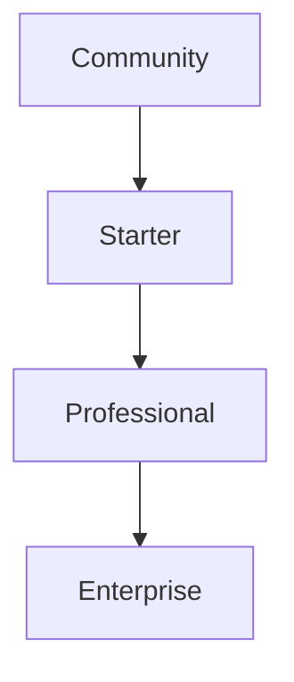
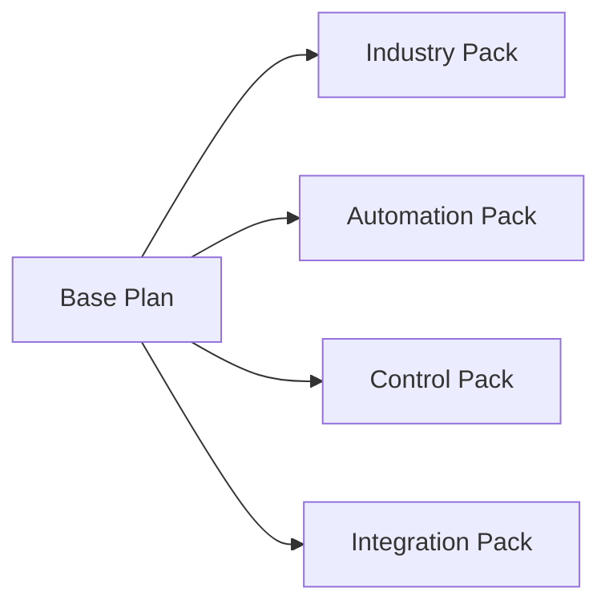

# Auterity Feature Rollout Strategy

## Overview

This document outlines the phased rollout of Auterity's features, aligning core capabilities with immediate launch needs while staging enterprise features for post-launch development.

## Phase 1: Core Launch Features

### 🚀 Immediate Launch Capabilities

#### Free Self-Hosted Community
- **Basic AI Integration**
  - GPT-3.5 & Claude 3 Base Models
  - Basic Workflow Canvas
  - Simple Node Execution
  - Community Support Forum
- **Core Workflow Features**
  - Visual Workflow Builder
  - Basic Templates (5)
  - Standard Nodes
  - Local Deployment
- **Essential Analytics**
  - Basic Usage Metrics
  - Simple Performance Monitoring
  - Standard Logging

#### SaaS Starter
*All Community features plus:*
- **Enhanced AI Access**
  - Additional Base Models
  - Basic Model Selection
  - Simple Routing
- **Workflow Enhancements**
  - 10 Templates
  - Email Support
  - Basic Integrations
- **Basic Monitoring**
  - Usage Dashboards
  - Simple Alerts
  - Basic Reporting

#### SaaS Professional
*All Starter features plus:*
- **Advanced AI Features**
  - Premium Model Access
  - Basic Fine-tuning
  - Model Performance Analytics
- **Professional Workflows**
  - 50 Templates
  - Advanced Nodes
  - Team Collaboration
- **Enhanced Analytics**
  - Custom Dashboards
  - Performance Metrics
  - API Usage Analytics

#### SaaS Enterprise
*All Professional features plus:*
- **Enterprise AI**
  - Custom Model Training
  - Advanced Fine-tuning
  - Priority Model Access
- **Enterprise Workflows**
  - 200 Templates
  - Custom Nodes
  - Advanced Orchestration
- **Full Analytics Suite**
  - Advanced Dashboards
  - Custom Reporting
  - Compliance Monitoring

## Phase 2: Post-Launch Enterprise Features

### 🏢 Industry Specializations

#### Healthcare Vertical Package
```typescript
{
  tier: 'enterprise',
  features: {
    compliance: ['HIPAA', 'GDPR', 'HITECH'],
    workflows: ['Clinical', 'Administrative', 'Billing'],
    ai_models: ['Medical NLP', 'Diagnostic Support', 'Patient Data Analysis'],
    templates: ['Patient Flow', 'Insurance Processing', 'Medical Records']
  }
}
```

#### Financial Services Package
```typescript
{
  tier: 'enterprise',
  features: {
    compliance: ['SOX', 'PCI-DSS', 'KYC'],
    workflows: ['Transaction', 'Risk Analysis', 'Fraud Detection'],
    ai_models: ['Financial NLP', 'Risk Assessment', 'Market Analysis'],
    templates: ['Trading', 'Compliance', 'Reporting']
  }
}
```

#### Automotive Package
```typescript
{
  tier: 'enterprise',
  features: {
    specialization: ['Dealership', 'Manufacturing', 'Service'],
    workflows: ['Sales', 'Inventory', 'Service Management'],
    ai_models: ['Vehicle Analysis', 'Customer Insights', 'Predictive Maintenance'],
    templates: ['Sales Process', 'Service Workflow', 'Inventory Management']
  }
}
```

### 🔄 Advanced Automation Features

#### Process Automation Suite
```typescript
{
  rolloutPhase: 'post-launch',
  features: {
    executors: {
      topological: true,
      crossSystem: true,
      intelligent: true,
      autonomous: true
    },
    optimization: {
      processDiscovery: true,
      workflowIntelligence: true,
      automatedTriage: true
    }
  }
}
```

#### AI Specialization Framework
```typescript
{
  rolloutPhase: 'post-launch',
  features: {
    toolSpecialization: true,
    domainAdaptation: true,
    industryModels: true,
    customTraining: true
  }
}
```

### 🎛️ Enterprise Control Features

#### Advanced Management Console
```typescript
{
  rolloutPhase: 'post-launch',
  features: {
    resourceManagement: {
      connectionPooling: true,
      cacheOptimization: true,
      loadBalancing: true
    },
    monitoring: {
      healthChecks: true,
      performanceMetrics: true,
      costOptimization: true
    }
  }
}
```

#### Enterprise Integration Hub
```typescript
{
  rolloutPhase: 'post-launch',
  features: {
    connectors: {
      enterprise: true,
      custom: true,
      legacy: true
    },
    adapters: {
      contextAware: true,
      intelligent: true,
      automated: true
    }
  }
}
```

## Feature Availability Matrix

### Phase 1 (Launch)

| Feature Category | Community | Starter | Professional | Enterprise |
|-----------------|-----------|---------|--------------|------------|
| **AI Models** | Basic | Enhanced | Premium | Custom |
| **Workflows** | Basic | Standard | Advanced | Enterprise |
| **Analytics** | Basic | Enhanced | Custom | Advanced |
| **Support** | Community | Email | Priority | Dedicated |
| **Templates** | 5 | 10 | 50 | 200 |

### Phase 2 (Post-Launch)

| Feature Category | Community | Starter | Professional | Enterprise |
|-----------------|-----------|---------|--------------|------------|
| **Industry Packs** | ❌ | ❌ | Basic | Full |
| **Process Automation** | ❌ | Basic | Advanced | Full |
| **AI Specialization** | ❌ | ❌ | Basic | Full |
| **Enterprise Control** | ❌ | ❌ | Basic | Full |
| **Integration Hub** | Basic | Standard | Advanced | Custom |

## Implementation Timeline

### Phase 1: Launch (0-6 months)
1. Core AI Integration
2. Basic Workflow Features
3. Essential Analytics
4. Standard Support Tiers

### Phase 2: Enterprise (6-12 months)
1. Industry Specializations
2. Advanced Automation
3. Enterprise Controls
4. Integration Hub

### Phase 3: Optimization (12+ months)
1. Advanced AI Features
2. Custom Solutions
3. Industry Expansions
4. Enterprise Tools

## Pricing Strategy

### Launch Pricing
- **Community**: $0/month
- **Starter**: $49/month
- **Professional**: $199/month
- **Enterprise**: $999/month

### Post-Launch Add-ons
- **Industry Packs**: +$499/month
- **Advanced Automation**: +$299/month
- **Enterprise Controls**: +$399/month
- **Integration Hub**: +$199/month

## Migration Paths

### Vertical Upgrades


### Horizontal Expansions


## Feature Request Process

1. **Community Features**
   - Public GitHub Issues
   - Community Voting
   - Regular Review Cycles

2. **Enterprise Features**
   - Direct Account Manager
   - Priority Development
   - Custom Solutions

## Development Guidelines

### Phase 1
- Focus on stability
- Core functionality
- Essential features
- Basic integrations

### Phase 2
- Enterprise capabilities
- Industry specialization
- Advanced automation
- Custom solutions

### Phase 3
- Feature optimization
- Performance tuning
- Advanced AI
- Custom development

## Success Metrics

### Launch Phase
- User Adoption
- Core Feature Usage
- Basic Integration Success
- Community Growth

### Enterprise Phase
- Industry Pack Adoption
- Advanced Feature Usage
- Enterprise Client Growth
- Custom Solution Success

This strategy ensures a solid foundation at launch while providing clear paths for enterprise expansion and specialization post-launch.
