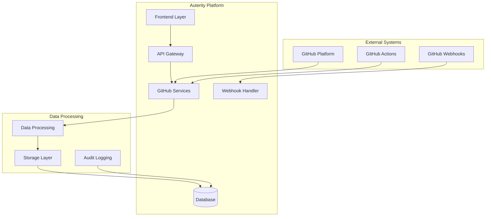
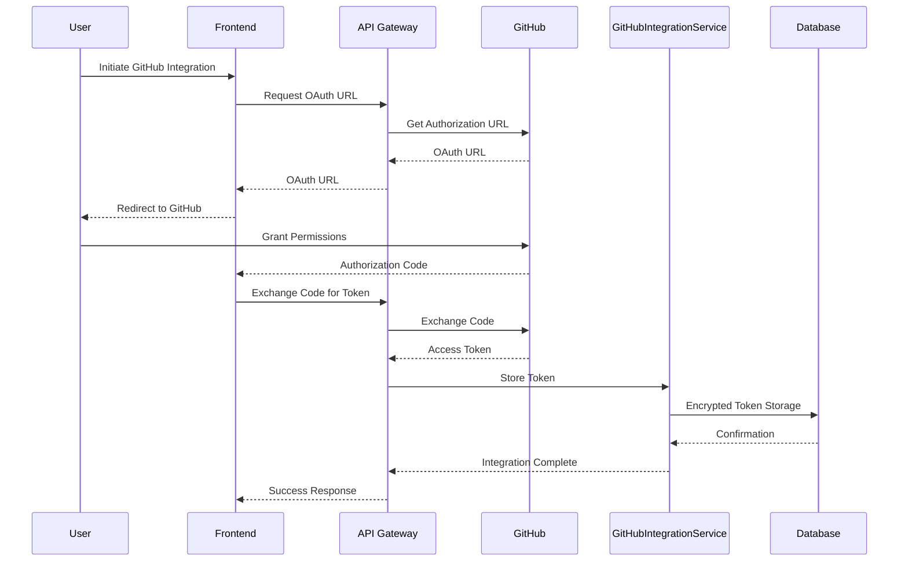
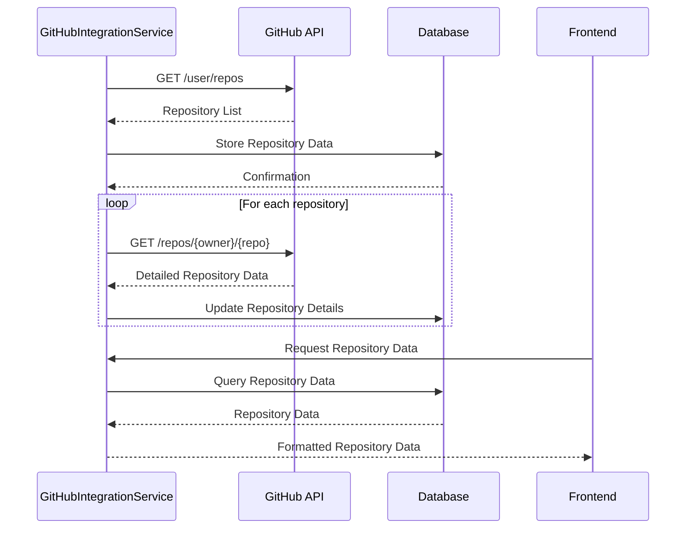
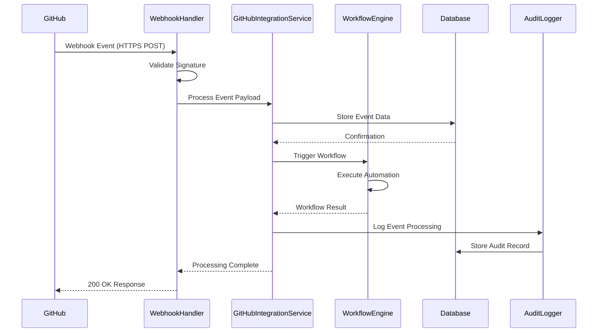
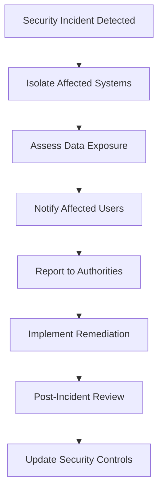

# 🔄 GitHub Integration Data Flow Documentation

**Date:** September 6, 2025  
**Version:** 1.0  
**Owner:** Data Protection Team  

---

## 📋 Document Purpose

This document maps all data flows related to GitHub integrations within the Auterity Error IQ platform, ensuring compliance with GDPR, CCPA, and GitHub's Terms of Service.

---

## 🏗️ Architecture Overview



---

## 📊 Data Flow Diagrams

### 1. OAuth Authentication Flow



**Data Collected:** OAuth tokens, user permissions, authorization codes
**Retention:** Token lifetime (typically 1 year)
**Security:** Encrypted storage, secure transmission

### 2. Repository Data Synchronization Flow



**Data Collected:** Repository metadata, file structures, commit history
**Retention:** 90 days with automatic cleanup
**Purpose:** Project management and workflow automation

### 3. Webhook Event Processing Flow



**Data Collected:** Event payloads, repository changes, user actions
**Retention:** 7 days for event data, 1 year for audit logs
**Security:** HMAC signature validation, payload encryption

---

## 🔐 Data Categories & Processing

### Personal Data Collected

| Data Category | Source | Processing Purpose | Legal Basis | Retention |
|---------------|--------|-------------------|-------------|-----------|
| **User Profile Data** | GitHub API | Authentication, personalization | Consent, Contract | Account lifetime |
| **Repository Metadata** | GitHub API | Project management | Consent, Legitimate Interest | 90 days |
| **Email Addresses** | GitHub API | Notifications, support | Consent | Account lifetime |
| **IP Addresses** | Web requests | Security, analytics | Legitimate Interest | 30 days |
| **Usage Analytics** | Application logs | Performance monitoring | Legitimate Interest | 1 year |

### Sensitive Data Handling

| Data Type | Encryption | Access Control | Purpose Limitation |
|-----------|------------|----------------|-------------------|
| **OAuth Tokens** | AES-256 at rest | Service accounts only | API authentication |
| **Webhook Payloads** | TLS 1.3 in transit | Application servers | Event processing |
| **User Content** | Git encryption | Repository permissions | Collaboration |

---

## 🛡️ Security Controls

### Data Protection Measures

| Control Type | Implementation | Verification |
|--------------|----------------|--------------|
| **Encryption at Rest** | AES-256 for sensitive data | Automated key rotation |
| **Encryption in Transit** | TLS 1.3 minimum | Certificate validation |
| **Access Controls** | Role-based permissions | Regular access reviews |
| **Audit Logging** | Comprehensive event logging | SIEM integration |
| **Data Minimization** | Selective data collection | API field filtering |

### Data Retention Policies

| Data Type | Retention Period | Deletion Method | Legal Basis |
|-----------|------------------|-----------------|-------------|
| **Authentication Tokens** | Token expiry + 30 days | Secure deletion | Contract necessity |
| **Repository Cache** | 90 days | Automated cleanup | Performance optimization |
| **Webhook Events** | 7 days | Database purging | Event processing |
| **Audit Logs** | 7 years | Compressed archival | Legal compliance |
| **User Data** | Account lifetime + 90 days | Secure deletion | Consent withdrawal |

---

## 🚨 Data Breach Response

### Incident Response Flow



### Notification Requirements

| Incident Type | Notification Timeline | Recipients | Content Requirements |
|---------------|----------------------|------------|---------------------|
| **Personal Data Breach** | 72 hours | Data subjects, ICO | Nature, consequences, mitigation |
| **Security Incident** | 24 hours | Security team | Technical details, impact |
| **System Compromise** | Immediate | All stakeholders | Scope, remediation plan |

---

## 📊 Data Subject Rights Implementation

### Right of Access

```typescript
// Implementation example
async function handleDataAccessRequest(userId: string) {
  const userData = await collectUserData(userId);
  const exportData = {
    personalData: userData.profile,
    githubIntegrations: userData.integrations,
    auditLogs: userData.logs,
    retentionSchedule: getRetentionInfo()
  };
  return generateDataExport(exportData);
}
```

### Right to Erasure

```typescript
// Implementation example
async function handleDataErasure(userId: string) {
  // Soft delete with retention
  await softDeleteUserData(userId);

  // Schedule hard delete
  scheduleHardDelete(userId, 90); // 90 days retention

  // Revoke GitHub tokens
  await revokeGitHubTokens(userId);

  // Log erasure event
  await logErasureEvent(userId);
}
```

---

## 🔍 Monitoring & Auditing

### Automated Monitoring

| Metric | Threshold | Alert Level | Response |
|--------|-----------|-------------|----------|
| **API Rate Limit Usage** | >80% | WARNING | Throttle requests |
| **Failed Authentication** | >5/minute | CRITICAL | Security review |
| **Data Export Requests** | >10/day | INFO | Monitor trends |
| **Webhook Signature Failures** | >0 | CRITICAL | Security incident |

### Compliance Reporting

| Report Type | Frequency | Recipients | Content |
|-------------|-----------|------------|---------|
| **Data Processing Audit** | Monthly | Compliance Team | Processing activities |
| **Privacy Impact Assessment** | Quarterly | Legal Team | Risk assessment |
| **Data Breach Report** | As needed | Regulators | Incident details |
| **User Rights Report** | Annual | Board | Rights exercised |

---

## 📞 Contact Information

**Data Protection Officer:** [Name]  
**Email:** `dpo@auterity.com`  
**Phone:** [Phone Number]  

**Compliance Team:** `compliance@auterity.com`  
**Security Team:** `security@auterity.com`  

---

## 📋 Change Log

| Date | Version | Changes | Author |
|------|---------|---------|--------|
| 2025-09-06 | 1.0 | Initial creation | Compliance Team |

---

*This document must be reviewed annually or when significant changes occur to data processing activities.*
