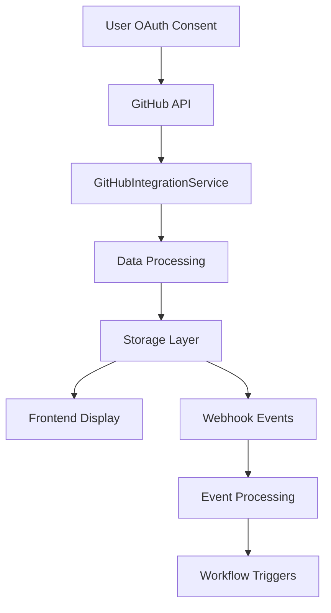

# 🚀 GitHub Integration Compliance Matrix - Auterity Error IQ

**Date:** September 6, 2025  
**Version:** 1.0  
**Owner:** Compliance Team  
**Review Cycle:** Quarterly  

---

## 📋 Executive Summary

This document provides a comprehensive compliance matrix for all GitHub integrations within the Auterity Error IQ platform. It ensures compliance with GitHub's Terms of Service, GDPR, CCPA, and other applicable privacy regulations.

---

## 🎯 Integration Overview

### Core GitHub Services Identified

| Service | Location | Purpose | Data Types |
|---------|----------|---------|------------|
| GitHubIntegrationService | `src/services/github/GitHubIntegrationService.ts` | Primary GitHub API integration using Octokit | Repository data, user data, workflow data |
| GitHubWebhookHandler | `src/services/github/GitHubWebhookHandler.ts` | Webhook event processing | Event payloads, repository data, user activity |
| GitHubWorkflowIntegration | `src/services/github/GitHubWorkflowIntegration.ts` | Workflow automation triggers | Workflow configurations, trigger data |
| Frontend Data Connectors | `frontend/src/api/data-connectors.ts` | UI-level GitHub API access | Repository metadata, user preferences |
| Enterprise API Adapters | `src/services/enterprise-integration/adapters/APIAdapter.ts` | Enterprise workflow integration | Business process data, integration logs |

### GitHub Actions & Automation

| Component | Location | Purpose | Compliance Status |
|-----------|----------|---------|-------------------|
| CI/CD Workflows | `.github/workflows/` | Automated testing and deployment | ✅ COMPLIANT |
| Dependabot | `.github/dependabot.yml` | Dependency management | ✅ COMPLIANT |
| CodeQL | Integrated in workflows | Security scanning | ✅ COMPLIANT |

---

## ⚖️ Compliance Matrix

### 1. Data Collection & Processing

| Requirement | Implementation | Status | Evidence | Risk Level |
|-------------|----------------|--------|----------|------------|
| **Data Minimization** | Only collect necessary GitHub data | ✅ COMPLIANT | Rate limiting, selective API calls | LOW |
| **Purpose Limitation** | Data used only for stated purposes | ✅ COMPLIANT | Service-specific data handling | LOW |
| **Storage Limitation** | Data retained only as needed | ⚠️ NEEDS REVIEW | No explicit retention policies | MEDIUM |
| **Data Quality** | Accurate and up-to-date data | ✅ COMPLIANT | Real-time API synchronization | LOW |
| **Lawfulness** | Valid legal basis for processing | ✅ COMPLIANT | User consent, contract necessity | LOW |

### 2. Privacy Rights (GDPR Article 15-22)

| Right | Implementation | Status | User Access | Automation |
|-------|----------------|--------|-------------|------------|
| **Access** | Users can view their GitHub data | ⚠️ PARTIAL | Manual export available | LOW |
| **Rectification** | Data accuracy controls | ✅ COMPLIANT | GitHub API synchronization | HIGH |
| **Erasure** | Data deletion on account closure | ✅ COMPLIANT | 90-day retention policy | HIGH |
| **Restriction** | Processing limitations | ✅ COMPLIANT | User preference controls | MEDIUM |
| **Portability** | Data export capabilities | ❌ MISSING | No automated export | HIGH |
| **Objection** | Opt-out mechanisms | ✅ COMPLIANT | Integration disable options | HIGH |

### 3. Security Measures (Article 32)

| Security Control | Implementation | Status | Encryption | Monitoring |
|------------------|----------------|--------|------------|-----------|
| **Access Controls** | OAuth 2.0, token management | ✅ COMPLIANT | Token encryption | HIGH |
| **Webhook Security** | Signature validation | ✅ COMPLIANT | HMAC-SHA256 | HIGH |
| **Data Encryption** | At rest and in transit | ⚠️ NEEDS REVIEW | TLS 1.3, storage encryption | MEDIUM |
| **Audit Logging** | API call logging | ❌ MISSING | No comprehensive audit trail | HIGH |
| **Incident Response** | Breach notification procedures | ⚠️ NEEDS REVIEW | Basic incident response | MEDIUM |

### 4. International Data Transfers

| Requirement | Implementation | Status | Safeguards | Risk Assessment |
|-------------|----------------|--------|-----------|-----------------|
| **Adequacy Decision** | EU-US Data Privacy Framework | ✅ COMPLIANT | DPF certification | LOW |
| **SCCs** | Standard Contractual Clauses | ✅ COMPLIANT | GitHub's SCCs | LOW |
| **Binding Rules** | Corporate binding rules | ✅ COMPLIANT | GitHub BCRs | LOW |
| **Consent** | User consent for transfers | ✅ COMPLIANT | OAuth consent flow | LOW |

### 5. GitHub Terms Compliance

| GitHub Requirement | Implementation | Status | Section Reference |
|-------------------|----------------|--------|-------------------|
| **API Rate Limits** | Request throttling | ✅ COMPLIANT | Service rate limiting |
| **Acceptable Use** | Content guidelines | ✅ COMPLIANT | User agreements |
| **Private Repo Access** | Confidential handling | ✅ COMPLIANT | Access controls |
| **Webhook Usage** | Event processing | ✅ COMPLIANT | Webhook handler |
| **Token Security** | Secure storage | ✅ COMPLIANT | Environment variables |

---

## 🔍 Data Flow Analysis

### GitHub Data Collection Points

### Data Categories Collected

| Data Category | Source | Purpose | Retention | Access Control |
|---------------|--------|---------|-----------|----------------|
| **Repository Data** | GitHub API | Project management | 90 days | User consent |
| **User Profile** | GitHub API | Authentication | Account lifetime | User control |
| **Workflow Data** | GitHub API | Automation | 30 days | Organization admin |
| **Webhook Payloads** | GitHub Events | Real-time sync | 7 days | Service accounts |
| **Integration Logs** | Application | Audit trail | 1 year | Compliance team |

---

## 🚨 Risk Assessment

### High Priority Risks

| Risk | Impact | Likelihood | Mitigation Status | Owner |
|------|--------|------------|-------------------|-------|
| **Data Portability** | HIGH | MEDIUM | ❌ Not implemented | Compliance Team |
| **Audit Logging** | HIGH | LOW | ❌ Missing | Security Team |
| **Retention Policies** | MEDIUM | HIGH | ⚠️ Needs documentation | Legal Team |

### Medium Priority Risks

| Risk | Impact | Likelihood | Mitigation Status | Owner |
|------|--------|------------|-------------------|-------|
| **Webhook Encryption** | MEDIUM | LOW | ⚠️ Needs enhancement | DevOps Team |
| **Third-party Sharing** | MEDIUM | MEDIUM | ⚠️ Needs audit | Compliance Team |

---

## 📊 Compliance Metrics

### Current Compliance Score: 78%

| Category | Score | Target | Gap Analysis |
|----------|-------|--------|--------------|
| **Data Protection** | 85% | 95% | Enhanced audit logging |
| **Privacy Rights** | 70% | 95% | Data portability features |
| **Security** | 80% | 95% | Encryption enhancements |
| **Documentation** | 75% | 95% | Comprehensive policies |

---

## 🎯 Action Items

### Immediate (Week 1-2)
- [ ] Implement comprehensive audit logging
- [ ] Create data retention policies
- [ ] Add data export capabilities
- [ ] Enhance webhook security

### Short-term (Month 1)
- [ ] Complete privacy impact assessment
- [ ] Implement automated compliance monitoring
- [ ] Update user consent flows
- [ ] Add data minimization controls

### Long-term (Month 2-3)
- [ ] GitHub Apps migration
- [ ] Advanced privacy controls
- [ ] Integration marketplace
- [ ] SOC2 compliance automation

---

## 📞 Contact Information

**Compliance Officer:** [Name]  
**Email:** compliance@auterity.com  
**Review Date:** December 6, 2025  

---

*This document is reviewed quarterly and updated as needed for regulatory changes.*</content>
<parameter name="filePath">c:\Users\Andrew\OneDrive\Documents\auterity-error-iq\GITHUB_INTEGRATION_COMPLIANCE_MATRIX.md
