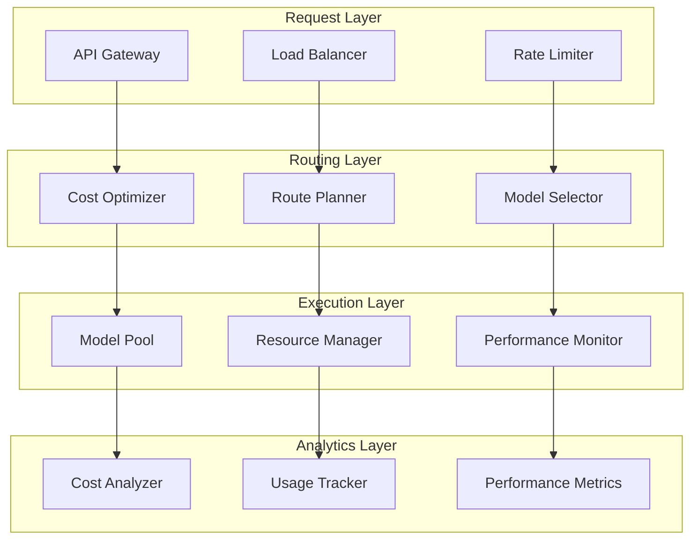

# 💰 AI Cost Optimization & Intelligent Routin

g

#

# Overvie

w

The AI Cost Optimization system provides intelligent routing, resource allocation, and cost management for AI operations across the platform. It optimizes costs while maintaining performance and reliability through dynamic model selection and request routing.

#

# Architectur

e

#

## System Components



#

# Core Component

s

#

## Cost Optimizer

```

typescript
interface CostOptimizationConfig {
  budget_limits: {
    daily: number;
    monthly: number;
    per_request: number;
  };
  performance_targets: {
    latency_ms: number;
    reliability_percent: number;
  };
  routing_strategy: 'cost_minimal' | 'balanced' | 'performance';
}

```

#

## Route Planner

```

typescript
interface RoutingDecision {
  model_id: string;
  provider: string;
  estimated_cost: number;
  expected_latency: number;
  confidence: number;
}

```

#

## Model Selector

```

typescript
interface ModelSelection {
  primary: ModelConfig;
  fallback: ModelConfig[];
  constraints: {
    max_cost: number;
    max_latency: number;
    min_reliability: number;
  };
}

```

#

# Optimization Strategie

s

#

## Cost-Based Routin

g

```

mermaid
sequenceDiagram
    participant C as Client
    participant O as Optimizer
    participant P1 as Provider1
    participant P2 as Provider2

    C->>O: Request

    O->>P1: Get Pricing

    O->>P2: Get Pricing

    P1-->>O: Cost1

    P2-->>O: Cost2

    O->>O: Compare Costs

    O->>P1: Route Request

    P1-->>C: Respons

e

```

#

## Performance-Based Selectio

n

```

mermaid
sequenceDiagram
    participant C as Client
    participant O as Optimizer
    participant M1 as Model1
    participant M2 as Model2

    C->>O: Request

    O->>M1: Check Performance

    O->>M2: Check Performance

    M1-->>O: Metrics1

    M2-->>O: Metrics2

    O->>O: Evaluate

    O->>M2: Select Model

    M2-->>C: Respons

e

```

#

# Resource Managemen

t

#

## Pooling Strategy

- Dynamic pool sizin

g

- Warm instance managemen

t

- Resource reclamatio

n

- Load distributio

n

#

## Capacity Planning

- Usage forecastin

g

- Peak load handlin

g

- Resource reservatio

n

- Scaling threshold

s

#

# Cost Analysi

s

#

## Metrics Tracking

```

typescript
interface CostMetrics {
  total_cost: number;
  cost_by_model: Record<string, number>;
  cost_by_provider: Record<string, number>;
  cost_by_endpoint: Record<string, number>;
  average_cost_per_request: number;
}

```

#

## Budget Management

- Budget allocatio

n

- Cost alert

s

- Usage quota

s

- Spending limit

s

#

# Performance Optimizatio

n

#

## Caching Strategy

- Result cachin

g

- Prompt cachin

g

- Embedding cachin

g

- Cache invalidatio

n

#

## Request Optimization

- Batch processin

g

- Request mergin

g

- Response streamin

g

- Concurrent request

s

#

# Monitoring & Alert

s

#

## Key Metrics

- Cost per reques

t

- Request latenc

y

- Error rate

s

- Cache hit rate

s

- Resource utilizatio

n

#

## Alert Conditions

```

typescript
interface AlertConfig {
  cost_threshold: number;
  latency_threshold: number;
  error_threshold: number;
  utilization_threshold: number;
}

```

#

# Integration Point

s

#

## API Integration

```

typescript
interface OptimizationRequest {
  content: string;
  model_preferences?: {
    provider?: string;
    model?: string;
    max_cost?: number;
  };
  performance_requirements?: {
    max_latency?: number;
    min_reliability?: number;
  };
}

```

#

## Monitoring Integration

```

typescript
interface PerformanceMetrics {
  request_id: string;
  timestamp: number;
  latency: number;
  cost: number;
  cache_hit: boolean;
  error?: string;
}

```

#

# Related Documentation

- [Intelligent Router Documentation](INTELLIGENT_ROUTER_DOCUMENTATION.md

)

- [Monitoring Documentation](MONITORING_DOCUMENTATION.md

)

- [Performance Documentation](PERFORMANCE_DOCUMENTATION.md

)

- [Security Documentation](SECURITY_DOCUMENTATION.md

)
