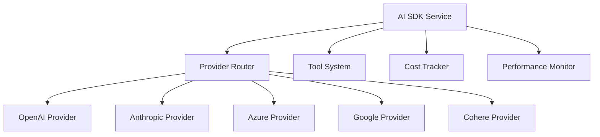

# 🤖 AI SDK Documentatio

n

#

# Overvie

w

This document provides comprehensive documentation for Auterity's AI SDK service, which provides unified AI capabilities using multiple providers (OpenAI, Anthropic, Azure, Google, Cohere) with advanced features like structured outputs, tool calling, streaming responses, and cost tracking.

#

# Table of Content

s

1. [Architecture Overview]

(

#architecture-overview

)

2. [Provider Integration]

(

#provider-integration

)

3. [Core Features]

(

#core-features

)

4. [Tool Integration]

(

#tool-integration

)

5. [Performance Optimization]

(

#performance-optimization

)

6. [Cost Management]

(

#cost-management

)

7. [Security Considerations]

(

#security-considerations

)

8. [Development Guidelines]

(

#development-guideline

s

)

#

# Architecture Overvie

w

#

## Component Architecture



#

## Component Locations

```

src/services/
├── aiSDKService.ts
├── providers/
│   ├── openai.ts
│   ├── anthropic.ts
│   ├── azure.ts
│   ├── google.ts
│   └── cohere.ts
└── tools/
    ├── crm.ts
    ├── workflow.ts
    └── analysis.ts

```

#

# Provider Integratio

n

#

## Configuration

```

typescript
// Environment configuration
const AI_CONFIG = {
  openai: {
    apiKey: import.meta.env.VITE_OPENAI_API_KEY || '',
    enabled: !!import.meta.env.VITE_OPENAI_API_KEY
  },
  anthropic: {
    apiKey: import.meta.env.VITE_ANTHROPIC_API_KEY || '',
    enabled: !!import.meta.env.VITE_ANTHROPIC_API_KEY
  },
  google: {
    apiKey: import.meta.env.VITE_GOOGLE_API_KEY || '',
    enabled: !!import.meta.env.VITE_GOOGLE_API_KEY
  },
  azure: {
    endpoint: import.meta.env.VITE_AZURE_OPENAI_ENDPOINT || '',
    apiKey: import.meta.env.VITE_AZURE_OPENAI_API_KEY || '',
    apiVersion: import.meta.env.VITE_AZURE_OPENAI_VERSION || '2024-02-15-preview',

    enabled: !!(import.meta.env.VITE_AZURE_OPENAI_ENDPOINT && import.meta.env.VITE_AZURE_OPENAI_API_KEY)
  },
  cohere: {
    apiKey: import.meta.env.VITE_COHERE_API_KEY || '',
    enabled: !!import.meta.env.VITE_COHERE_API_KEY
  }
};

```

#

## Provider Implementation

```

typescript
import { openai } from '@ai-sdk/openai';

import { anthropic } from '@ai-sdk/anthropic';

import { azure } from '@ai-sdk/azure';

import { google } from '@ai-sdk/google';

import { cohere } from '@ai-sdk/cohere'

;

class AIProvider {
    constructor(
        private config: ProviderConfig,
        private client: any
    ) {}

    async generateText(
        prompt: string,
        options: GenerateOptions = {}
    ): Promise<string> {
        const response = await this.client.complete({
            prompt,
            maxTokens: options.maxTokens,
            temperature: options.temperature,
            stop: options.stopSequences
        });

        return response.text;
    }

    async generateObject<T>(
        prompt: string,
        schema: z.ZodType<T>,
        options: GenerateOptions = {}
    ): Promise<T> {
        const response = await this.client.complete({
            prompt,
            maxTokens: options.maxTokens,
            temperature: options.temperature,
            stop: options.stopSequences,
            format: 'json'
        });

        return schema.parse(response.json);
    }
}

```

#

## Provider Router

```

typescript
class ProviderRouter {
    private providers: Map<string, AIProvider> = new Map();

    constructor(config: AIConfig) {
        if (config.openai.enabled) {
            this.providers.set('openai', new AIProvider(
                config.openai,
                openai
            ));
        }

        if (config.anthropic.enabled) {
            this.providers.set('anthropic', new AIProvider(
                config.anthropic,
                anthropic
            ));
        }

        // Initialize other providers...
    }

    async route(
        request: AIRequest,
        preferences: ProviderPreferences = {}
    ): Promise<AIProvider> {
        const provider = await this.selectProvider(
            request,
            preferences
        );

        return provider;
    }
}

```

#

# Core Feature

s

#

## Text Generation

```

typescript
class AISDKService {
    async generateText(
        prompt: string,
        options: GenerateOptions = {}
    ): Promise<string> {
        const provider = await this.router.route({
            type: 'text',
            prompt,
            options
        });

        const result = await provider.generateText(
            prompt,
            options
        );

        await this.trackUsage(provider, result);
        return result;
    }
}

```

#

## Structured Output

```

typescript
class AISDKService {
    async generateObject<T>(
        prompt: string,
        schema: z.ZodType<T>,
        options: GenerateOptions = {}
    ): Promise<T> {
        const provider = await this.router.route({
            type: 'object',
            prompt,
            options
        });

        const result = await provider.generateObject(
            prompt,
            schema,
            options
        );

        await this.trackUsage(provider, result);
        return result;
    }
}

```

#

## Streaming Responses

```

typescript
class AISDKService {
    async *streamText(

        prompt: string,
        options: StreamOptions = {}
    ): AsyncGenerator<string> {
        const provider = await this.router.route({
            type: 'stream',
            prompt,
            options
        });

        const stream = await provider.createStream(
            prompt,
            options
        );

        for await (const chunk of stream) {
            yield chunk;
            await this.trackStreamUsage(provider, chunk);
        }
    }
}

```

#

# Tool Integratio

n

#

## Tool Definition

```

typescript
interface Tool {
    name: string;
    description: string;
    parameters: z.ZodObject<any>;
    execute(params: any): Promise<any>;
}

const crmTool: Tool = {
    name: 'query_customer',
    description: 'Query customer information from CRM',
    parameters: z.object({
        customerId: z.string(),
        fields: z.array(z.string())
    }),
    execute: async (params) => {
        return await crmService.getCustomer(
            params.customerId,
            params.fields
        );
    }
};

```

#

## Tool Calling

```

typescript
class AISDKService {
    async executeWithTools(
        prompt: string,
        tools: Tool[],
        options: ToolOptions = {}
    ): Promise<any> {
        const provider = await this.router.route({
            type: 'tool',
            prompt,
            options
        });

        const result = await provider.executeWithTools(
            prompt,
            tools,
            options
        );

        await this.trackToolUsage(provider, result);
        return result;
    }
}

```

#

# Performance Optimizatio

n

#

## Caching

```

typescript
class AISDKService {
    private cache = new LRUCache<string, any>({
        max: 1000,
        ttl: 1000

 * 6

0

 * 60 // 1 hour

    });

    async getCachedResult(
        key: string,
        generator: () => Promise<any>
    ): Promise<any> {
        const cached = this.cache.get(key);
        if (cached) {
            return cached;
        }

        const result = await generator();
        this.cache.set(key, result);
        return result;
    }
}

```

#

## Request Batching

```

typescript
class AISDKService {
    private batchQueue: Map<string, Promise<any>> = new Map();

    async batchRequest(
        key: string,
        request: () => Promise<any>
    ): Promise<any> {
        const existing = this.batchQueue.get(key);
        if (existing) {
            return existing;
        }

        const promise = request();
        this.batchQueue.set(key, promise);

        try {
            return await promise;
        } finally {
            this.batchQueue.delete(key);
        }
    }
}

```

#

# Cost Managemen

t

#

## Usage Tracking

```

typescript
class AISDKService {
    private costTracker = new CostTracker();

    async trackUsage(
        provider: string,
        tokens: number,
        type: string
    ): Promise<void> {
        await this.costTracker.recordUsage({
            provider,
            tokens,
            type,
            timestamp: new Date(),
            cost: this.calculateCost(provider, tokens, type)
        });
    }

    private calculateCost(
        provider: string,
        tokens: number,
        type: string
    ): number {
        const rates = this.costTracker.getRates(provider);
        return tokens

 * rates[type];

    }
}

```

#

## Budget Management

```

typescript
class AISDKService {
    async checkBudget(
        request: AIRequest
    ): Promise<boolean> {
        const usage = await this.costTracker.getCurrentUsage();
        const budget = await this.costTracker.getBudget();

        const estimatedCost = this.estimateCost(request);
        return usage

 + estimatedCost <= budget;

    }

    private estimateCost(request: AIRequest): number {
        const tokenEstimate = this.estimateTokens(request);
        return this.calculateCost(
            request.provider,
            tokenEstimate,
            request.type
        );
    }
}

```

#

# Security Consideration

s

#

## API Key Management

```

typescript
class AISDKService {
    private async getApiKey(
        provider: string
    ): Promise<string> {
        return await this.secretsManager.getSecret(
            `ai_provider_${provider}_key`
        );
    }

    private async rotateApiKey(
        provider: string
    ): Promise<void> {
        const newKey = await this.generateApiKey();
        await this.secretsManager.setSecret(
            `ai_provider_${provider}_key`,
            newKey
        );
    }
}

```

#

## Request Validation

```

typescript
class AISDKService {
    private validateRequest(
        request: AIRequest
    ): void {
        // Validate prompt content
        if (this.containsSensitiveData(request.prompt)) {
            throw new Error('Prompt contains sensitive data');
        }

        // Validate tool permissions
        if (request.tools) {
            this.validateToolPermissions(request.tools);
        }

        // Validate rate limits
        if (!this.checkRateLimit(request)) {
            throw new Error('Rate limit exceeded');
        }
    }
}

```

#

# Development Guideline

s

#

## Error Handling

```

typescript
class AISDKService {
    async handleError(
        error: any,
        request: AIRequest
    ): Promise<void> {
        // Log error
        await this.logger.error('AI request failed', {
            error,
            request: this.sanitizeRequest(request)
        });

        // Retry if appropriate
        if (this.isRetryable(error)) {
            return await this.retry(request);
        }

        // Fallback to alternative provider
        if (this.hasFallback(request)) {
            return await this.useFallback(request);
        }

        throw this.normalizeError(error);
    }
}

```

#

## Testing Strategy

```

typescript
// Example AI SDK test
import { AISDKService } from './aiSDKService';

describe('AISDKService', () => {
    it('should route to appropriate provider', async () => {
        const service = new AISDKService(testConfig);

        const result = await service.generateText(
            'Test prompt',
            {
                provider: 'openai',
                model: 'gpt-4'

            }
        );

        expect(result).toBeDefined();
    });

    it('should handle provider failures', async () => {
        const service = new AISDKService(testConfig);

        // Mock primary provider failure
        mockOpenAI.fail();

        const result = await service.generateText(
            'Test prompt',
            {
                provider: 'openai',
                fallback: 'anthropic'
            }
        );

        expect(result).toBeDefined();
    });
});

```

This documentation provides a comprehensive overview of the AI SDK service in the Auterity platform. For specific implementation details or advanced usage patterns, refer to the individual service documentation or contact the development team.
