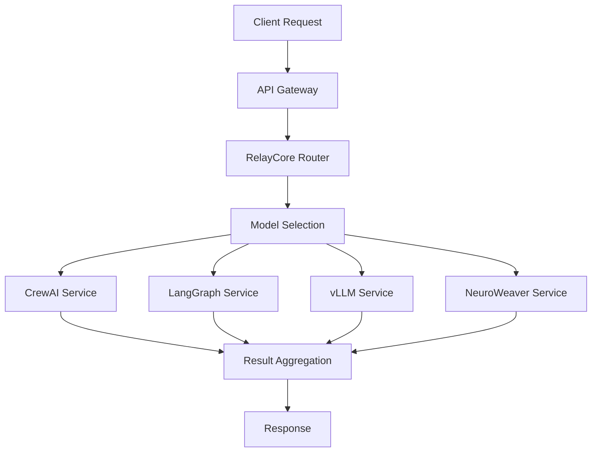

# 🤖 AI Services Integration Documentation

## Overview

This document provides comprehensive documentation for integrating and utilizing Auterity's advanced AI services: CrewAI, LangGraph, vLLM, and NeuroWeaver. These services work together to provide sophisticated AI capabilities across the platform.

## Table of Contents

1. [Architecture Overview](#architecture-overview)
2. [CrewAI Integration](#crewai-integration)
3. [LangGraph Integration](#langgraph-integration)
4. [vLLM Integration](#vllm-integration)
5. [NeuroWeaver Integration](#neuroweaver-integration)
6. [Integration Patterns](#integration-patterns)
7. [Performance Optimization](#performance-optimization)
8. [Security Considerations](#security-considerations)

## Architecture Overview

### AI Service Stack


### Service Locations
- CrewAI: `systems/crewai/` (Port: 8003)
- LangGraph: `systems/langgraph/` (Port: 8002)
- vLLM: `systems/vllm/` (Port: 8001)
- NeuroWeaver: `systems/neuroweaver/` (Port: 8004)

## CrewAI Integration

### Overview
CrewAI provides multi-agent collaborative AI capabilities for complex problem-solving.

### Configuration
```python
# systems/crewai/config/default.json
{
  "service": {
    "port": 8003,
    "workers": 4,
    "timeout": 300
  },
  "agents": {
    "max_concurrent": 10,
    "default_model": "gpt-4",
    "fallback_model": "gpt-3.5-turbo"
  },
  "memory": {
    "type": "redis",
    "ttl": 3600
  }
}
```

### Basic Usage
```python
from crewai_service import CrewAIService

service = CrewAIService()

# Create an agent team
team = await service.create_team([
    {
        "role": "researcher",
        "expertise": ["data analysis", "market research"],
        "goals": ["gather relevant information", "analyze trends"]
    },
    {
        "role": "writer",
        "expertise": ["content creation", "technical writing"],
        "goals": ["create clear documentation", "maintain consistency"]
    }
])

# Execute collaborative task
result = await team.execute_task({
    "objective": "Create market analysis report",
    "context": "Focusing on AI industry trends",
    "output_format": "markdown"
})
```

### Advanced Features
- Hierarchical agent structures
- Dynamic role assignment
- Cross-agent knowledge sharing
- Automated task decomposition

## LangGraph Integration

### Overview
LangGraph provides AI-powered workflow orchestration and decision-making capabilities.

### Configuration
```python
# systems/langgraph/config/default.json
{
  "service": {
    "port": 8002,
    "max_nodes": 100,
    "execution_timeout": 600
  },
  "graph": {
    "max_depth": 10,
    "cache_ttl": 3600,
    "parallel_execution": true
  }
}
```

### Basic Usage
```python
from langgraph_service import LangGraphService

service = LangGraphService()

# Create workflow graph
graph = await service.create_graph({
    "nodes": [
        {
            "id": "data_collection",
            "type": "input",
            "model": "gpt-4"
        },
        {
            "id": "analysis",
            "type": "processing",
            "model": "gpt-4"
        },
        {
            "id": "output_generation",
            "type": "output",
            "model": "gpt-4"
        }
    ],
    "edges": [
        ["data_collection", "analysis"],
        ["analysis", "output_generation"]
    ]
})

# Execute workflow
result = await graph.execute({
    "input": "Analyze customer feedback",
    "parameters": {
        "sentiment_analysis": true,
        "key_themes": true
    }
})
```

### Advanced Features
- Dynamic graph modification
- Conditional execution paths
- State management
- Error recovery

## vLLM Integration

### Overview
vLLM provides high-performance AI model serving with advanced optimization.

### Configuration
```python
# systems/vllm/config/default.json
{
  "service": {
    "port": 8001,
    "gpu_devices": [0, 1],
    "max_batch_size": 32
  },
  "models": {
    "cache_size": 8,
    "quantization": "int8",
    "tensor_parallel": true
  }
}
```

### Basic Usage
```python
from vllm_service import vLLMService

service = vLLMService()

# Load model
model = await service.load_model("gpt-4")

# Generate text
response = await model.generate(
    prompt="Explain quantum computing",
    max_tokens=500,
    temperature=0.7
)
```

### Advanced Features
- Dynamic batching
- Continuous batching
- KV cache management
- Tensor parallelism

## NeuroWeaver Integration

### Overview
NeuroWeaver provides model specialization and fine-tuning capabilities.

### Configuration
```python
# systems/neuroweaver/config/default.json
{
  "service": {
    "port": 8004,
    "training_workers": 4,
    "inference_workers": 8
  },
  "training": {
    "max_epochs": 100,
    "batch_size": 32,
    "learning_rate": 1e-5
  }
}
```

### Basic Usage
```python
from neuroweaver_service import NeuroWeaverService

service = NeuroWeaverService()

# Fine-tune model
model = await service.fine_tune({
    "base_model": "gpt-4",
    "training_data": training_data,
    "validation_data": validation_data,
    "parameters": {
        "epochs": 10,
        "learning_rate": 2e-5
    }
})

# Use fine-tuned model
response = await model.generate(
    prompt="Analyze system performance",
    context={"domain": "automotive"}
)
```

### Advanced Features
- Custom architecture design
- Transfer learning
- Multi-task learning
- Model compression

## Integration Patterns

### Combined Service Usage
```python
from unified_ai_service import UnifiedAIService

service = UnifiedAIService()

# Complex workflow with multiple AI services
result = await service.execute_workflow({
    "type": "document_analysis",
    "input": document,
    "steps": [
        {
            "service": "crewai",
            "task": "initial_analysis"
        },
        {
            "service": "langgraph",
            "task": "process_findings"
        },
        {
            "service": "vllm",
            "task": "generate_report"
        }
    ]
})
```

### Error Handling
```python
try:
    result = await ai_service.execute()
except AIServiceError as e:
    if e.type == "model_unavailable":
        result = await ai_service.use_fallback_model()
    elif e.type == "timeout":
        result = await ai_service.retry_with_backoff()
```

## Performance Optimization

### Caching Strategy
```python
# Configure model caching
cache_config = {
    "type": "redis",
    "max_size": "10GB",
    "ttl": 3600,
    "eviction_policy": "lru"
}

# Use cached results
result = await cache.get_or_compute(
    key=request_hash,
    computer=ai_service.execute,
    ttl=3600
)
```

### Load Balancing
```python
# Configure load balancing
balance_config = {
    "strategy": "least_loaded",
    "max_concurrent": 100,
    "health_check_interval": 30
}

# Get optimal service instance
instance = await load_balancer.get_instance(service_type)
result = await instance.execute(task)
```

## Security Considerations

### Authentication
```python
# Configure service authentication
auth_config = {
    "type": "jwt",
    "key_rotation": true,
    "token_ttl": 3600
}

# Authenticate service calls
token = await auth.get_service_token(service_name)
result = await ai_service.execute(task, token=token)
```

### Data Protection
```python
# Configure data protection
protection_config = {
    "encryption": "aes-256",
    "pii_detection": true,
    "audit_logging": true
}

# Process sensitive data
result = await ai_service.execute_secure(
    task,
    sensitive_data,
    protection_config
)
```

## Monitoring and Metrics

### Performance Monitoring
```python
# Configure monitoring
monitor_config = {
    "metrics": ["latency", "throughput", "error_rate"],
    "alert_thresholds": {
        "latency_p95": 1000,
        "error_rate": 0.01
    }
}

# Track metrics
with monitoring.track_operation("ai_inference"):
    result = await ai_service.execute(task)
```

### Cost Tracking
```python
# Configure cost tracking
cost_config = {
    "track_tokens": true,
    "track_compute": true,
    "budget_alerts": true
}

# Monitor operation costs
with cost_tracking.track_operation("model_inference"):
    result = await ai_service.execute(task)
```

## Development Guidelines

### Service Implementation
```python
class AIService(BaseService):
    async def initialize(self) -> None:
        self.model = await self.load_model()
        self.cache = await self.setup_cache()
        self.metrics = await self.setup_metrics()

    async def execute(
        self,
        task: Task,
        config: Config
    ) -> Result:
        with self.metrics.track():
            return await self._process(task, config)
```

### Testing Strategy
```python
class TestAIService(TestCase):
    async def test_service_execution(self):
        service = AIService()
        result = await service.execute(
            task=mock_task,
            config=test_config
        )
        self.validate_result(result)
```

This documentation provides a comprehensive guide for integrating and utilizing Auterity's AI services. For specific implementation details or advanced usage patterns, refer to the individual service documentation or contact the development team.
