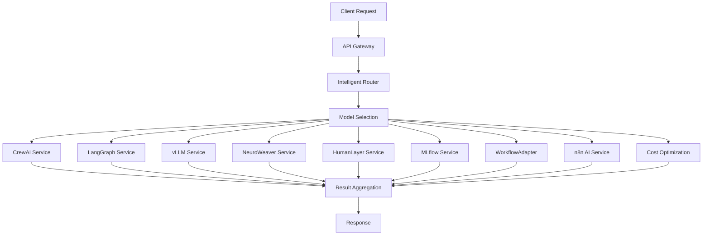

# 🤖 AI Services Integration Documentatio

n

#

# Overvie

w

This document provides comprehensive documentation for integrating and utilizing Auterity's advanced AI services: CrewAI, LangGraph, vLLM, NeuroWeaver, Intelligent Router, HumanLayer, MLflow, WorkflowAdapter, n8n AI Enhancements, and Cost Optimization Engine. These services work together to provide sophisticated AI capabilities across the platform.

#

# Table of Content

s

1. [Architecture Overview]

(

#architecture-overview

)

2. [CrewAI Integration]

(

#crewai-integration

)

3. [LangGraph Integration]

(

#langgraph-integration

)

4. [vLLM Integration]

(

#vllm-integration

)

5. [NeuroWeaver Integration]

(

#neuroweaver-integration

)

6. [Intelligent Router Integration]

(

#intelligent-router-integration

)

7. [HumanLayer Integration]

(

#humanlayer-integration

)

8. [MLflow Integration]

(

#mlflow-integration

)

9. [WorkflowAdapter Integration]

(

#workflowadapter-integration

)

10. [n8n AI Enhancements]

(

#n8n-ai-enhancements

)

11. [Cost Optimization Engine]

(

#cost-optimization-engine

)

12. [Integration Patterns]

(

#integration-patterns

)

13. [Performance Optimization]

(

#performance-optimization

)

14. [Security Considerations]

(

#security-consideration

s

)

#

# Architecture Overvie

w

#

## AI Service Stack



#

## Service Locations

- CrewAI: `systems/crewai/` (Port: 8003

)

- LangGraph: `systems/langgraph/` (Port: 8002

)

- vLLM: `systems/vllm/` (Port: 8001

)

- NeuroWeaver: `systems/neuroweaver/` (Port: 8004

)

- Intelligent Router: `services/intelligentRouter/` (Port: 8005

)

- HumanLayer: `services/humanLayerService/` (Port: 8006

)

- MLflow: `services/humanlayerMLflowIntegration/` (Port: 8007

)

- WorkflowAdapter: `services/WorkflowAdapter/` (Port: 8008

)

- n8n AI: `services/n8n-ai-enhancements/` (Port: 8009

)

- Cost Optimization: `services/costOptimizationEngine/` (Port: 8010

)

#

# CrewAI Integratio

n

#

## Overview

CrewAI provides multi-agent collaborative AI capabilities for complex problem-solving

.

#

## Configuration

```

python

# systems/crewai/config/default.json

{
  "service": {
    "port": 8003,
    "workers": 4,
    "timeout": 300
  },
  "agents": {
    "max_concurrent": 10,
    "default_model": "gpt-4",

    "fallback_model": "gpt-3.5-turbo

"

  },
  "memory": {
    "type": "redis",
    "ttl": 3600
  }
}

```

#

## Basic Usage

```

python
from crewai_service import CrewAIService

service = CrewAIService()

# Create an agent team

team = await service.create_team([
    {
        "role": "researcher",
        "expertise": ["data analysis", "market research"],
        "goals": ["gather relevant information", "analyze trends"]
    },
    {
        "role": "writer",
        "expertise": ["content creation", "technical writing"],
        "goals": ["create clear documentation", "maintain consistency"]
    }
])

# Execute collaborative task

result = await team.execute_task({
    "objective": "Create market analysis report",
    "context": "Focusing on AI industry trends",
    "output_format": "markdown"
})

```

#

## Advanced Features

- Hierarchical agent structure

s

- Dynamic role assignmen

t

- Cross-agent knowledge sharin

g

- Automated task decompositio

n

#

# LangGraph Integratio

n

#

## Overview

LangGraph provides AI-powered workflow orchestration and decision-making capabilities

.

#

## Configuration

```

python

# systems/langgraph/config/default.json

{
  "service": {
    "port": 8002,
    "max_nodes": 100,
    "execution_timeout": 600
  },
  "graph": {
    "max_depth": 10,
    "cache_ttl": 3600,
    "parallel_execution": true
  }
}

```

#

## Basic Usage

```

python
from langgraph_service import LangGraphService

service = LangGraphService()

# Create workflow graph

graph = await service.create_graph({
    "nodes": [
        {
            "id": "data_collection",
            "type": "input",
            "model": "gpt-4"

        },
        {
            "id": "analysis",
            "type": "processing",
            "model": "gpt-4"

        },
        {
            "id": "output_generation",
            "type": "output",
            "model": "gpt-4"

        }
    ],
    "edges": [
        ["data_collection", "analysis"],
        ["analysis", "output_generation"]
    ]
})

# Execute workflow

result = await graph.execute({
    "input": "Analyze customer feedback",
    "parameters": {
        "sentiment_analysis": true,
        "key_themes": true
    }
})

```

#

## Advanced Features

- Dynamic graph modificatio

n

- Conditional execution path

s

- State managemen

t

- Error recover

y

#

# vLLM Integratio

n

#

## Overview

vLLM provides high-performance AI model serving with advanced optimization

.

#

## Configuration

```

python

# systems/vllm/config/default.json

{
  "service": {
    "port": 8001,
    "gpu_devices": [0, 1],
    "max_batch_size": 32
  },
  "models": {
    "cache_size": 8,
    "quantization": "int8",
    "tensor_parallel": true
  }
}

```

#

## Basic Usage

```

python
from vllm_service import vLLMService

service = vLLMService()

# Load model

model = await service.load_model("gpt-4"

)

# Generate text

response = await model.generate(
    prompt="Explain quantum computing",
    max_tokens=500,
    temperature=0.7

)

```

#

## Advanced Features

- Dynamic batchin

g

- Continuous batchin

g

- KV cache managemen

t

- Tensor parallelis

m

#

# NeuroWeaver Integratio

n

#

## Overview

NeuroWeaver provides model specialization and fine-tuning capabilities

.

#

## Configuration

```

python

# systems/neuroweaver/config/default.json

{
  "service": {
    "port": 8004,
    "training_workers": 4,
    "inference_workers": 8
  },
  "training": {
    "max_epochs": 100,
    "batch_size": 32,
    "learning_rate": 1e-5

  }
}

```

#

## Basic Usage

```

python
from neuroweaver_service import NeuroWeaverService

service = NeuroWeaverService()

# Fine-tune mode

l

model = await service.fine_tune({
    "base_model": "gpt-4",

    "training_data": training_data,
    "validation_data": validation_data,
    "parameters": {
        "epochs": 10,
        "learning_rate": 2e-5

    }
})

# Use fine-tuned mode

l

response = await model.generate(
    prompt="Analyze system performance",
    context={"domain": "automotive"}
)

```

#

## Advanced Features

- Custom architecture desig

n

- Transfer learnin

g

- Multi-task learnin

g

- Model compressio

n

#

# Intelligent Router Integratio

n

#

## Overview

The Intelligent Router provides advanced AI model routing and load balancing capabilities, automatically selecting the optimal AI model for each task based on performance, cost, and availability.

#

## Configuration

```

typescript
// services/intelligentRouter/routerConfig.ts
export const routerConfig = {
  port: 8005,
  models: {
    'gpt-4': { priority: 1, cost: 0.03, performance: 9 }

,

    'claude-3': { priority: 2, cost: 0.015, performance: 8 }

,

    'llama-3': { priority: 3, cost: 0.001, performance: 7

}

  },
  routing: {
    strategy: 'performance_first',
    fallback_enabled: true,
    metrics_collection: true
  }
};

```

#

## Basic Usage

```

typescript
import { IntelligentRouter } from 'services/intelligentRouter';

const router = new IntelligentRouter();

// Route request to optimal model
const result = await router.route({
  task: 'code_generation',
  complexity: 'high',
  budget: 0.05

});

```

#

## Advanced Features

- Dynamic load balancin

g

- Cost-performance optimizatio

n

- Real-time metrics collectio

n

- Automatic fallback mechanism

s

#

# HumanLayer Integratio

n

#

## Overview

HumanLayer provides human-in-the-loop AI workflows, enabling human oversight and approval for critical AI decisions

.

#

## Configuration

```

typescript
// services/humanLayerService/humanLayerService.ts
export const humanLayerConfig = {
  port: 8006,
  workflows: {
    approval_required: ['financial_decisions', 'legal_matters'],
    human_override: true,
    audit_trail: true
  },
  notifications: {
    email: true,
    slack: true,
    urgency_levels: ['low', 'medium', 'high']
  }
};

```

#

## Basic Usage

```

typescript
import { HumanLayerService } from 'services/humanLayerService';

const humanLayer = new HumanLayerService();

// Submit for human approval
const approval = await humanLayer.requestApproval({
  task: 'contract_review',
  content: contractText,
  urgency: 'high',
  approver: 'legal_team'
});

```

#

## Advanced Features

- Configurable approval workflow

s

- Audit trail loggin

g

- Real-time notification

s

- Escalation procedure

s

#

# MLflow Integratio

n

#

## Overview

MLflow integration provides comprehensive machine learning lifecycle management, experiment tracking, and model versioning.

#

## Configuration

```

python

# services/humanlayerMLflowIntegration/mlflowClient.ts

mlflow_config = {
    'tracking_uri': 'http://localhost:8007',
    'experiment_name': 'auterity_ai_models',
    'model_registry': {
        'staging': 'staging',
        'production': 'production'
    }
}

```

#

## Basic Usage

```

python
from mlflow_client import MLflowClient

client = MLflowClient()

# Track experiment

with client.start_run():
    client.log_param('model_type', 'transformer')
    client.log_metric('accuracy', 0.95)

    client.log_model(model, 'model')

```

#

## Advanced Features

- Experiment trackin

g

- Model registr

y

- Performance metric

s

- Reproducibilit

y

#

# WorkflowAdapter Integratio

n

#

## Overview

WorkflowAdapter provides enterprise-grade workflow orchestration and adaptation capabilities for complex business processes

.

#

## Configuration

```

typescript
// services/WorkflowAdapter/workflowAdapter.ts
export const workflowConfig = {
  port: 8008,
  orchestration: {
    max_concurrent: 50,
    timeout: 3600,
    retry_policy: 'exponential_backoff'
  },
  adaptation: {
    dynamic_scaling: true,
    resource_optimization: true
  }
};

```

#

## Basic Usage

```

typescript
import { WorkflowAdapter } from 'services/WorkflowAdapter';

const adapter = new WorkflowAdapter();

// Execute enterprise workflow
const result = await adapter.execute({
  workflow: 'order_processing',
  data: orderData,
  priority: 'high'
});

```

#

## Advanced Features

- Multi-tenant suppor

t

- Dynamic scalin

g

- Resource optimizatio

n

- Enterprise integratio

n

#

# n8n AI Enhancement

s

#

## Overview

n8n AI Enhancements provide intelligent workflow generation and AI-powered automation capabilities

.

#

## Configuration

```

typescript
// services/n8n-ai-enhancements/aiWorkflowGenerator.ts

export const n8nConfig = {
  port: 8009,
  ai: {
    model: 'gpt-4',

    temperature: 0.7,

    max_tokens: 2000
  },
  workflows: {
    auto_generation: true,
    optimization: true,
    testing: true
  }
};

```

#

## Basic Usage

```

typescript
import { AIWorkflowGenerator } from 'services/n8n-ai-enhancements'

;

const generator = new AIWorkflowGenerator();

// Generate workflow from description
const workflow = await generator.generate({
  description: 'Automate invoice processing with AI validation',
  complexity: 'medium'
});

```

#

## Advanced Features

- Natural language processin

g

- Smart node recommendation

s

- Automated testin

g

- Workflow optimizatio

n

#

# Cost Optimization Engin

e

#

## Overview

The Cost Optimization Engine provides AI-powered cost analysis and optimization for cloud resources and AI operations

.

#

## Configuration

```

typescript
// services/costOptimizationEngine/costAnalyzer.ts
export const costConfig = {
  port: 8010,
  analysis: {
    providers: ['aws', 'gcp', 'azure'],
    metrics: ['compute', 'storage', 'networking'],
    optimization: {
      auto_scaling: true,
      resource_rightsizing: true
    }
  }
};

```

#

## Basic Usage

```

typescript
import { CostAnalyzer } from 'services/costOptimizationEngine';

const analyzer = new CostAnalyzer();

// Analyze and optimize costs
const optimization = await analyzer.optimize({
  provider: 'aws',
  resources: currentResources,
  budget: monthlyBudget
});

```

#

## Advanced Features

- Real-time cost monitorin

g

- Automated scaling recommendation

s

- Resource utilization trackin

g

- Budget forecastin

g

#

# Integration Pattern

s

#

## Combined Service Usage

```

python
from unified_ai_service import UnifiedAIService

service = UnifiedAIService()

# Complex workflow with multiple AI services

result = await service.execute_workflow({
    "type": "document_analysis",
    "input": document,
    "steps": [
        {
            "service": "crewai",
            "task": "initial_analysis"
        },
        {
            "service": "langgraph",
            "task": "process_findings"
        },
        {
            "service": "vllm",
            "task": "generate_report"
        }
    ]
})

```

#

## Error Handling

```

python
try:
    result = await ai_service.execute()
except AIServiceError as e:
    if e.type == "model_unavailable":
        result = await ai_service.use_fallback_model()
    elif e.type == "timeout":
        result = await ai_service.retry_with_backoff()

```

#

# Performance Optimizatio

n

#

## Caching Strategy

```

python

# Configure model caching

cache_config = {
    "type": "redis",
    "max_size": "10GB",
    "ttl": 3600,
    "eviction_policy": "lru"
}

# Use cached results

result = await cache.get_or_compute(
    key=request_hash,
    computer=ai_service.execute,
    ttl=3600
)

```

#

## Load Balancing

```

python

# Configure load balancing

balance_config = {
    "strategy": "least_loaded",
    "max_concurrent": 100,
    "health_check_interval": 30
}

# Get optimal service instance

instance = await load_balancer.get_instance(service_type)
result = await instance.execute(task)

```

#

# Security Consideration

s

#

## Authentication

```

python

# Configure service authentication

auth_config = {
    "type": "jwt",
    "key_rotation": true,
    "token_ttl": 3600
}

# Authenticate service calls

token = await auth.get_service_token(service_name)
result = await ai_service.execute(task, token=token)

```

#

## Data Protection

```

python

# Configure data protection

protection_config = {
    "encryption": "aes-256",

    "pii_detection": true,
    "audit_logging": true
}

# Process sensitive data

result = await ai_service.execute_secure(
    task,
    sensitive_data,
    protection_config
)

```

#

# Monitoring and Metric

s

#

## Performance Monitoring

```

python

# Configure monitoring

monitor_config = {
    "metrics": ["latency", "throughput", "error_rate"],
    "alert_thresholds": {
        "latency_p95": 1000,
        "error_rate": 0.01

    }
}

# Track metrics

with monitoring.track_operation("ai_inference"):
    result = await ai_service.execute(task)

```

#

## Cost Tracking

```

python

# Configure cost tracking

cost_config = {
    "track_tokens": true,
    "track_compute": true,
    "budget_alerts": true
}

# Monitor operation costs

with cost_tracking.track_operation("model_inference"):
    result = await ai_service.execute(task)

```

#

# Development Guideline

s

#

## Service Implementation

```

python
class AIService(BaseService):
    async def initialize(self) -> None:

        self.model = await self.load_model()
        self.cache = await self.setup_cache()
        self.metrics = await self.setup_metrics()

    async def execute(
        self,
        task: Task,
        config: Config
    ) -> Result:

        with self.metrics.track():
            return await self._process(task, config)

```

#

## Testing Strategy

```

python
class TestAIService(TestCase):
    async def test_service_execution(self):
        service = AIService()
        result = await service.execute(
            task=mock_task,
            config=test_config
        )
        self.validate_result(result)

```

This documentation provides a comprehensive guide for integrating and utilizing Auterity's AI services. For specific implementation details or advanced usage patterns, refer to the individual service documentation or contact the development team.
