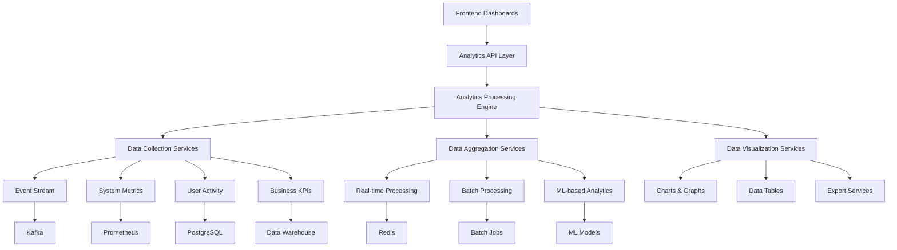

# 📊 Analytics System Documentatio

n

#

# Overvie

w

This document provides comprehensive documentation for Auterity's analytics system, including all dashboard variants, data flows, processing pipelines, and integration points with other system components.

#

# Table of Content

s

1. [Analytics Architecture]

(

#analytics-architecture

)

2. [Core Analytics Components]

(

#core-analytics-components

)

3. [Analytics Dashboard Variants]

(

#analytics-dashboard-variants

)

4. [Data Processing Pipeline]

(

#data-processing-pipeline

)

5. [Integration Points]

(

#integration-points

)

6. [Advanced Analytics Features]

(

#advanced-analytics-features

)

7. [Performance Considerations]

(

#performance-considerations

)

8. [Security & Compliance]

(

#security--complianc

e

)

#

# Analytics Architectur

e

#

## System Overview



#

## Component Locations

```

frontend/
├── src/
│   ├── components/
│   │   ├── analytics/
│   │   │   ├── AnalyticsDashboard.tsx
│   │   │   ├── WorkflowAnalyticsDashboard.tsx
│   │   │   ├── PredictiveOrchestrationDashboard.tsx
│   │   │   └── CrossFilterAnalyticsDashboard.tsx
│   │   └── charts/
│   │       ├── BarChart.tsx
│   │       ├── LineChart.tsx
│   │       └── optimized/
│   ├── api/
│   │   └── analytics.ts
│   └── hooks/
│       ├── useWorkflowAnalytics.ts
│       └── usePredictiveOrchestration.ts

services/
├── api/
│   └── src/
│       ├── app/
│       │   ├── api/
│       │   │   └── analytics.py
│       │   └── services/
│       │       ├── analytics_service.py
│       │       ├── advanced_analytics_service.py
│       │       └── predictive_modeling_service.py

```

#

# Core Analytics Component

s

#

## Analytics Service

**Location**: `services/api/src/app/services/analytics_service.py

`
**Purpose**: Core analytics data processing and aggregatio

n
**Features**

:

- Metric collectio

n

- Data aggregatio

n

- Time-series analysi

s

- Report generatio

n

```

python

# Analytics Service

class AnalyticsService:
    def __init__(self):
        self.metrics_collector = MetricsCollector()
        self.time_series_analyzer = TimeSeriesAnalyzer()
        self.report_generator = ReportGenerator()
        self.data_warehouse = DataWarehouse()

    async def get_metrics(
        self,
        metric_types: List[str],
        time_range: TimeRange,
        filters: Dict[str, Any] = None
    ) -> Dict[str, MetricData]:

        """Get metrics for specified types and time range"""
        raw_data = await self.metrics_collector.collect(
            metric_types,
            time_range,
            filters
        )

        aggregated = await self.aggregate_metrics(raw_data)
        return aggregated

    async def generate_report(
        self,
        report_type: str,
        parameters: Dict[str, Any]
    ) -> Report:

        """Generate analytics report"""
        report_data = await self.data_warehouse.query(
            report_type,
            parameters
        )

        return await self.report_generator.generate(
            report_type,
            report_data
        )

```

#

## Advanced Analytics Service

**Location**: `services/api/src/app/services/advanced_analytics_service.py

`
**Purpose**: Advanced analytics processing with ML capabilitie

s
**Features**

:

- Anomaly detectio

n

- Trend analysi

s

- Predictive modelin

g

- Pattern recognitio

n

```

python

# Advanced Analytics Service

class AdvancedAnalyticsService:
    def __init__(self):
        self.anomaly_detector = AnomalyDetector()
        self.trend_analyzer = TrendAnalyzer()
        self.predictive_modeler = PredictiveModeler()
        self.pattern_recognizer = PatternRecognizer()

    async def detect_anomalies(
        self,
        data: List[DataPoint],
        sensitivity: float = 0.8

    ) -> List[Anomaly]:

        """Detect anomalies in time series data"""
        return await self.anomaly_detector.detect(
            data,
            sensitivity
        )

    async def predict_trend(
        self,
        data: List[DataPoint],
        horizon: int = 24
    ) -> List[Prediction]:

        """Predict future trend based on historical data"""
        return await self.predictive_modeler.predict(
            data,
            horizon
        )

```

#

# Analytics Dashboard Variant

s

#

## Main Analytics Dashboard

**Location**: `frontend/src/components/analytics/AnalyticsDashboard.tsx

`
**Purpose**: Primary analytics overview dashboar

d
**Backend Integration**: `analytics_service.py

`
**Features**

:

- System-wide KPI

s

- Customizable metric

s

- Time range selectio

n

- Filtering capabilitie

s

```

typescript
// Analytics Dashboard Component
interface AnalyticsDashboardProps {
    timeRange: TimeRange;
    metrics: string[];
    filters?: Record<string, any>;
    refreshInterval?: number;
}

const AnalyticsDashboard: React.FC<AnalyticsDashboardProps> = ({
    timeRange,
    metrics,
    filters,
    refreshInterval = 60000
}) => {
    const [data, setData] = useState<MetricData[]>([]);
    const [loading, setLoading] = useState<boolean>(true);

    useEffect(() => {
        const fetchData = async () => {
            setLoading(true);
            try {
                const response = await api.analytics.getMetrics({
                    metrics,
                    timeRange,
                    filters
                });
                setData(response.data);
            } catch (error) {
                console.error('Failed to fetch analytics data', error);
            } finally {
                setLoading(false);
            }
        };

        fetchData();

        // Set up refresh interval
        const intervalId = setInterval(fetchData, refreshInterval);
        return () => clearInterval(intervalId);
    }, [timeRange, metrics, filters, refreshInterval]);

    return (
        <div className="analytics-dashboard">

            <DashboardHeader title="Analytics Dashboard" />

            <MetricGrid>
                {data.map(metric => (
                    <MetricCard
                        key={metric.id}
                        title={metric.name}
                        value={metric.value}
                        trend={metric.trend}
                        chart={metric.history}
                    />
                ))}
            </MetricGrid>

            <DetailedCharts data={data} />
        </div>
    );
};

```

#

## Workflow Analytics Dashboard

**Location**: `frontend/src/components/analytics/WorkflowAnalyticsDashboard.tsx

`
**Purpose**: Workflow-specific analytic

s
**Backend Integration**: `workflow_engine.py`, `analytics_service.py

`
**Features**

:

- Workflow execution metric

s

- Success/failure rate

s

- Performance analysi

s

- Bottleneck identificatio

n

```

typescript
// Workflow Analytics Dashboard
const WorkflowAnalyticsDashboard: React.FC<{
    workflowId?: string;
}> = ({ workflowId }) => {
    const { data, loading, error } = useWorkflowAnalytics(workflowId);

    if (loading) return <LoadingSpinner />;
    if (error) return <ErrorDisplay error={error} />;

    return (
        <div className="workflow-analytics-dashboard">

            <ExecutionMetrics
                successRate={data.successRate}
                averageDuration={data.averageDuration}
                totalExecutions={data.totalExecutions}
                failureRate={data.failureRate}
            />

            <ExecutionTrend data={data.executionHistory} />

            <PerformanceAnalysis
                bottlenecks={data.bottlenecks}
                resourceUtilization={data.resourceUtilization}
            />

            <ErrorAnalysis errors={data.errors} />
        </div>
    );
};

```

#

## Predictive Orchestration Dashboard

**Location**: `frontend/src/components/analytics/PredictiveOrchestrationDashboard.tsx

`
**Purpose**: AI-powered predictive analytic

s
**Backend Integration**: `predictive_modeling_service.py

`
**Features**

:

- Workflow predictio

n

- Resource optimizatio

n

- Anomaly detectio

n

- Trend forecastin

g

```

typescript
// Predictive Orchestration Dashboard
const PredictiveOrchestrationDashboard: React.FC = () => {
    const {
        predictions,
        anomalies,
        recommendations,
        loading
    } = usePredictiveOrchestration();

    return (
        <div className="predictive-dashboard">

            <PredictionSection
                title="Workflow Predictions"
                predictions={predictions.workflows}
            />

            <PredictionSection
                title="Resource Predictions"
                predictions={predictions.resources}
            />

            <AnomalyDetection anomalies={anomalies} />

            <OptimizationRecommendations
                recommendations={recommendations}
            />

            <ModelPerformance
                accuracy={predictions.modelMetrics.accuracy}
                precision={predictions.modelMetrics.precision}
                recall={predictions.modelMetrics.recall}
            />
        </div>
    );
};

```

#

## Cross-Filter Analytics Dashboar

d

**Location**: `frontend/src/components/CrossFilterAnalyticsDashboard.tsx

`
**Purpose**: Interactive cross-filtering analytic

s
**Backend Integration**: `advanced_analytics_service.py

`
**Features**

:

- Interactive filterin

g

- Cross-dimensional analysi

s

- Dynamic data exploratio

n

- Multi-metric correlatio

n

```

typescript
// Cross-Filter Analytics Dashboard

const CrossFilterAnalyticsDashboard: React.FC = () => {
    const [filters, setFilters] = useState<Filters>({});
    const [dimensions, setDimensions] = useState<string[]>([
        'time', 'workflow', 'user', 'status'
    ]);

    const { data, loading } = useAnalyticsData(dimensions, filters);

    const handleFilterChange = (dimension: string, value: any) => {
        setFilters(prev => ({
            ...prev,
            [dimension]: value
        }));
    };

    return (
        <div className="cross-filter-dashboard">

            <FilterPanel
                dimensions={dimensions}
                filters={filters}
                onFilterChange={handleFilterChange}
            />

            <div className="visualization-grid">

                {dimensions.map(dimension => (
                    <DimensionChart
                        key={dimension}
                        dimension={dimension}
                        data={data[dimension]}
                        onSelect={(value) => handleFilterChange(dimension, value)}
                    />
                ))}
            </div>

            <CorrelationMatrix data={data} dimensions={dimensions} />
        </div>
    );
};

```

#

# Data Processing Pipelin

e

#

## Data Collection

```

python

# Data Collection Service

class DataCollectionService:
    def __init__(self):
        self.event_collector = EventCollector()
        self.metric_collector = MetricCollector()
        self.activity_collector = ActivityCollector()
        self.kpi_collector = KPICollector()

    async def collect_data(
        self,
        sources: List[str],
        time_range: TimeRange
    ) -> Dict[str, List[DataPoint]]:

        """Collect data from multiple sources"""
        results = {}

        if 'events' in sources:
            results['events'] = await self.event_collector.collect(time_range)

        if 'metrics' in sources:
            results['metrics'] = await self.metric_collector.collect(time_range)

        if 'activity' in sources:
            results['activity'] = await self.activity_collector.collect(time_range)

        if 'kpis' in sources:
            results['kpis'] = await self.kpi_collector.collect(time_range)

        return results

```

#

## Data Aggregation

```

python

# Data Aggregation Service

class DataAggregationService:
    def __init__(self):
        self.time_aggregator = TimeAggregator()
        self.dimension_aggregator = DimensionAggregator()
        self.statistical_aggregator = StatisticalAggregator()

    async def aggregate_data(
        self,
        data: List[DataPoint],
        aggregation_config: AggregationConfig
    ) -> AggregatedData:

        """Aggregate data according to configuration"""


# Time-based aggregatio

n

        if aggregation_config.time_bucket:
            data = await self.time_aggregator.aggregate(
                data,
                aggregation_config.time_bucket
            )


# Dimension-based aggregatio

n

        if aggregation_config.dimensions:
            data = await self.dimension_aggregator.aggregate(
                data,
                aggregation_config.dimensions
            )


# Statistical aggregation

        if aggregation_config.statistics:
            data = await self.statistical_aggregator.aggregate(
                data,
                aggregation_config.statistics
            )

        return AggregatedData(data=data)

```

#

# Integration Point

s

#

## Analytics API

**Location**: `services/api/src/app/api/analytics.py

`
**Purpose**: REST API for analytics dat

a
**Endpoints**

:

- GET `/api/v1/analytics/metrics

`

- GET `/api/v1/analytics/dashboards

`

- POST `/api/v1/analytics/custom-reports

`

```

python

# Analytics API

@router.get("/metrics")
async def get_metrics(
    metric_types: List[str] = Query(...),
    start_time: datetime = Query(...),
    end_time: datetime = Query(...),
    filters: Dict[str, Any] = Query(None),
    current_user: User = Depends(get_current_user)
):
    """Get metrics for specified types and time range"""


# Authorize user

    await authorize_user(current_user, "analytics:read")


# Create time range

    time_range = TimeRange(start=start_time, end=end_time)


# Get metrics

    analytics_service = AnalyticsService()
    metrics = await analytics_service.get_metrics(
        metric_types,
        time_range,
        filters
    )

    return metrics

```

#

## Frontend Integration

**Location**: `frontend/src/api/analytics.ts

`
**Purpose**: API client for analytics dat

a
**Features**

:

- Data fetchin

g

- Response parsin

g

- Error handlin

g

- Cachin

g

```

typescript
// Analytics API Client
export const analyticsApi = {
    getMetrics: async ({
        metrics,
        timeRange,
        filters
    }: GetMetricsParams): Promise<MetricData[]> => {
        const params = new URLSearchParams();

        // Add metric types
        metrics.forEach(metric => {
            params.append('metric_types', metric);
        });

        // Add time range
        params.append('start_time', timeRange.start.toISOString());
        params.append('end_time', timeRange.end.toISOString());

        // Add filters
        if (filters) {
            params.append('filters', JSON.stringify(filters));
        }

        const response = await apiClient.get(
            '/api/v1/analytics/metrics',
            { params }
        );

        return response.data;
    },

    getDashboards: async (): Promise<Dashboard[]> => {
        const response = await apiClient.get('/api/v1/analytics/dashboards');
        return response.data;
    },

    generateReport: async (
        reportType: string,
        parameters: Record<string, any>
    ): Promise<Report> => {
        const response = await apiClient.post(
            '/api/v1/analytics/custom-reports',

            {
                reportType,
                parameters
            }
        );

        return response.data;
    }
};

```

#

## Hooks Integration

**Location**: `frontend/src/hooks/useWorkflowAnalytics.ts

`
**Purpose**: React hook for workflow analytic

s
**Features**

:

- Data fetchin

g

- State managemen

t

- Real-time update

s

- Error handlin

g

```

typescript
// Workflow Analytics Hook
export const useWorkflowAnalytics = (
    workflowId?: string,
    options: WorkflowAnalyticsOptions = {}
) => {
    const {
        timeRange = {
            start: subDays(new Date(), 7),
            end: new Date()
        },
        refreshInterval = 60000,
        metrics = ['execution_rate', 'success_rate', 'duration', 'errors']
    } = options;

    const [data, setData] = useState<WorkflowAnalyticsData | null>(null);
    const [loading, setLoading] = useState<boolean>(true);
    const [error, setError] = useState<Error | null>(null);

    useEffect(() => {
        const fetchData = async () => {
            try {
                setLoading(true);

                const response = await analyticsApi.getMetrics({
                    metrics,
                    timeRange,
                    filters: workflowId ? { workflow_id: workflowId } : undefined
                });

                const processedData = processWorkflowAnalyticsData(response);
                setData(processedData);
                setError(null);
            } catch (err) {
                setError(err as Error);
            } finally {
                setLoading(false);
            }
        };

        fetchData();

        const intervalId = setInterval(fetchData, refreshInterval);
        return () => clearInterval(intervalId);
    }, [workflowId, timeRange, refreshInterval, metrics]);

    return { data, loading, error };
};

```

#

# Advanced Analytics Feature

s

#

## Anomaly Detection

```

python

# Anomaly Detection Service

class AnomalyDetectionService:
    def __init__(self):
        self.models = {
            'time_series': TimeSeriesAnomalyDetector(),
            'statistical': StatisticalAnomalyDetector(),
            'clustering': ClusteringAnomalyDetector()
        }

    async def detect_anomalies(
        self,
        data: List[DataPoint],
        method: str = 'time_series',
        sensitivity: float = 0.8

    ) -> List[Anomaly]:

        """Detect anomalies in data"""
        detector = self.models.get(method)
        if not detector:
            raise ValueError(f"Unknown anomaly detection method: {method}")

        return await detector.detect(data, sensitivity)

```

#

## Predictive Modeling

```

python

# Predictive Modeling Service

class PredictiveModelingService:
    def __init__(self):
        self.models = {
            'time_series': TimeSeriesPredictor(),
            'regression': RegressionPredictor(),
            'classification': ClassificationPredictor()
        }
        self.model_registry = ModelRegistry()

    async def predict(
        self,
        data: List[DataPoint],
        target: str,
        method: str = 'time_series',
        horizon: int = 24
    ) -> List[Prediction]:

        """Generate predictions for target variable"""
        predictor = self.models.get(method)
        if not predictor:
            raise ValueError(f"Unknown prediction method: {method}")

        model = await self.model_registry.get_model(target, method)
        return await predictor.predict(data, model, horizon)

```

#

# Performance Consideration

s

#

## Data Optimization

```

python

# Data Optimization Service

class DataOptimizationService:
    def __init__(self):
        self.downsampler = Downsampler()
        self.aggregator = Aggregator()
        self.cache = CacheManager()

    async def optimize_data(
        self,
        data: List[DataPoint],
        target_points: int = 1000
    ) -> List[DataPoint]:

        """Optimize data for visualization"""
        if len(data) <= target_points:
            return data

        return await self.downsampler.downsample(
            data,
            target_points
        )

    async def get_cached_data(
        self,
        key: str,
        fetcher: Callable,
        ttl: int = 300
    ) -> Any:

        """Get data from cache or fetch it"""
        cached = await self.cache.get(key)
        if cached:
            return cached

        data = await fetcher()
        await self.cache.set(key, data, ttl)
        return data

```

#

## Query Optimization

```

python

# Query Optimization Service

class QueryOptimizationService:
    def __init__(self):
        self.query_planner = QueryPlanner()
        self.query_cache = QueryCache()
        self.query_analyzer = QueryAnalyzer()

    async def optimize_query(
        self,
        query: Query
    ) -> Query:

        """Optimize query for performance"""


# Analyze query

        analysis = await self.query_analyzer.analyze(query)


# Check if query is cached

        cached = await self.query_cache.get(query)
        if cached:
            return cached


# Optimize query

        optimized = await self.query_planner.optimize(
            query,
            analysis
        )


# Cache optimized query

        await self.query_cache.set(query, optimized)

        return optimized

```

#

# Security & Complianc

e

#

## Data Access Control

```

python

# Data Access Control Service

class DataAccessControlService:
    def __init__(self):
        self.policy_engine = PolicyEngine()
        self.access_logger = AccessLogger()

    async def authorize_access(
        self,
        user: User,
        resource: str,
        action: str
    ) -> bool:

        """Authorize data access"""


# Check user permissions

        allowed = await self.policy_engine.evaluate(
            user,
            resource,
            action
        )


# Log access attempt

        await self.access_logger.log(
            user,
            resource,
            action,
            allowed
        )

        return allowed

    async def filter_data(
        self,
        user: User,
        data: List[DataPoint]
    ) -> List[DataPoint]:

        """Filter data based on user permissions"""


# Get user data access policy

        policy = await self.policy_engine.get_data_policy(user)


# Apply policy filters

        return [
            point for point in data
            if await policy.allows_access(point)
        ]

```

#

## Audit Logging

```

python

# Analytics Audit Service

class AnalyticsAuditService:
    def __init__(self):
        self.audit_logger = AuditLogger()

    async def log_analytics_access(
        self,
        user: User,
        metrics: List[str],
        filters: Dict[str, Any]
    ) -> None:

        """Log analytics access for audit purposes"""
        await self.audit_logger.log({
            'event_type': 'analytics_access',
            'user_id': user.id,
            'user_role': user.role,
            'metrics': metrics,
            'filters': filters,
            'timestamp': datetime.utcnow()
        })

    async def log_report_generation(
        self,
        user: User,
        report_type: str,
        parameters: Dict[str, Any]
    ) -> None:

        """Log report generation for audit purposes"""
        await self.audit_logger.log({
            'event_type': 'report_generation',
            'user_id': user.id,
            'user_role': user.role,
            'report_type': report_type,
            'parameters': parameters,
            'timestamp': datetime.utcnow()
        })

```

This documentation provides a comprehensive overview of Auterity's analytics system, covering all dashboard variants, data processing pipelines, integration points, and advanced features. For specific implementation details or advanced usage patterns, refer to the individual component documentation or contact the development team.
