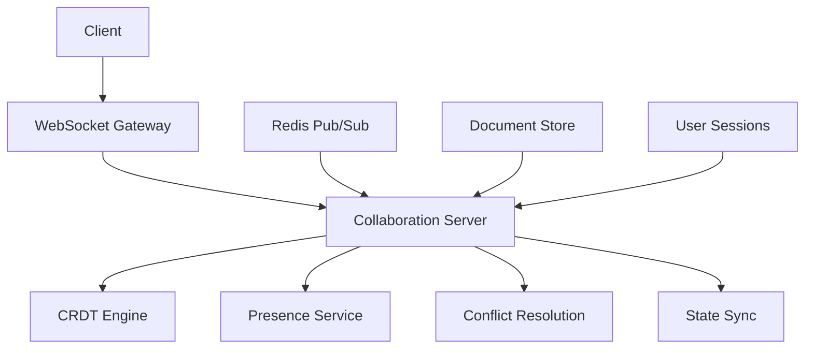

# 👥 Real-Time Collaboration Documentati

o

n

#

# Overvie

w

This document provides comprehensive documentation for Auterity's real-time collaboration features, including shared editing, presence awareness, and collaborative workflows

.

#

# Table of Content

s

1. [Architecture Overview]

(

#architecture-overview

)

2. [Core Features]

(

#core-features

)

3. [Implementation Details]

(

#implementation-details

)

4. [Integration Points]

(

#integration-points

)

5. [Performance Optimization]

(

#performance-optimization

)

6. [Security Considerations]

(

#security-considerations

)

7. [Development Guidelines]

(

#development-guidelines

)

8. [Testing Strategy]

(

#testing-strateg

y

)

#

# Architecture Overvie

w

#

## System Architecture



#

## Component Locations

```

frontend/src/
├── collaboration/
│   ├── components/
│   │   ├── CollaborativeEditor.tsx
│   │   ├── PresenceIndicator.tsx
│   │   └── CursorOverlay.tsx
│   ├── hooks/
│   │   ├── useCollaboration.ts
│   │   └── usePresence.ts
│   └── services/
│       ├── collaborationService.ts
│       └── presenceService.ts

backend/services/
├── collaboration/
│   ├── server.ts
│   ├── crdt.ts
│   └── presence.ts

```

#

# Core Feature

s

#

## Collaborative Editing

**Location**: `frontend/src/collaboration/components/CollaborativeEditor.tsx

`
**Purpose**: Real-time shared document editin

g
**Features**

:

- CRDT-based synchronizatio

n

- Conflict resolutio

n

- History trackin

g

- Offline suppor

t

```

typescript
// Collaborative Editor Component
interface CollaborativeEditor {
    documentId: string;
    userId: string;
    mode: 'code' | 'text' | 'diagram';
    permissions: Permissions;
}

class CollaborativeEditorComponent extends Component<CollaborativeEditor> {
    private crdt: CRDTDocument;
    private sync: SyncManager;
    private history: HistoryManager;

    async componentDidMount(): Promise<void> {
        this.crdt = await this.initializeCRDT();
        this.sync = await this.initializeSync();
        this.history = await this.initializeHistory();

        await this.sync.connect();
        await this.loadDocument();
    }

    private async handleChange(
        change: Change
    ): Promise<void> {
        const operation = this.crdt.createOperation(change);
        await this.sync.broadcast(operation);
        await this.history.record(operation);
    }
}

```

#

## Presence Awareness

**Location**: `frontend/src/collaboration/components/PresenceIndicator.tsx

`
**Purpose**: Real-time user presence trackin

g
**Features**

:

- Cursor position

s

- Selection range

s

- User statu

s

- Activity indicator

s

```

typescript
// Presence System
interface Presence {
    userId: string;
    cursor: Position;
    selection: Range;
    status: 'active' | 'idle' | 'offline';
    lastActivity: Date;
}

class PresenceManager {
    private presence: Map<string, Presence> = new Map();
    private broadcast: PresenceBroadcast;

    async updatePresence(
        userId: string,
        update: Partial<Presence>
    ): Promise<void> {
        const current = this.presence.get(userId) || {
            userId,
            status: 'offline',
            lastActivity: new Date()
        };

        const updated = {
            ...current,
            ...update,
            lastActivity: new Date()
        };

        this.presence.set(userId, updated);
        await this.broadcast.update(updated);
    }
}

```

#

## Conflict Resolution

**Location**: `backend/services/collaboration/crdt.ts

`
**Purpose**: Automatic conflict resolutio

n
**Features**

:

- CRDT operation

s

- Causality trackin

g

- State mergin

g

- Consistency verificatio

n

```

typescript
// CRDT Implementation
class CRDTDocument {
    private state: CRDTState;
    private vector: VectorClock;

    async applyOperation(
        operation: Operation
    ): Promise<void> {
        // Validate causality
        if (!this.vector.isCausallyReady(operation)) {
            await this.queue.enqueue(operation);
            return;
        }

        // Apply operation
        this.state = this.state.apply(operation);
        this.vector.increment(operation.site);

        // Process queue
        await this.processQueue();
    }

    async merge(
        remote: CRDTState
    ): Promise<void> {
        this.state = this.state.merge(remote);
        await this.broadcast.sync(this.state);
    }
}

```

#

# Implementation Detail

s

#

## WebSocket Integration

```

typescript
// WebSocket Manager
class WebSocketManager {
    private socket: WebSocket;
    private reconnect: ReconnectStrategy;
    private messageQueue: MessageQueue;

    async connect(): Promise<void> {
        this.socket = await this.createSocket();

        this.socket.onmessage = (event) => {
            this.handleMessage(event.data);
        };

        this.socket.onclose = () => {
            this.handleDisconnect();
        };
    }

    private async handleDisconnect(): Promise<void> {
        await this.messageQueue.pause();
        await this.reconnect.attempt();
    }
}

```

#

## State Synchronization

```

typescript
// State Sync Manager
class StateSyncManager {
    private store: DocumentStore;
    private diff: DiffGenerator;
    private merge: MergeResolver;

    async synchronize(
        clientState: DocumentState,
        serverState: DocumentState
    ): Promise<SyncResult> {
        const diff = await this.diff.generate(
            clientState,
            serverState
        );

        if (diff.hasConflicts) {
            return await this.resolveConflicts(diff);
        }

        return await this.merge.apply(diff);
    }
}

```

#

## Offline Support

```

typescript
// Offline Manager
class OfflineManager {
    private storage: LocalStorage;
    private queue: OperationQueue;
    private sync: SyncManager;

    async handleOffline(): Promise<void> {
        await this.queue.start();
        await this.enableOfflineMode();
    }

    async handleOnline(): Promise<void> {
        const operations = await this.queue.flush();
        await this.sync.batchSync(operations);
        await this.disableOfflineMode();
    }
}

```

#

# Integration Point

s

#

## Editor Integration

```

typescript
// Editor Integration
class EditorIntegration {
    private editor: CodeEditor;
    private collaboration: CollaborationService;
    private presence: PresenceService;

    async initialize(): Promise<void> {
        await this.setupCollaboration();
        await this.setupPresence();
        await this.setupSync();
    }

    private async handleEditorChange(
        change: EditorChange
    ): Promise<void> {
        const operation = this.createOperation(change);
        await this.collaboration.broadcast(operation);
        await this.presence.updateCursor(change.cursor);
    }
}

```

#

## Version Control Integration

```

typescript
// Version Control Integration
class VCSIntegration {
    private vcs: VersionControl;
    private collaboration: CollaborationService;

    async commit(
        changes: Changes
    ): Promise<void> {
        // Ensure collaboration is synced
        await this.collaboration.waitForSync();

        // Create commit
        const commit = await this.vcs.createCommit(
            changes
        );

        // Notify collaborators
        await this.collaboration.notifyCommit(commit);
    }
}

```

#

# Performance Optimizatio

n

#

## Operation Batching

```

typescript
// Operation Batcher
class OperationBatcher {
    private batch: Operation[] = [];
    private timeout: number = 50; // ms
    private maxSize: number = 100;

    async addOperation(
        operation: Operation
    ): Promise<void> {
        this.batch.push(operation);

        if (this.shouldFlush()) {
            await this.flush();
        } else {
            this.scheduleFlush();
        }
    }

    private shouldFlush(): boolean {
        return this.batch.length >= this.maxSize;
    }

    private async flush(): Promise<void> {
        const operations = [...this.batch];
        this.batch = [];

        await this.broadcast.send(operations);
    }
}

```

#

## State Compression

```

typescript
// State Compressor
class StateCompressor {
    private compress(
        state: DocumentState
    ): CompressedState {
        return {
            base: this.getBaseState(state),
            operations: this.getRecentOperations(state),
            metadata: this.getMetadata(state)
        };
    }

    private decompress(
        compressed: CompressedState
    ): DocumentState {
        const base = this.applyBaseState(
            compressed.base
        );

        return this.applyOperations(
            base,
            compressed.operations
        );
    }
}

```

#

# Security Consideration

s

#

## Access Control

```

typescript
// Access Control
class CollaborationAccessControl {
    private acl: AccessControlList;
    private auth: AuthenticationService;

    async checkAccess(
        user: User,
        document: Document,
        operation: Operation
    ): Promise<boolean> {
        // Verify authentication
        if (!await this.auth.verify(user)) {
            return false;
        }

        // Check permissions
        const permissions = await this.acl.get(
            user,
            document
        );

        return this.canPerformOperation(
            permissions,
            operation
        );
    }
}

```

#

## Data Validation

```

typescript
// Data Validator
class CollaborationValidator {
    async validateOperation(
        operation: Operation
    ): Promise<ValidationResult> {
        // Validate structure
        if (!this.isValidStructure(operation)) {
            return { valid: false, error: 'Invalid structure' };
        }

        // Validate content
        if (!this.isValidContent(operation)) {
            return { valid: false, error: 'Invalid content' };
        }

        // Validate permissions
        if (!await this.hasPermission(operation)) {
            return { valid: false, error: 'Permission denied' };
        }

        return { valid: true };
    }
}

```

#

# Development Guideline

s

#

## Component Development

```

typescript
// Collaborative Component Template
abstract class CollaborativeComponent<T> extends Component<T> {
    protected collaboration: CollaborationService;
    protected presence: PresenceService;

    async componentDidMount(): Promise<void> {
        await this.initializeCollaboration();
        await this.initializePresence();
        await this.subscribeToChanges();
    }

    protected abstract handleCollaborativeChange(
        change: Change
    ): Promise<void>;

    protected abstract handlePresenceUpdate(
        presence: Presence
    ): Promise<void>;
}

```

#

## Testing Strategy

```

typescript
// Collaboration Test Suite
class CollaborationTestSuite {
    private testUsers: TestUser[] = [];
    private testDocuments: TestDocument[] = [];

    async testConcurrentEditing(): Promise<void> {
        // Setup test environment
        const users = await this.createTestUsers(3);
        const document = await this.createTestDocument();

        // Simulate concurrent edits
        await Promise.all(
            users.map(user =>
                this.simulateEditing(user, document)
            )
        );

        // Verify consistency
        await this.verifyDocumentConsistency(
            document,
            users
        );
    }
}

```

This documentation provides a comprehensive overview of Auterity's real-time collaboration features. For specific implementation details or advanced patterns, refer to the individual component documentation or contact the development team

.
