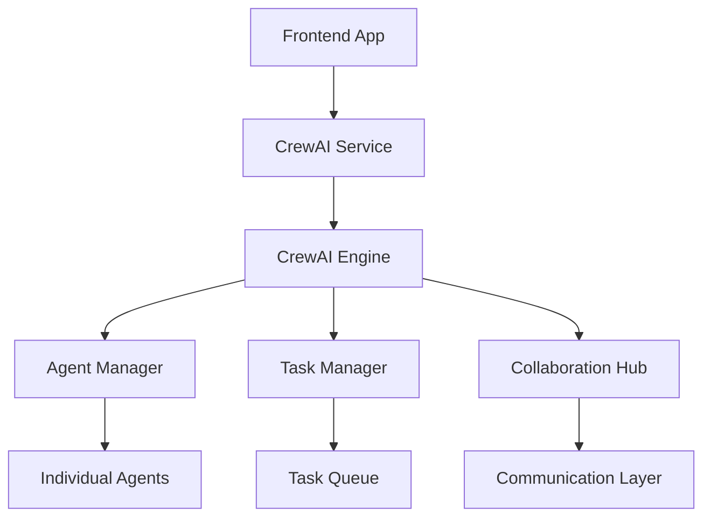

# CrewAI API Documentation

## Overview

CrewAI is a framework for orchestrating role-playing autonomous AI agents. This documentation covers the integration of CrewAI within the Auterity Unified AI Platform, providing comprehensive API documentation for building and managing multi-agent systems.

## Architecture

### Core Components



### Service Architecture

```
┌─────────────────┐    ┌─────────────────┐    ┌─────────────────┐
│   Frontend      │    │   CrewAI        │    │   Backend       │
│   Components    │◄──►│   Service       │◄──►│   Services      │
└─────────────────┘    └─────────────────┘    └─────────────────┘
         │                       │                       │
         └───────────────────────┼───────────────────────┘
                                 │
                    ┌─────────────────┐
                    │   CrewAI        │
                    │   Multi-Agent   │
                    │   System        │
                    └─────────────────┘
```

## API Reference

### Base URL

```
https://api.auterity.com/v1/ai/crewai
```

### Authentication

All API requests require authentication using Bearer tokens:

```bash
Authorization: Bearer <your_api_token>
```

### Error Handling

All endpoints return standard HTTP status codes with detailed error messages:

```json
{
  "error": {
    "code": "VALIDATION_ERROR",
    "message": "Invalid crew configuration",
    "details": {
      "field": "agents",
      "issue": "Agent role cannot be empty"
    }
  },
  "timestamp": "2024-01-15T10:30:00Z",
  "request_id": "req_123456789"
}
```

## Crew Management APIs

### Create Crew

Create a new multi-agent crew with specified configuration.

```http
POST /crews
```

**Request Body:**

```json
{
  "name": "Content Creation Team",
  "description": "A collaborative team for creating marketing content",
  "version": "1.0.0",
  "agents": [
    {
      "name": "Research Analyst",
      "role": "Senior Research Analyst",
      "goal": "Conduct thorough research and provide comprehensive analysis",
      "backstory": "You are an experienced research analyst with 10+ years in market research...",
      "llm": {
        "model": "gpt-4",
        "temperature": 0.3,
        "max_tokens": 2000
      },
      "tools": [
        {
          "name": "web_search",
          "description": "Search the web for information",
          "parameters": {
            "query": "string",
            "num_results": "integer"
          }
        },
        {
          "name": "data_analyzer",
          "description": "Analyze data and extract insights",
          "parameters": {
            "data": "object",
            "analysis_type": "string"
          }
        }
      ],
      "memory": {
        "type": "conversation",
        "max_items": 100
      },
      "verbose": true,
      "allow_delegation": true
    },
    {
      "name": "Content Writer",
      "role": "Creative Content Writer",
      "goal": "Create engaging and compelling content based on research",
      "backstory": "You are a skilled content writer with expertise in marketing copy...",
      "llm": {
        "model": "gpt-4",
        "temperature": 0.7,
        "max_tokens": 3000
      },
      "tools": [
        {
          "name": "content_generator",
          "description": "Generate content based on specifications",
          "parameters": {
            "topic": "string",
            "tone": "string",
            "length": "string"
          }
        }
      ],
      "verbose": true,
      "allow_delegation": false
    },
    {
      "name": "Editor",
      "role": "Senior Content Editor",
      "goal": "Review and edit content for quality, accuracy, and engagement",
      "backstory": "You are an experienced editor with expertise in content quality...",
      "llm": {
        "model": "gpt-4",
        "temperature": 0.2,
        "max_tokens": 1500
      },
      "tools": [
        {
          "name": "grammar_checker",
          "description": "Check grammar and style",
          "parameters": {
            "text": "string"
          }
        },
        {
          "name": "seo_optimizer",
          "description": "Optimize content for SEO",
          "parameters": {
            "content": "string",
            "keywords": "array"
          }
        }
      ],
      "verbose": true,
      "allow_delegation": true
    }
  ],
  "tasks": [
    {
      "description": "Research the latest trends in AI technology and market adoption",
      "expected_output": "Comprehensive research report with key findings, statistics, and insights",
      "agent": "Research Analyst",
      "async_execution": false,
      "context": [
        "Current market trends",
        "Technology adoption rates",
        "Competitive landscape",
        "Future projections"
      ],
      "output_file": "research_report.md"
    },
    {
      "description": "Create engaging blog post about AI trends based on research findings",
      "expected_output": "Well-written, SEO-optimized blog post ready for publication",
      "agent": "Content Writer",
      "async_execution": false,
      "context": [
        "Use research findings from previous task",
        "Target audience: tech-savvy business professionals",
        "Tone: informative and engaging",
        "Include actionable insights"
      ],
      "output_file": "ai_trends_blog_post.md"
    },
    {
      "description": "Review and edit the blog post for quality, accuracy, and engagement",
      "expected_output": "Polished, publication-ready blog post with editorial feedback",
      "agent": "Editor",
      "async_execution": false,
      "context": [
        "Check factual accuracy against research",
        "Ensure engaging narrative flow",
        "Optimize for SEO and readability",
        "Provide editorial suggestions"
      ],
      "output_file": "edited_blog_post.md"
    }
  ],
  "process": "sequential",
  "verbose": true,
  "memory": true,
  "cache": true,
  "max_rpm": 10,
  "manager_llm": {
    "model": "gpt-4",
    "temperature": 0.1
  },
  "function_calling_llm": {
    "model": "gpt-4",
    "temperature": 0.1
  },
  "metadata": {
    "created_by": "user123",
    "tags": ["content-creation", "marketing", "ai"],
    "business_unit": "marketing",
    "priority": "high"
  }
}
```

**Response:**

```json
{
  "crew_id": "crew_123456789",
  "status": "created",
  "created_at": "2024-01-15T10:30:00Z",
  "crew_url": "/crews/crew_123456789",
  "execution_url": "/crews/crew_123456789/execute",
  "configuration": {
    "agents_count": 3,
    "tasks_count": 3,
    "process": "sequential"
  }
}
```

### Get Crew

Retrieve a specific crew configuration and metadata.

```http
GET /crews/{crew_id}
```

**Response:**

```json
{
  "crew_id": "crew_123456789",
  "name": "Content Creation Team",
  "description": "A collaborative team for creating marketing content",
  "version": "1.0.0",
  "status": "active",
  "created_at": "2024-01-15T10:30:00Z",
  "updated_at": "2024-01-15T10:35:00Z",
  "agents": [ ... ],
  "tasks": [ ... ],
  "process": "sequential",
  "metadata": { ... },
  "stats": {
    "total_executions": 45,
    "successful_executions": 42,
    "failed_executions": 3,
    "average_execution_time": 125.8,
    "last_execution": "2024-01-15T10:25:00Z"
  }
}
```

### Update Crew

Update an existing crew's configuration.

```http
PUT /crews/{crew_id}
```

**Request Body:** (same as create, but all fields optional)

### Delete Crew

Delete a crew and all its associated data.

```http
DELETE /crews/{crew_id}
```

### List Crews

Retrieve a paginated list of crews.

```http
GET /crews
```

**Query Parameters:**

- `page`: Page number (default: 1)
- `limit`: Items per page (default: 20, max: 100)
- `status`: Filter by status (active, inactive, archived)
- `tags`: Filter by tags (comma-separated)
- `created_by`: Filter by creator
- `search`: Search in name and description

**Response:**

```json
{
  "crews": [
    {
      "crew_id": "crew_123456789",
      "name": "Content Creation Team",
      "status": "active",
      "created_at": "2024-01-15T10:30:00Z",
      "updated_at": "2024-01-15T10:35:00Z",
      "tags": ["content-creation", "marketing", "ai"],
      "agents_count": 3,
      "tasks_count": 3
    }
  ],
  "pagination": {
    "page": 1,
    "limit": 20,
    "total": 15,
    "total_pages": 1
  }
}
```

## Execution APIs

### Execute Crew

Execute a crew with the provided input and tasks.

```http
POST /crews/{crew_id}/execute
```

**Request Body:**

```json
{
  "input": {
    "topic": "The Future of AI in Healthcare",
    "target_audience": "Healthcare professionals and administrators",
    "content_type": "blog_post",
    "word_count": 1500,
    "keywords": ["AI healthcare", "medical diagnosis", "patient care", "technology adoption"],
    "tone": "professional_informative",
    "deadline": "2024-01-20T00:00:00Z"
  },
  "config": {
    "max_iterations": 10,
    "step_callback": true,
    "memory": true,
    "cache": true,
    "verbose": true
  },
  "metadata": {
    "source": "api",
    "user_id": "user456",
    "correlation_id": "req_789",
    "priority": "high"
  }
}
```

**Response:**

```json
{
  "execution_id": "exec_987654321",
  "status": "completed",
  "output": {
    "final_result": "# The Future of AI in Healthcare\n\n## Executive Summary\n\nArtificial Intelligence is revolutionizing healthcare delivery...",
    "task_outputs": [
      {
        "task_id": "research_task",
        "agent": "Research Analyst",
        "output": "Research findings on AI in healthcare...",
        "duration": 45.2,
        "tokens_used": 1250
      },
      {
        "task_id": "writing_task",
        "agent": "Content Writer",
        "output": "Draft blog post content...",
        "duration": 67.8,
        "tokens_used": 2100
      },
      {
        "task_id": "editing_task",
        "agent": "Editor",
        "output": "Edited and polished final content...",
        "duration": 23.4,
        "tokens_used": 890
      }
    ],
    "usage_metrics": {
      "total_tokens": 4240,
      "total_cost": 0.021,
      "execution_time": 136.4
    }
  },
  "execution_time": 136.4,
  "completed_at": "2024-01-15T10:32:16Z"
}
```

### Execute Crew Streaming

Execute a crew with real-time streaming of agent activities and results.

```http
POST /crews/{crew_id}/execute/stream
```

**Response:** Server-Sent Events (SSE) stream

```javascript
// Event: crew_start
{
  "event": "crew_start",
  "execution_id": "exec_987654321",
  "crew_id": "crew_123456789",
  "timestamp": "2024-01-15T10:30:00Z"
}

// Event: task_start
{
  "event": "task_start",
  "execution_id": "exec_987654321",
  "task_id": "research_task",
  "agent": "Research Analyst",
  "timestamp": "2024-01-15T10:30:01Z"
}

// Event: agent_action
{
  "event": "agent_action",
  "execution_id": "exec_987654321",
  "agent": "Research Analyst",
  "action": "Using tool: web_search",
  "parameters": {
    "query": "AI healthcare trends 2024",
    "num_results": 10
  },
  "timestamp": "2024-01-15T10:30:05Z"
}

// Event: agent_thought
{
  "event": "agent_thought",
  "execution_id": "exec_987654321",
  "agent": "Research Analyst",
  "thought": "I found several recent studies on AI adoption in healthcare...",
  "timestamp": "2024-01-15T10:30:12Z"
}

// Event: task_complete
{
  "event": "task_complete",
  "execution_id": "exec_987654321",
  "task_id": "research_task",
  "agent": "Research Analyst",
  "output": "Research findings...",
  "duration": 45.2,
  "timestamp": "2024-01-15T10:30:46Z"
}

// Event: crew_complete
{
  "event": "crew_complete",
  "execution_id": "exec_987654321",
  "final_output": "Final blog post content...",
  "execution_time": 136.4,
  "timestamp": "2024-01-15T10:32:16Z"
}
```

### Get Execution Status

Check the status of a running crew execution.

```http
GET /executions/{execution_id}
```

**Response:**

```json
{
  "execution_id": "exec_987654321",
  "crew_id": "crew_123456789",
  "status": "running",
  "current_task": "writing_task",
  "current_agent": "Content Writer",
  "progress": 0.67,
  "started_at": "2024-01-15T10:30:00Z",
  "estimated_completion": "2024-01-15T10:32:00Z",
  "completed_tasks": 1,
  "total_tasks": 3,
  "usage_metrics": {
    "tokens_used": 1250,
    "cost_so_far": 0.006,
    "execution_time": 46.2
  }
}
```

### Cancel Execution

Cancel a running crew execution.

```http
POST /executions/{execution_id}/cancel
```

### List Executions

Get execution history for a crew.

```http
GET /crews/{crew_id}/executions
```

**Query Parameters:**

- `status`: Filter by status (completed, failed, running, cancelled)
- `start_date`: Filter by start date
- `end_date`: Filter by end date
- `user_id`: Filter by user who initiated execution

## Agent Management APIs

### Create Agent

Create a new agent for use in crews.

```http
POST /agents
```

**Request Body:**

```json
{
  "name": "Data Scientist",
  "role": "Senior Data Science Analyst",
  "goal": "Analyze data and provide insights for business decisions",
  "backstory": "You are an experienced data scientist with expertise in machine learning...",
  "llm": {
    "model": "gpt-4",
    "temperature": 0.2,
    "max_tokens": 2000
  },
  "tools": [
    {
      "name": "data_analyzer",
      "description": "Analyze datasets and extract insights",
      "parameters": {
        "data": "object",
        "analysis_type": "string"
      }
    },
    {
      "name": "visualization_generator",
      "description": "Create data visualizations",
      "parameters": {
        "data": "object",
        "chart_type": "string"
      }
    }
  ],
  "memory": {
    "type": "conversation",
    "max_items": 50
  },
  "verbose": true,
  "allow_delegation": true,
  "max_iter": 5,
  "max_rpm": 10,
  "tags": ["data-science", "analytics", "ml"],
  "metadata": {
    "created_by": "user123",
    "department": "data_science"
  }
}
```

### Get Agent

Get details of a specific agent.

```http
GET /agents/{agent_id}
```

### Update Agent

Update an agent's configuration.

```http
PUT /agents/{agent_id}
```

### Delete Agent

Delete an agent.

```http
DELETE /agents/{agent_id}
```

### List Agents

Get all available agents.

```http
GET /agents
```

## Tool Management APIs

### Register Tool

Register a custom tool for use by agents.

```http
POST /tools
```

**Request Body:**

```json
{
  "name": "web_scraper",
  "description": "Scrape web pages and extract structured data",
  "category": "data_collection",
  "parameters": {
    "type": "object",
    "properties": {
      "url": {
        "type": "string",
        "description": "URL to scrape"
      },
      "selectors": {
        "type": "object",
        "description": "CSS selectors for data extraction",
        "properties": {
          "title": { "type": "string" },
          "content": { "type": "string" },
          "metadata": { "type": "object" }
        }
      },
      "follow_links": {
        "type": "boolean",
        "description": "Whether to follow links",
        "default": false
      }
    },
    "required": ["url"]
  },
  "implementation": {
    "type": "function",
    "runtime": "python",
    "code": "def web_scraper(url, selectors, follow_links=False): ...",
    "dependencies": ["beautifulsoup4", "requests"]
  },
  "metadata": {
    "tags": ["web", "scraping", "data-collection"],
    "cost_per_call": 0.005,
    "rate_limit": 10,
    "timeout": 30
  }
}
```

### List Tools

Get all available tools.

```http
GET /tools
```

### Get Tool

Get details of a specific tool.

```http
GET /tools/{tool_id}
```

### Update Tool

Update a tool's configuration.

```http
PUT /tools/{tool_id}
```

### Delete Tool

Delete a tool.

```http
DELETE /tools/{tool_id}
```

## Task Management APIs

### Create Task

Create a reusable task template.

```http
POST /tasks
```

**Request Body:**

```json
{
  "name": "Market Research Analysis",
  "description": "Conduct comprehensive market research and analysis",
  "expected_output": "Detailed market research report with insights and recommendations",
  "context": [
    "Industry trends",
    "Competitive landscape",
    "Customer preferences",
    "Market opportunities"
  ],
  "tools_required": ["web_search", "data_analyzer", "report_generator"],
  "estimated_duration": 45,
  "difficulty": "medium",
  "tags": ["research", "analysis", "market"],
  "metadata": {
    "created_by": "user123",
    "department": "research"
  }
}
```

### Get Task

Get details of a specific task template.

```http
GET /tasks/{task_id}
```

### Update Task

Update a task template.

```http
PUT /tasks/{task_id}
```

### Delete Task

Delete a task template.

```http
DELETE /tasks/{task_id}
```

### List Tasks

Get all available task templates.

```http
GET /tasks
```

## Process Types

### Sequential Process

Tasks are executed one after another in order.

```json
{
  "process": "sequential",
  "task_order": ["research", "analysis", "reporting"]
}
```

### Hierarchical Process

Tasks are organized in a hierarchical structure with a manager agent.

```json
{
  "process": "hierarchical",
  "manager_agent": "Project Manager",
  "task_hierarchy": {
    "research": {
      "subtasks": ["market_research", "competitor_analysis"],
      "assigned_agent": "Research Analyst"
    },
    "content_creation": {
      "subtasks": ["draft_content", "edit_content"],
      "assigned_agent": "Content Writer"
    }
  }
}
```

### Collaborative Process

All agents work together on all tasks simultaneously.

```json
{
  "process": "collaborative",
  "communication_channels": ["shared_memory", "direct_messaging"],
  "consensus_mechanism": "majority_vote"
}
```

## SDK Integration

### JavaScript/TypeScript SDK

```typescript
import { CrewAIClient } from '@auterity/crewai-sdk';

const client = new CrewAIClient({
  apiKey: 'your_api_key',
  baseUrl: 'https://api.auterity.com/v1/ai/crewai'
});

// Create a crew
const crew = await client.crews.create({
  name: 'Research Team',
  agents: [...],
  tasks: [...],
  process: 'sequential'
});

// Execute the crew
const result = await client.crews.execute(crew.id, {
  input: { topic: 'AI in Healthcare' }
});

// Stream execution results
const stream = await client.crews.executeStream(crew.id, {
  input: { topic: 'AI in Healthcare' }
});

for await (const event of stream) {
  console.log(event.event, event.data);
}
```

### Python SDK

```python
from auterity_crewai import CrewAIClient

client = CrewAIClient(
    api_key='your_api_key',
    base_url='https://api.auterity.com/v1/ai/crewai'
)

# Create a crew
crew = client.crews.create(
    name='Research Team',
    agents=[...],
    tasks=[...],
    process='sequential'
)

# Execute the crew
result = client.crews.execute(
    crew_id=crew.id,
    input={'topic': 'AI in Healthcare'}
)

# Stream execution results
for event in client.crews.execute_stream(
    crew_id=crew.id,
    input={'topic': 'AI in Healthcare'}
):
    print(event['event'], event['data'])
```

## Monitoring and Analytics

### Get Crew Analytics

```http
GET /crews/{crew_id}/analytics
```

**Response:**

```json
{
  "crew_id": "crew_123456789",
  "time_range": {
    "start": "2024-01-01T00:00:00Z",
    "end": "2024-01-15T23:59:59Z"
  },
  "metrics": {
    "total_executions": 45,
    "successful_executions": 42,
    "failed_executions": 3,
    "average_execution_time": 125.8,
    "median_execution_time": 118.5,
    "p95_execution_time": 200.0,
    "success_rate": 0.933,
    "error_rate": 0.067
  },
  "agent_metrics": [
    {
      "agent_name": "Research Analyst",
      "executions": 45,
      "average_time": 42.3,
      "success_rate": 0.98,
      "tools_used": ["web_search", "data_analyzer"],
      "tokens_used": 12500
    },
    {
      "agent_name": "Content Writer",
      "executions": 42,
      "average_time": 65.8,
      "success_rate": 0.95,
      "tools_used": ["content_generator"],
      "tokens_used": 21000
    }
  ],
  "task_metrics": [
    {
      "task_description": "Research Analysis",
      "executions": 45,
      "average_time": 42.3,
      "success_rate": 0.98,
      "assigned_agents": ["Research Analyst"]
    }
  ],
  "cost_metrics": {
    "total_cost": 45.50,
    "average_cost_per_execution": 1.011,
    "cost_by_agent": {
      "Research Analyst": 18.30,
      "Content Writer": 22.20,
      "Editor": 5.00
    }
  }
}
```

### Get System Health

```http
GET /health
```

**Response:**

```json
{
  "status": "healthy",
  "version": "1.0.0",
  "uptime": 86400,
  "services": {
    "crew_execution": "healthy",
    "agent_management": "healthy",
    "tool_registry": "healthy",
    "task_management": "healthy"
  },
  "metrics": {
    "active_executions": 3,
    "queued_executions": 1,
    "total_crews": 15,
    "total_agents": 45,
    "total_tools": 23
  }
}
```

## Rate Limiting

API rate limits are enforced per organization:

- **Free Tier**: 50 requests/hour, 500 executions/month
- **Pro Tier**: 500 requests/hour, 5,000 executions/month
- **Enterprise Tier**: 5,000 requests/hour, unlimited executions

Rate limit headers are included in all responses:

```http
X-RateLimit-Limit: 500
X-RateLimit-Remaining: 450
X-RateLimit-Reset: 1640995200
X-RateLimit-Retry-After: 60
```

## Webhook Integration

### Register Webhook

```http
POST /webhooks
```

**Request Body:**

```json
{
  "url": "https://your-app.com/webhooks/crewai",
  "events": [
    "execution.completed",
    "execution.failed",
    "agent.action",
    "task.completed"
  ],
  "secret": "your_webhook_secret",
  "active": true
}
```

### Webhook Payload

```json
{
  "event": "execution.completed",
  "timestamp": "2024-01-15T10:32:16Z",
  "data": {
    "execution_id": "exec_987654321",
    "crew_id": "crew_123456789",
    "status": "completed",
    "output": { ... },
    "execution_time": 136.4,
    "metadata": { ... }
  },
  "signature": "sha256=..."
}
```

## Error Codes

| Code | Description | HTTP Status |
|------|-------------|-------------|
| `VALIDATION_ERROR` | Invalid request parameters | 400 |
| `CREW_NOT_FOUND` | Crew does not exist | 404 |
| `AGENT_NOT_FOUND` | Agent does not exist | 404 |
| `EXECUTION_FAILED` | Crew execution failed | 500 |
| `TOOL_EXECUTION_ERROR` | Tool execution failed | 500 |
| `RATE_LIMIT_EXCEEDED` | Rate limit exceeded | 429 |
| `AUTHENTICATION_ERROR` | Invalid API key | 401 |
| `AUTHORIZATION_ERROR` | Insufficient permissions | 403 |
| `SERVICE_UNAVAILABLE` | Service temporarily unavailable | 503 |

## Best Practices

### Crew Design

1. **Define clear roles**: Each agent should have a well-defined role and expertise area
2. **Use appropriate tools**: Select tools that match each agent's capabilities
3. **Design task dependencies**: Structure tasks to maximize collaboration efficiency
4. **Set realistic expectations**: Define clear expected outputs for each task

### Agent Configuration

1. **Craft detailed backstories**: Provide rich context for agent personalities and expertise
2. **Balance temperature settings**: Use lower temperatures for analytical tasks, higher for creative tasks
3. **Configure memory appropriately**: Set memory limits based on task complexity
4. **Enable delegation selectively**: Allow delegation for complex multi-step tasks

### Process Selection

1. **Sequential for linear workflows**: Use when tasks have clear dependencies
2. **Hierarchical for complex projects**: Use when tasks require different expertise levels
3. **Collaborative for creative tasks**: Use when agents need to work together simultaneously

### Performance Optimization

1. **Use caching**: Enable caching for repeated tasks and tool calls
2. **Set iteration limits**: Prevent infinite loops with reasonable iteration limits
3. **Monitor resource usage**: Track token usage and execution times
4. **Optimize prompts**: Craft clear, specific prompts for better results

## Examples

### Content Creation Crew

```json
{
  "name": "Content Creation Crew",
  "description": "Multi-agent team for creating high-quality content",
  "agents": [
    {
      "name": "Researcher",
      "role": "Senior Research Analyst",
      "goal": "Conduct thorough research and provide insights",
      "tools": ["web_search", "data_analyzer"]
    },
    {
      "name": "Writer",
      "role": "Creative Content Writer",
      "goal": "Create engaging content based on research",
      "tools": ["content_generator", "style_analyzer"]
    },
    {
      "name": "Editor",
      "role": "Senior Content Editor",
      "goal": "Review and polish content for quality",
      "tools": ["grammar_checker", "seo_optimizer"]
    }
  ],
  "tasks": [
    {
      "description": "Research the topic thoroughly",
      "agent": "Researcher"
    },
    {
      "description": "Write engaging content based on research",
      "agent": "Writer"
    },
    {
      "description": "Edit and optimize the content",
      "agent": "Editor"
    }
  ],
  "process": "sequential"
}
```

### Data Analysis Crew

```json
{
  "name": "Data Analysis Crew",
  "description": "Collaborative team for data analysis and insights",
  "agents": [
    {
      "name": "Data Engineer",
      "role": "Senior Data Engineer",
      "goal": "Prepare and clean data for analysis",
      "tools": ["data_cleaner", "sql_executor", "etl_pipeline"]
    },
    {
      "name": "Data Scientist",
      "role": "Senior Data Scientist",
      "goal": "Analyze data and build models",
      "tools": ["statistical_analyzer", "ml_trainer", "model_validator"]
    },
    {
      "name": "Business Analyst",
      "role": "Senior Business Analyst",
      "goal": "Interpret results and provide business insights",
      "tools": ["visualization_generator", "report_builder", "insight_extractor"]
    }
  ],
  "tasks": [
    {
      "description": "Clean and prepare the dataset",
      "agent": "Data Engineer"
    },
    {
      "description": "Perform statistical analysis and modeling",
      "agent": "Data Scientist"
    },
    {
      "description": "Generate insights and recommendations",
      "agent": "Business Analyst"
    }
  ],
  "process": "hierarchical"
}
```

## Support

For additional support:

- **Documentation**: https://docs.auterity.com/crewai
- **API Reference**: https://api.auterity.com/docs/crewai
- **Community Forum**: https://community.auterity.com/crewai
- **Support Email**: support@auterity.com

---

*Last updated: January 15, 2024*

