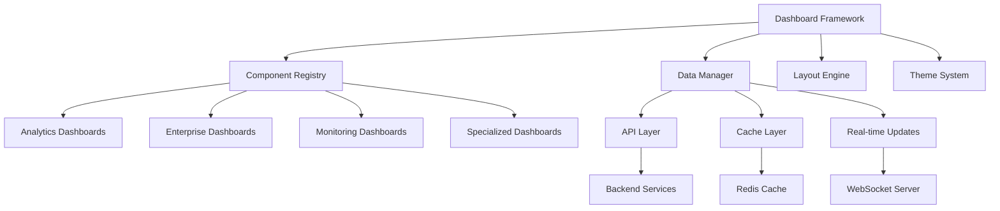
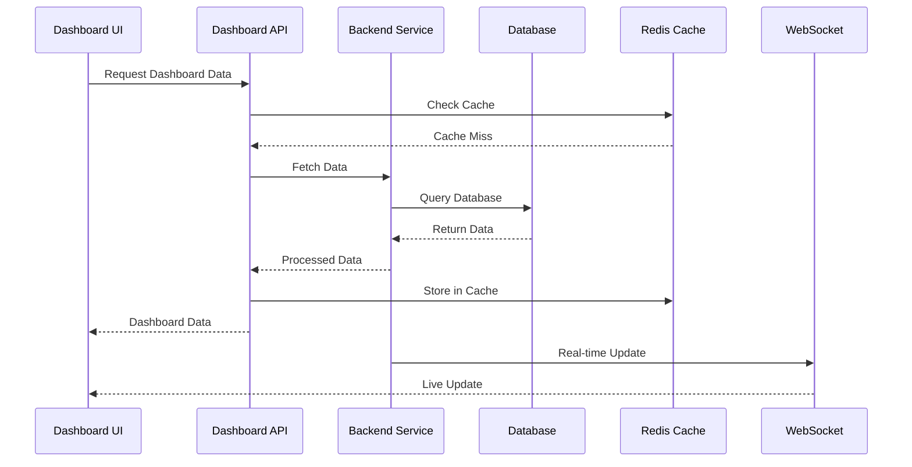

# 📊 Dashboard System Documentation

## Overview

This document provides comprehensive documentation for Auterity's dashboard system, covering all dashboard components, their backend integrations, data flows, and end-to-end functionality.

## Table of Contents

1. [Dashboard Architecture](#dashboard-architecture)
2. [Core Dashboard Components](#core-dashboard-components)
3. [Analytics Dashboards](#analytics-dashboards)
4. [Enterprise Dashboards](#enterprise-dashboards)
5. [Specialized Dashboards](#specialized-dashboards)
6. [Backend Integration](#backend-integration)
7. [Data Flow Architecture](#data-flow-architecture)
8. [Real-time Updates](#real-time-updates)

## Dashboard Architecture

### System Overview


### Component Locations
```
frontend/src/components/
├── analytics/
│   ├── AnalyticsDashboard.tsx
│   ├── WorkflowAnalyticsDashboard.tsx
│   ├── PredictiveOrchestrationDashboard.tsx
│   └── CrossFilterAnalyticsDashboard.tsx
├── enterprise/
│   ├── EnterpriseDashboard.tsx
│   ├── APIGatewayDashboard.tsx
│   └── DeveloperPlatformDashboard.tsx
├── monitoring/
│   ├── UnifiedMonitoringDashboard.tsx
│   ├── PerformanceDashboard.tsx
│   └── ErrorCorrelationDashboard.tsx
├── specialized/
│   ├── CognitiveDashboard.tsx
│   ├── AgentDashboard.tsx
│   └── ProcessMiningDashboard.tsx
└── core/
    ├── Layout.tsx
    ├── EnhancedLayout.tsx
    └── ModernLandingPage.tsx
```

## Core Dashboard Components

### Dashboard Framework
**Location**: `frontend/src/components/Layout.tsx`
**Purpose**: Base dashboard framework
**Features**:
- Responsive layout system
- Widget management
- Theme integration
- Navigation handling

```typescript
// Dashboard Framework
interface DashboardProps {
    layout: LayoutConfig;
    widgets: Widget[];
    theme: ThemeConfig;
    permissions: Permission[];
}

class DashboardFramework extends Component<DashboardProps> {
    private layoutEngine: LayoutEngine;
    private widgetManager: WidgetManager;
    private dataManager: DataManager;
    
    async componentDidMount(): Promise<void> {
        await this.initializeLayout();
        await this.loadWidgets();
        await this.setupDataSources();
        await this.enableRealTimeUpdates();
    }
    
    private async setupDataSources(): Promise<void> {
        for (const widget of this.props.widgets) {
            await this.dataManager.registerDataSource(
                widget.id,
                widget.dataSource
            );
        }
    }
}
```

### Enhanced Layout
**Location**: `frontend/src/components/EnhancedLayout.tsx`
**Purpose**: Advanced dashboard layout with customization
**Features**:
- Drag-and-drop widgets
- Resizable panels
- Custom themes
- Export/import layouts

```typescript
// Enhanced Layout System
interface EnhancedLayoutProps {
    initialLayout: GridLayout[];
    widgets: WidgetConfig[];
    editable: boolean;
    onLayoutChange: (layout: GridLayout[]) => void;
}

class EnhancedLayout extends Component<EnhancedLayoutProps> {
    private gridSystem: GridLayoutSystem;
    private dragDropManager: DragDropManager;
    
    render() {
        return (
            <ResponsiveGridLayout
                layouts={this.state.layouts}
                onLayoutChange={this.handleLayoutChange}
                breakpoints={{ lg: 1200, md: 996, sm: 768 }}
                cols={{ lg: 12, md: 10, sm: 6 }}
                isDraggable={this.props.editable}
                isResizable={this.props.editable}
            >
                {this.renderWidgets()}
            </ResponsiveGridLayout>
        );
    }
}
```

## Analytics Dashboards

### Main Analytics Dashboard
**Location**: `frontend/src/components/analytics/AnalyticsDashboard.tsx`
**Purpose**: Comprehensive analytics overview
**Backend Integration**: 
- Analytics Service API
- Data aggregation service
- Real-time metrics

```typescript
// Analytics Dashboard
interface AnalyticsDashboardState {
    metrics: MetricData[];
    timeRange: TimeRange;
    filters: FilterConfig[];
    loading: boolean;
}

class AnalyticsDashboard extends Component<{}, AnalyticsDashboardState> {
    private analyticsAPI: AnalyticsAPI;
    private metricsCollector: MetricsCollector;
    private realTimeUpdater: RealTimeUpdater;
    
    async componentDidMount(): Promise<void> {
        await this.loadMetrics();
        await this.setupRealTimeUpdates();
    }
    
    private async loadMetrics(): Promise<void> {
        const metrics = await this.analyticsAPI.getMetrics({
            timeRange: this.state.timeRange,
            filters: this.state.filters
        });
        
        this.setState({ metrics, loading: false });
    }
    
    private async setupRealTimeUpdates(): Promise<void> {
        this.realTimeUpdater.subscribe('metrics', (update) => {
            this.updateMetrics(update);
        });
    }
}
```

### Workflow Analytics Dashboard
**Location**: `frontend/src/components/analytics/WorkflowAnalyticsDashboard.tsx`
**Purpose**: Workflow-specific analytics
**Backend Integration**:
- Workflow execution service
- Performance metrics API
- Error tracking service

```typescript
// Workflow Analytics Dashboard
interface WorkflowAnalyticsProps {
    workflowId?: string;
    timeRange: TimeRange;
    showRealTime: boolean;
}

class WorkflowAnalyticsDashboard extends Component<WorkflowAnalyticsProps> {
    private workflowAPI: WorkflowAPI;
    private executionTracker: ExecutionTracker;
    
    render() {
        return (
            <div className="workflow-analytics-dashboard">
                <MetricGrid>
                    <ExecutionRateChart data={this.state.executionData} />
                    <SuccessRateChart data={this.state.successData} />
                    <PerformanceChart data={this.state.performanceData} />
                    <ErrorDistributionChart data={this.state.errorData} />
                </MetricGrid>
                
                <DetailedAnalysis>
                    <WorkflowHeatmap data={this.state.heatmapData} />
                    <BottleneckAnalysis data={this.state.bottleneckData} />
                    <ResourceUtilization data={this.state.resourceData} />
                </DetailedAnalysis>
            </div>
        );
    }
}
```

### Predictive Orchestration Dashboard
**Location**: `frontend/src/components/analytics/PredictiveOrchestrationDashboard.tsx`
**Purpose**: AI-powered predictive analytics
**Backend Integration**:
- Machine learning service
- Prediction API
- Model performance tracking

```typescript
// Predictive Orchestration Dashboard
class PredictiveOrchestrationDashboard extends Component {
    private mlService: MachineLearningService;
    private predictionEngine: PredictionEngine;
    
    private async loadPredictions(): Promise<void> {
        const predictions = await this.predictionEngine.getPredictions({
            horizon: '24h',
            confidence: 0.8,
            models: ['workflow_performance', 'resource_usage']
        });
        
        this.setState({ predictions });
    }
    
    render() {
        return (
            <div className="predictive-dashboard">
                <PredictionPanel>
                    <WorkflowPredictions data={this.state.workflowPredictions} />
                    <ResourcePredictions data={this.state.resourcePredictions} />
                    <AnomalyDetection data={this.state.anomalies} />
                </PredictionPanel>
                
                <ModelPerformance>
                    <ModelAccuracy models={this.state.models} />
                    <FeatureImportance features={this.state.features} />
                    <ModelDrift drift={this.state.drift} />
                </ModelPerformance>
            </div>
        );
    }
}
```

## Enterprise Dashboards

### Enterprise Dashboard
**Location**: `frontend/src/components/enterprise/EnterpriseDashboard.tsx`
**Purpose**: Enterprise-level overview and management
**Backend Integration**:
- Enterprise management API
- Tenant management service
- Billing and usage tracking

```typescript
// Enterprise Dashboard
class EnterpriseDashboard extends Component {
    private enterpriseAPI: EnterpriseAPI;
    private tenantManager: TenantManager;
    private billingService: BillingService;
    
    render() {
        return (
            <div className="enterprise-dashboard">
                <ExecutiveSummary>
                    <KPIGrid>
                        <TotalUsers count={this.state.userCount} />
                        <ActiveWorkflows count={this.state.workflowCount} />
                        <SystemHealth status={this.state.healthStatus} />
                        <CostOptimization savings={this.state.savings} />
                    </KPIGrid>
                </ExecutiveSummary>
                
                <TenantManagement>
                    <TenantList tenants={this.state.tenants} />
                    <ResourceAllocation resources={this.state.resources} />
                    <ComplianceStatus compliance={this.state.compliance} />
                </TenantManagement>
            </div>
        );
    }
}
```

### API Gateway Dashboard
**Location**: `frontend/src/components/enterprise/APIGatewayDashboard.tsx`
**Purpose**: API gateway monitoring and management
**Backend Integration**:
- Kong API gateway
- Rate limiting service
- API analytics

```typescript
// API Gateway Dashboard
class APIGatewayDashboard extends Component {
    private kongAPI: KongAPI;
    private rateLimitService: RateLimitService;
    
    render() {
        return (
            <div className="api-gateway-dashboard">
                <APIMetrics>
                    <RequestVolume data={this.state.requestData} />
                    <ResponseTimes data={this.state.latencyData} />
                    <ErrorRates data={this.state.errorData} />
                    <RateLimitStatus limits={this.state.rateLimits} />
                </APIMetrics>
                
                <EndpointManagement>
                    <EndpointList endpoints={this.state.endpoints} />
                    <SecurityPolicies policies={this.state.policies} />
                    <LoadBalancing config={this.state.loadBalancing} />
                </EndpointManagement>
            </div>
        );
    }
}
```

## Specialized Dashboards

### Cognitive Dashboard
**Location**: `frontend/src/components/cognitive/CognitiveDashboard.tsx`
**Purpose**: AI cognitive services monitoring
**Backend Integration**:
- Cognitive engine API
- AI model performance
- Knowledge base metrics

### Agent Dashboard
**Location**: `frontend/src/components/agents/AgentDashboard.tsx`
**Purpose**: AI agent management and monitoring
**Backend Integration**:
- Agent registry service
- Agent performance metrics
- Task execution tracking

### Process Mining Dashboard
**Location**: `frontend/src/components/process-mining/ProcessMiningDashboard.tsx`
**Purpose**: Business process analysis
**Backend Integration**:
- Process mining engine
- Event log analysis
- Process optimization service

## Backend Integration

### Data Service Layer
```typescript
// Dashboard Data Service
class DashboardDataService {
    private apiClient: APIClient;
    private cacheManager: CacheManager;
    private realTimeService: RealTimeService;
    
    async getDashboardData(
        dashboardId: string,
        config: DashboardConfig
    ): Promise<DashboardData> {
        // Check cache first
        const cached = await this.cacheManager.get(
            `dashboard:${dashboardId}`
        );
        
        if (cached && !this.isStale(cached)) {
            return cached;
        }
        
        // Fetch from API
        const data = await this.apiClient.get(
            `/api/dashboards/${dashboardId}/data`,
            { params: config }
        );
        
        // Cache the result
        await this.cacheManager.set(
            `dashboard:${dashboardId}`,
            data,
            { ttl: 300 } // 5 minutes
        );
        
        return data;
    }
}
```

### Real-time Updates
```typescript
// Real-time Dashboard Updates
class DashboardRealTimeService {
    private websocket: WebSocketManager;
    private subscriptions: Map<string, Subscription[]>;
    
    subscribeToUpdates(
        dashboardId: string,
        callback: UpdateCallback
    ): Subscription {
        const subscription = {
            id: generateId(),
            dashboardId,
            callback
        };
        
        this.addSubscription(subscription);
        
        // Subscribe to relevant channels
        this.websocket.subscribe(
            `dashboard:${dashboardId}`,
            (update) => callback(update)
        );
        
        return subscription;
    }
}
```

## Data Flow Architecture

### End-to-End Data Flow


### Data Processing Pipeline
```typescript
// Data Processing Pipeline
class DashboardDataPipeline {
    private processors: DataProcessor[];
    private aggregators: DataAggregator[];
    private formatters: DataFormatter[];
    
    async processData(
        rawData: RawData,
        config: ProcessingConfig
    ): Promise<ProcessedData> {
        let data = rawData;
        
        // Apply processors
        for (const processor of this.processors) {
            data = await processor.process(data, config);
        }
        
        // Apply aggregations
        const aggregated = await this.aggregateData(
            data,
            config.aggregations
        );
        
        // Format for display
        return await this.formatData(
            aggregated,
            config.format
        );
    }
}
```

This documentation provides a comprehensive overview of Auterity's dashboard system with complete frontend-backend integration mapping. Each dashboard component is documented with its specific backend integrations, data flows, and real-time update mechanisms.
