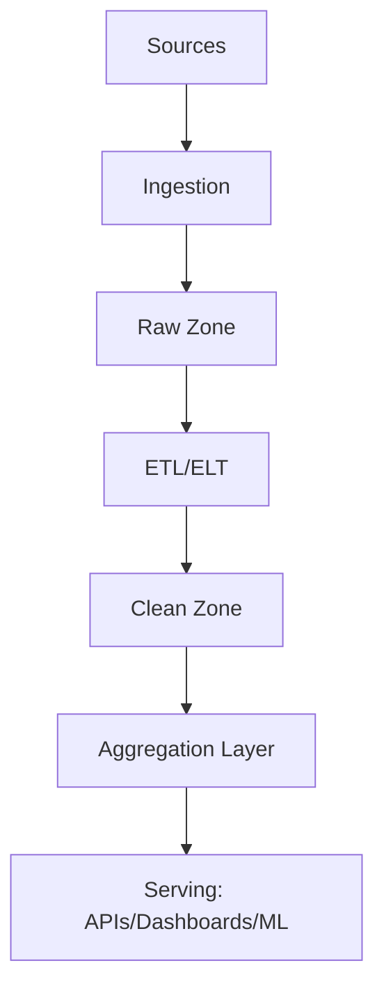

# 🛠️ Data Pipelines & Transformations

## Overview

Standardizes data ingestion, processing, storage, and serving across the platform with clear contracts, observability, and governance.

## Reference Architecture



- Sources: event streams, databases, files, external APIs
- Ingestion: connectors, CDC, batch loads
- Zones: raw immutable, clean curated, aggregated marts

## Ingestion

### Connectors
- Kafka consumers, HTTP pull, S3/GCS loaders, DB replication (CDC)

### Contracts
```typescript
interface IngestionContract {
  source: string;
  schema_version: string;
  delivery: 'stream' | 'batch';
  watermark?: string; // late data handling
  privacy_level: 'public' | 'internal' | 'restricted';
}
```

## Transformations

### ELT with Declarative Models

- SQL-based models with dependencies (DAG)
- Idempotent, incremental where possible

```sql
-- example incremental model
create table if not exists analytics.events_daily as
select date_trunc('day', occurred_at) as day,
       event_type,
       count(*) as event_count
from raw.events
where occurred_at >= now() - interval '30 days'
group by 1,2;
```

### Data Quality

- Constraints: not null, uniqueness, referential integrity
- Validation tests: freshness, volume, schema conformity

```typescript
interface DataQualityRule {
  name: string;
  type: 'freshness' | 'uniqueness' | 'completeness' | 'valid_values';
  target: string; // table/column
  threshold: number | string;
}
```

## Orchestration

- DAG scheduler with retries, backoff, SLAs
- Backfill support and lineage tracking

## Serving Layer

- APIs, materialized views, feature stores, vector indices
- Caching strategies for hot data

## Governance

- Ownership, documentation, change management
- PII tagging and masking policies

## Observability

- Pipeline metrics: runtime, success rate, data volume
- Data metrics: freshness, null rates, drift
- Alerting on SLA breaches

## Change Management

- Schema migration strategy with versioned tables
- Blue/green for critical data products

## Related Documentation

- Data & Analytics Governance
- Monitoring & Observability
- End-to-End Integration
