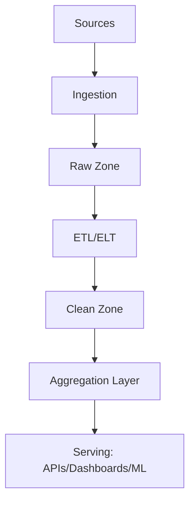

# 🛠️ Data Pipelines & Transformation

s

#

# Overvie

w

Standardizes data ingestion, processing, storage, and serving across the platform with clear contracts, observability, and governance.

#

# Reference Architectur

e



- Sources: event streams, databases, files, external API

s

- Ingestion: connectors, CDC, batch load

s

- Zones: raw immutable, clean curated, aggregated mart

s

#

# Ingestio

n

#

## Connectors

- Kafka consumers, HTTP pull, S3/GCS loaders, DB replication (CDC

)

#

## Contracts

```

typescript
interface IngestionContract {
  source: string;
  schema_version: string;
  delivery: 'stream' | 'batch';
  watermark?: string; // late data handling
  privacy_level: 'public' | 'internal' | 'restricted';
}

```

#

# Transformation

s

#

## ELT with Declarative Model

s

- SQL-based models with dependencies (DAG

)

- Idempotent, incremental where possibl

e

```

sql
- - example incremental model

create table if not exists analytics.events_daily as
select date_trunc('day', occurred_at) as day,
       event_type,
       count(*) as event_count

from raw.events
where occurred_at >= now()

 - interval '30 days'

group by 1,2;

```

#

## Data Qualit

y

- Constraints: not null, uniqueness, referential integrit

y

- Validation tests: freshness, volume, schema conformit

y

```

typescript
interface DataQualityRule {
  name: string;
  type: 'freshness' | 'uniqueness' | 'completeness' | 'valid_values';
  target: string; // table/column
  threshold: number | string;
}

```

#

# Orchestratio

n

- DAG scheduler with retries, backoff, SLA

s

- Backfill support and lineage trackin

g

#

# Serving Laye

r

- APIs, materialized views, feature stores, vector indice

s

- Caching strategies for hot dat

a

#

# Governanc

e

- Ownership, documentation, change managemen

t

- PII tagging and masking policie

s

#

# Observabilit

y

- Pipeline metrics: runtime, success rate, data volum

e

- Data metrics: freshness, null rates, drif

t

- Alerting on SLA breache

s

#

# Change Managemen

t

- Schema migration strategy with versioned table

s

- Blue/green for critical data product

s

#

# Related Documentatio

n

- Data & Analytics Governanc

e

- Monitoring & Observabilit

y

- End-to-End Integratio

n
