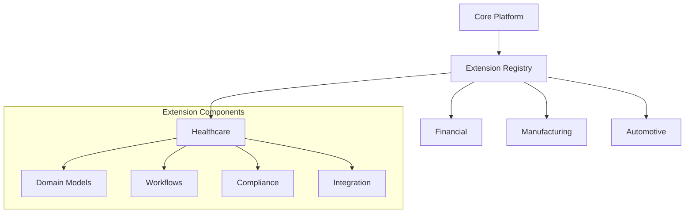

# 🏗️ Domain-Specific Extensions (Future Development)

## Overview

This document outlines the planned domain-specific extensions for Auterity's core platform. These extensions will be developed as separate modules to maintain a clean separation between core platform functionality and domain-specific implementations.

## Planned Extensions

### Healthcare Extension
- Patient flow optimization
- Clinical decision support
- Compliance automation (HIPAA)
- Medical data integration

### Financial Services Extension
- Risk assessment models
- Fraud detection
- Regulatory compliance
- Transaction monitoring

### Manufacturing Extension
- Equipment monitoring
- Quality control
- Supply chain optimization
- Predictive maintenance

### Automotive Extension
- Lead management
- Service optimization
- Inventory forecasting
- Customer lifecycle

## Extension Architecture



## Development Guidelines

### Extension Structure
```
extensions/
├── {domain}/
│   ├── models/
│   ├── workflows/
│   ├── compliance/
│   └── integration/
```

### Integration Points
- Model extension hooks
- Custom workflows
- Domain-specific APIs
- Compliance rules

### Validation Requirements
- Domain expert review
- Compliance certification
- Performance benchmarks
- Integration testing

## Roadmap Status

| Domain | Planning | Development | Testing | Release |
|--------|----------|-------------|----------|----------|
| Healthcare | ✅ | 🔄 | - | - |
| Financial | ✅ | - | - | - |
| Manufacturing | ✅ | - | - | - |
| Automotive | ✅ | - | - | - |

## Related Core Documentation
- [Predictive Analytics Platform](PREDICTIVE_ANALYTICS_PLATFORM.md)
- [ML Governance Handbook](ml/ML_GOVERNANCE_HANDBOOK.md)
- [Integration Playbooks](integrations/INTEGRATIONS_PLAYBOOKS.md)
