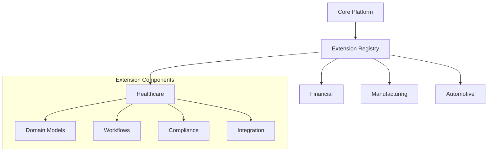

# 🏗️ Domain-Specific Extensions (Future Developmen

t

)

#

# Overvie

w

This document outlines the planned domain-specific extensions for Auterity's core platform. These extensions will be developed as separate modules to maintain a clean separation between core platform functionality and domain-specific implementations

.

#

# Planned Extension

s

#

## Healthcare Extension

- Patient flow optimizatio

n

- Clinical decision suppor

t

- Compliance automation (HIPAA

)

- Medical data integratio

n

#

## Financial Services Extension

- Risk assessment model

s

- Fraud detectio

n

- Regulatory complianc

e

- Transaction monitorin

g

#

## Manufacturing Extension

- Equipment monitorin

g

- Quality contro

l

- Supply chain optimizatio

n

- Predictive maintenanc

e

#

## Automotive Extension

- Lead managemen

t

- Service optimizatio

n

- Inventory forecastin

g

- Customer lifecycl

e

#

# Extension Architectur

e



#

# Development Guideline

s

#

## Extension Structure

```

extensions/
├── {domain}/
│   ├── models/
│   ├── workflows/
│   ├── compliance/
│   └── integration/

```

#

## Integration Points

- Model extension hook

s

- Custom workflow

s

- Domain-specific API

s

- Compliance rule

s

#

## Validation Requirements

- Domain expert revie

w

- Compliance certificatio

n

- Performance benchmark

s

- Integration testin

g

#

# Roadmap Statu

s

| Domain | Planning | Development | Testing | Release |
|--------|----------|-------------|----------|----------|

| Healthcare | ✅ | 🔄 |

 - |

 - |

| Financial | ✅ |

 - |

 - |

 - |

| Manufacturing | ✅ |

 - |

 - |

 - |

| Automotive | ✅ |

 - |

 - |

 - |

#

# Related Core Documentation

- [Predictive Analytics Platform](PREDICTIVE_ANALYTICS_PLATFORM.md

)

- [ML Governance Handbook](ml/ML_GOVERNANCE_HANDBOOK.md

)

- [Integration Playbooks](integrations/INTEGRATIONS_PLAYBOOKS.md

)
