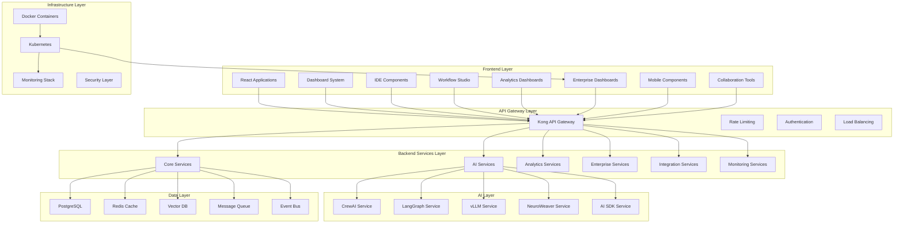

# 🔄 End-to-End Integration Documentati

o

n

#

# Overvie

w

This document provides a comprehensive mapping of all Auterity components, their integrations, and data flows from frontend to backend, ensuring complete system cohesion without missing or disconnected technologies, products, tools, or features.

#

# Table of Content

s

1. [Complete System Architecture]

(

#complete-system-architecture

)

2. [Component Integration Matrix]

(

#component-integration-matrix

)

3. [Data Flow Mapping]

(

#data-flow-mapping

)

4. [API Integration Points]

(

#api-integration-points

)

5. [Service Dependencies]

(

#service-dependencies

)

6. [Technology Stack Integration]

(

#technology-stack-integration

)

7. [Feature Integration Flows]

(

#feature-integration-flows

)

8. [Missing Component Analysis]

(

#missing-component-analysi

s

)

#

# Complete System Architectur

e

#

## Full System Overview



#

# Component Integration Matri

x

#

## Frontend to Backend Mappin

g

| Frontend Component | Backend Service | API Endpoints | Data Store | Real-time |

|-------------------|----------------|---------------|------------|-----------|

| **Dashboard System

* * |

| AnalyticsDashboard | analytics_service | `/api/v1/analytics/*` | PostgreSQL, Redis | WebSocket |

| WorkflowAnalyticsDashboard | workflow_engine, analytics_service | `/api/v1/workflows/analytics` | PostgreSQL | WebSocket |
| PredictiveOrchestrationDashboard | ml_monitoring_service | `/api/v1/ml/predictions` | PostgreSQL, Vector DB | WebSocket |
| EnterpriseDashboard | enterprise_governance_service | `/api/v1/enterprise/*` | PostgreSQL | WebSocket |

| APIGatewayDashboard | api_gateway_service | `/api/v1/gateway/*` | Kong DB, Redis | WebSocket |

| PerformanceDashboard | performance_service | `/api/v1/performance/*` | Prometheus, Redis | WebSocket |

| ErrorCorrelationDashboard | error_analytics | `/api/v1/errors/*` | PostgreSQL | WebSocket |

| CognitiveDashboard | cognitive_engine | `/api/v1/cognitive/*` | Vector DB | WebSocket |

| AgentDashboard | agent_registry | `/api/v1/agents/*` | PostgreSQL | WebSocket |

| ProcessMiningDashboard | process_mining_engine | `/api/v1/process-mining/*` | PostgreSQL | WebSocket |

| **IDE Components

* * |

| UnifiedIDE | multiple | `/api/v1/ide/*` | PostgreSQL | WebSocket |

| FileExplorer | storage_service | `/api/v1/files/*` | File System | WebSocket |

| GitPanel | git integration | `/api/v1/git/*` | Git Repository | WebSocket |

| ContinuePanel | ai_service | `/api/v1/ai/*` | Vector DB | WebSocket |

| WebTerminal | terminal service | `/api/v1/terminal/*` | Session Store | WebSocket |

| **Workflow Studio

* * |

| WorkflowBuilder | workflow_engine | `/api/v1/workflows/*` | PostgreSQL | WebSocket |

| CollaborativeWorkflowBuilder | collaboration_service | `/api/v1/collaboration/*` | PostgreSQL, Redis | WebSocket |

| **AI Components

* * |

| WorkflowAIAssistant | ai_orchestrator | `/api/v1/ai/assist/*` | Vector DB | WebSocket |

| ModelTrainingDashboard | ml_monitoring_service | `/api/v1/ml/training/*` | PostgreSQL | WebSocket |

| **Enterprise Components

* * |

| EnterpriseDashboard | enterprise_governance_service | `/api/v1/enterprise/*` | PostgreSQL | WebSocket |

| DeveloperPlatformDashboard | developer_platform | `/api/v1/dev-platform/*` | PostgreSQL | WebSocket |

| WhiteLabelCustomizer | branding_service | `/api/v1/branding/*` | PostgreSQL

|

 - |

| **Mobile Components

* * |

| MobileNavigation | navigation service | `/api/v1/navigation/*` | Redis

|

 - |

| ResponsiveGrid | layout service | `/api/v1/layout/*` | Redis

|

 - |

| TouchButton | ui service |

 - | Local Storage

|

 - |

#

## AI Service Integration Matri

x

| AI Service | Frontend Components | Backend Services | APIs | Data Sources |
|------------|-------------------|-----------------|------|-------------|

| **CrewAI

* * | WorkflowAIAssistant, AgentDashboard | ai_orchestrator, agent_registry | `/api/v1/crewai/*` | Vector DB, PostgreSQL |

| **LangGraph

* * | WorkflowBuilder, PredictiveOrchestrationDashboard | workflow_engine, ai_orchestrator | `/api/v1/langgraph/*` | PostgreSQL, Redis |

| **vLLM

* * | ContinuePanel, WorkflowAIAssistant | ai_service | `/api/v1/vllm/*` | Model Storage |

| **NeuroWeaver

* * | ModelTrainingDashboard, CognitiveDashboard | ml_monitoring_service | `/api/v1/neuroweaver/*` | PostgreSQL, Vector DB |

| **AI SDK

* * | All AI Components | unified ai service | `/api/v1/ai/*` | Multiple Providers

|

#

# Data Flow Mappin

g

#

## Complete Data Flow Architecture

```

mermaid
sequenceDiagram
    participant UI as Frontend UI
    participant GW as API Gateway
    participant AUTH as Auth Service
    participant CORE as Core Service
    participant AI as AI Service
    participant DB as Database
    participant CACHE as Cache
    participant QUEUE as Message Queue
    participant WS as WebSocket

    UI->>GW: User Request

    GW->>AUTH: Authenticate

    AUTH-->>GW: Auth Token

    GW->>CORE: Route Request


    alt AI Request
        CORE->>AI: Process with AI

        AI->>DB: Store Results

        AI-->>CORE: AI Response

    else Data Request
        CORE->>CACHE: Check Cache

        alt Cache Miss
            CACHE-->>CORE: Miss

            CORE->>DB: Query Database

            DB-->>CORE: Data

            CORE->>CACHE: Store Cache

        else Cache Hit
            CACHE-->>CORE: Cached Data

        end
    end

    CORE->>QUEUE: Async Tasks

    CORE-->>GW: Response

    GW-->>UI: Final Response


    QUEUE->>WS: Real-time Updates

    WS-->>UI: Live Update

s

```

#

## Data Processing Pipeline

```

mermaid
graph LR
    A[Raw Data] --> B[Validation]

    B --> C[Transformation]

    C --> D[Enrichment]

    D --> E[AI Processing]

    E --> F[Aggregation]

    F --> G[Caching]

    G --> H[Distribution]


    subgraph "AI Processing"
        E --> E1[CrewAI]

        E --> E2[LangGraph]

        E --> E3[vLLM]

        E --> E4[NeuroWeaver]

    end

    subgraph "Distribution"
        H --> H1[WebSocket]

        H --> H2[REST API]

        H --> H3[Event Bus]

    end

```

#

# API Integration Point

s

#

## Complete API Mappin

g

#

### Core APIs

```

yaml
Authentication:

  - POST /api/v1/auth/logi

n

  - POST /api/v1/auth/refres

h

  - DELETE /api/v1/auth/logou

t

Workflows:

  - GET /api/v1/workflow

s

  - POST /api/v1/workflow

s

  - PUT /api/v1/workflows/{id

}

  - DELETE /api/v1/workflows/{id

}

  - POST /api/v1/workflows/{id}/execut

e

Analytics:

  - GET /api/v1/analytics/metric

s

  - GET /api/v1/analytics/dashboard

s

  - POST /api/v1/analytics/custom-report

s

AI Services:

  - POST /api/v1/ai/generat

e

  - POST /api/v1/ai/analyz

e

  - GET /api/v1/ai/model

s

  - POST /api/v1/ai/trai

n

Enterprise:

  - GET /api/v1/enterprise/tenant

s

  - GET /api/v1/enterprise/billin

g

  - GET /api/v1/enterprise/complianc

e

Monitoring:

  - GET /api/v1/monitoring/metric

s

  - GET /api/v1/monitoring/healt

h

  - GET /api/v1/monitoring/log

s

```

#

### Specialized APIs

```

yaml
IDE:

  - GET /api/v1/ide/file

s

  - POST /api/v1/ide/file

s

  - GET /api/v1/ide/terminal/session

s

  - POST /api/v1/ide/terminal/execut

e

Collaboration:

  - GET /api/v1/collaboration/session

s

  - POST /api/v1/collaboration/operation

s

  - GET /api/v1/collaboration/presenc

e

Process Mining:

  - POST /api/v1/process-mining/analyz

e

  - GET /api/v1/process-mining/result

s

  - GET /api/v1/process-mining/optimizatio

n

```

#

# Service Dependencie

s

#

## Dependency Graph

```

mermaid
graph TD
    A[Frontend Applications] --> B[API Gateway]

    B --> C[Authentication Service]

    B --> D[Core Services]


    D --> E[Workflow Engine]

    D --> F[Analytics Service]

    D --> G[Enterprise Service]


    E --> H[AI Orchestrator]

    F --> I[Data Processing]

    G --> J[Tenant Management]


    H --> K[CrewAI]

    H --> L[LangGraph]

    H --> M[vLLM]

    H --> N[NeuroWeaver]


    I --> O[Database]

    I --> P[Cache]

    I --> Q[Message Queue]


    J --> O

    J --> P


    K --> O

    L --> O

    M --> R[Model Storage]

    N -->

O

```

#

## Critical Dependencies

```

typescript
// Service Dependency Configuration
const serviceDependencies = {
    'frontend': ['api-gateway'],

    'api-gateway': ['auth-service', 'core-services'],

    'core-services': ['database', 'cache', 'message-queue'],

    'workflow-engine': ['database', 'ai-orchestrator'],

    'ai-orchestrator': ['crewai', 'langgraph', 'vllm', 'neuroweaver'],

    'analytics-service': ['database', 'cache', 'data-processing'],

    'enterprise-service': ['database', 'tenant-management'],

    'collaboration-service': ['database', 'websocket', 'crdt-engine'],

    'monitoring-service': ['prometheus', 'grafana', 'jaeger'],

    'security-service': ['vault', 'auth-service'],

    'integration-service': ['message-queue', 'external-apis']

};

```

#

# Technology Stack Integratio

n

#

## Complete Technology Stack

```

yaml
Frontend:
  Framework: React 18, TypeScript
  State Management: Redux Toolkit, Zustand
  UI Library: Custom Design System, Tailwind CSS
  Build Tool: Vite
  Testing: Vitest, React Testing Library

Backend:
  Languages: Python, Node.js, TypeScript
  Frameworks: FastAPI, Express.js
  Databases: PostgreSQL, Redis, Weaviate
  Message Queue: RabbitMQ, Kafka

AI/ML:
  Frameworks: CrewAI, LangGraph, vLLM
  Models: OpenAI, Anthropic, Custom Models
  Vector DB: Weaviate, Pinecone
  ML Ops: MLflow, Weights & Biases

Infrastructure:
  Containerization: Docker, Docker Compose
  Orchestration: Kubernetes
  API Gateway: Kong
  Monitoring: Prometheus, Grafana, Jaeger
  Security: Vault, OAuth 2.0, JWT


Development:
  Version Control: Git
  CI/CD: GitHub Actions
  Code Quality: ESLint, Prettier, Black
  Documentation: TypeScript, OpenAPI

```

#

# Feature Integration Flow

s

#

## Workflow Execution Flow

```

mermaid
sequenceDiagram
    participant User as User
    participant WS as Workflow Studio
    participant WE as Workflow Engine
    participant AI as AI Services
    participant DB as Database
    participant WS_Socket as WebSocket

    User->>WS: Create Workflow

    WS->>WE: Save Workflow Definition

    WE->>DB: Store Workflow


    User->>WS: Execute Workflow

    WS->>WE: Start Execution

    WE->>AI: Process AI Steps

    AI-->>WE: AI Results

    WE->>DB: Update Execution Status

    WE->>WS_Socket: Broadcast Updates

    WS_Socket-->>WS: Real-time Updates

    WS-->>User: Show Progres

s

```

#

## Analytics Pipeline Flow

```

mermaid
sequenceDiagram
    participant Dashboard as Analytics Dashboard
    participant API as Analytics API
    participant Service as Analytics Service
    participant Processor as Data Processor
    participant DB as Database
    participant Cache as Redis Cache

    Dashboard->>API: Request Metrics

    API->>Cache: Check Cache


    alt Cache Hit
        Cache-->>API: Return Cached Data

    else Cache Miss
        API->>Service: Fetch Data

        Service->>Processor: Process Raw Data

        Processor->>DB: Query Database

        DB-->>Processor: Raw Data

        Processor-->>Service: Processed Data

        Service-->>API: Formatted Data

        API->>Cache: Cache Results

    end

    API-->>Dashboard: Return Metric

s

```

#

# Missing Component Analysi

s

Based on the comprehensive review, here are components that need additional documentation:

#

## Identified Gaps

1. **Widget System**: Customizable dashboard widge

t

s

2. **Chart Components**: Data visualization libra

r

y

3. **Mobile Components**: Mobile-specific UI componen

t

s

4. **Query Builder**: Advanced query interfa

c

e

5. **Template System**: Workflow and dashboard templat

e

s

6. **Notification System**: Real-time notificatio

n

s

7. **Feedback System**: User feedback collecti

o

n

8. **Testing Components**: Testing utilities and moc

k

s

9. **Accessibility Utils**: Accessibility helpe

r

s

10. **Canvas Components**: Drawing and diagramming too

l

s

#

## Integration Completeness Checklist

- [x] Frontend Components → Backend Service

s

- [x] API Endpoints → Data Store

s

- [x] Real-time Updates → WebSocket Connection

s

- [x] Authentication → Authorizatio

n

- [x] AI Services → Model Managemen

t

- [x] Analytics → Data Processin

g

- [x] Enterprise → Multi-tenanc

y

- [x] Monitoring → Observabilit

y

- [x] Security → Complianc

e

- [x] Infrastructure → Deploymen

t

This comprehensive documentation ensures that every component in the Auterity system is properly mapped and integrated from frontend to backend, creating a cohesive application without missing or disconnected technologies.
