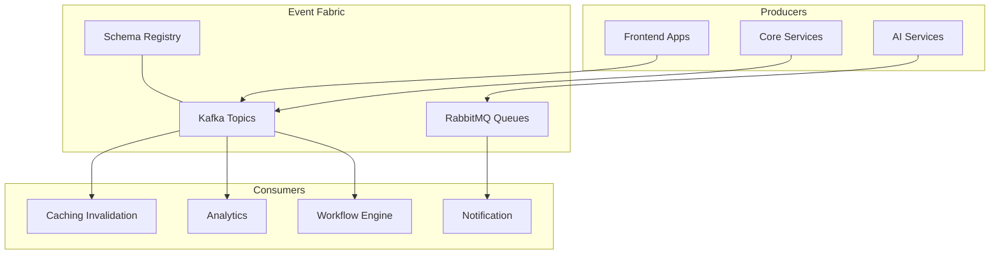

# 📬 Event System & Message Patterns

## Overview

Defines platform-wide eventing standards: topics/queues, message schema, delivery semantics, retries/DLQ, idempotency, ordering, and schema governance.

## Architecture



## Message Schema

```json
{
  "id": "uuid",
  "type": "event.name.v1",
  "occurred_at": "2025-01-01T00:00:00Z",
  "source": "service-name",
  "correlation_id": "uuid",
  "trace_id": "traceid",
  "payload": {"...": "..."},
  "metadata": {"partition_key": "entity-123", "tenant_id": "t1"}
}
```

- type: dotted lower-case with version suffix
- correlation_id and trace_id required for observability
- metadata used for routing and tenancy

## Delivery Semantics

- At-least-once by default; consumers must be idempotent
- Exactly-once with Kafka + transactional outbox + consumer offsets stored with state
- Ordering by partition_key; no global ordering guarantees

## Reliability

- Retries with exponential backoff
- Dead Letter Queue (DLQ) after N attempts with error context
- Poison-pill detection and quarantine

## Patterns

### Outbox Pattern
Service writes event to local outbox within the same transaction as state change; a relay publishes to Kafka to prevent lost events.

### SAGA (Process Manager)
Use orchestration for multi-step workflows; employ compensating actions for failure paths.

### Event Sourcing (Selective)
For high-audit domains, use append-only streams with snapshotting.

## Topic/Queue Conventions

- Kafka topics: `domain.entity.event.v1` (e.g., `workflow.instance.started.v1`)
- Rabbit queues: `service.action.priority` (e.g., `notify.email.high`)
- Partitions decided by entity key for locality

## Idempotency

```typescript
interface IdempotencyKeyStore {
  has(key: string): Promise<boolean>;
  put(key: string, ttlSeconds: number): Promise<void>;
}
```

Consumers must guard side effects with idempotency keys derived from message `id`.

## Error Handling Contract

```json
{
  "error": {
    "code": "VALIDATION_FAILED",
    "message": "Missing field x",
    "details": {"field": "x"}
  }
}
```

Attach last error to DLQ entry along with headers and attempt count.

## Schema Governance

- All schemas registered; backward-compatible evolution enforced
- Use additive changes; breaking changes require new `.vN`
- CI checks: schema diff gates; contract tests for critical consumers

## Observability

- Emit `event.processed` and `event.failed` metrics with `trace_id`
- Traces: producer -> broker -> consumer; propagate `trace_id` header
- Dashboards: throughput, lag, DLQ rate, processing latency

## Security

- Per-topic ACLs; tenant scoping in metadata
- PII classification in schema; encryption where required

## Related Documentation

- Message Queue Architecture
- Cross System Protocol
- Monitoring Documentation
