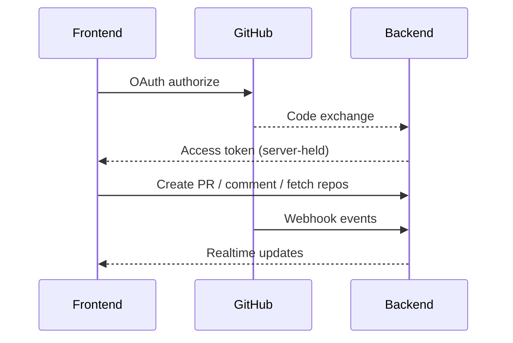

# 🐙 GitHub Integration Documentation

## Overview

Documentation of authentication, PR automation, webhooks, and workflow integrations.

## Components

- Frontend services: `src/services/githubIntegration.ts`
- Backend: webhook handler, OAuth app, workflow triggers

## Capabilities

- OAuth-based sign-in and token storage
- Repo listing and file operations
- PR creation, comments, checks integration
- Webhook ingestion for events (push, PR, issues)

## Flows

## Security

- Store tokens server-side; minimal scopes
- Verify webhook signatures

