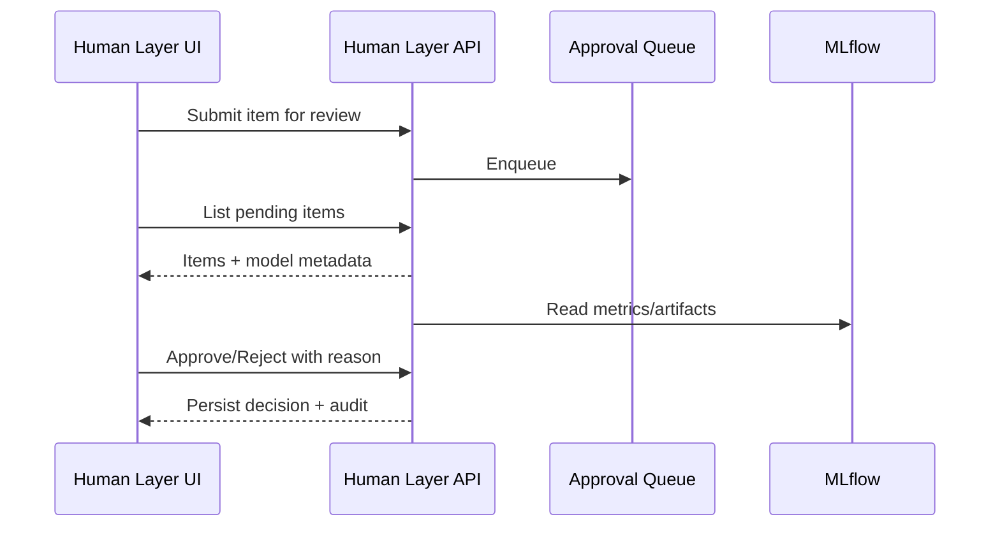

# 🧑‍⚖️ Human Layer & MLflow Integration

## Overview

Guidance for incorporating human-in-the-loop review, approvals, and interventions with MLflow-powered experiment and model tracking.

## Components

- Frontend: `src/services/humanLayerService.ts`, `src/services/humanlayerMLflowIntegration.ts`, `frontend/src/components/humanlayer-mlflow/HumanLayerMLflowDashboard.tsx`
- Backend: approval queues, audit logs, MLflow tracking server

## Flows

## Policies & Audit

- Per-role approval thresholds
- Reason capture, immutable logs
- SLA timers and escalation

## UI

- Dashboard linking model runs (metrics, params, artifacts) to review tasks
- Filters: risk, impact, freshness

