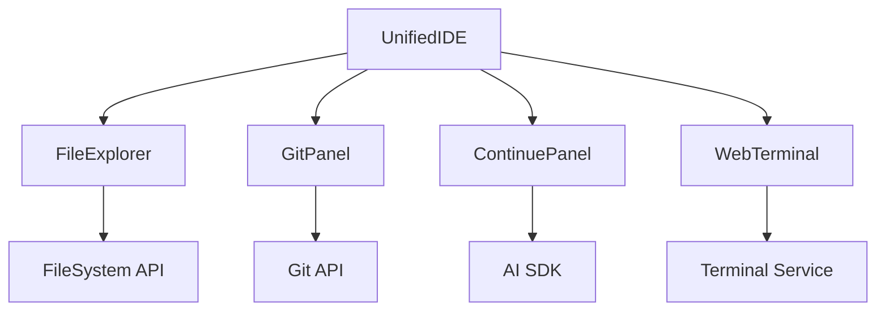

# 💻 IDE Integration Documentation

## Overview

This document provides comprehensive documentation for Auterity's integrated development environment (IDE) components, including the terminal integration, file explorer, Git integration, and AI-assisted development features.

## Table of Contents

1. [Architecture Overview](#architecture-overview)
2. [IDE Components](#ide-components)
3. [Terminal Integration](#terminal-integration)
4. [Git Integration](#git-integration)
5. [AI Integration](#ai-integration)
6. [File System](#file-system)
7. [Extension System](#extension-system)
8. [Performance Considerations](#performance-considerations)

## Architecture Overview

### Component Architecture


### Component Locations
```
frontend/src/
├── components/
│   ├── ide/
│   │   ├── UnifiedIDE.tsx
│   │   ├── FileExplorer.tsx
│   │   ├── GitPanel.tsx
│   │   └── ContinuePanel.tsx
│   └── terminal/
│       └── WebTerminal.tsx
└── services/
    ├── fileSystem.ts
    ├── gitService.ts
    └── terminalService.ts
```

## IDE Components

### UnifiedIDE Component
**Location**: `frontend/src/components/ide/UnifiedIDE.tsx`
**Purpose**: Main IDE container component
**Features**:
- Layout management
- Component coordination
- State management
- Plugin system

```typescript
import { UnifiedIDE } from '@components/ide/UnifiedIDE';

<UnifiedIDE
  initialLayout={{
    orientation: 'horizontal',
    panels: ['explorer', 'editor', 'terminal']
  }}
  plugins={[
    gitPlugin,
    terminalPlugin,
    aiAssistantPlugin
  ]}
/>
```

### File Explorer
**Location**: `frontend/src/components/ide/FileExplorer.tsx`
**Purpose**: File system navigation and management
**Features**:
- Tree view navigation
- File operations
- Search and filter
- Context menus

```typescript
import { FileExplorer } from '@components/ide/FileExplorer';

<FileExplorer
  rootPath="/project"
  onFileSelect={handleFileSelect}
  onContextMenu={handleContextMenu}
  filter={searchPattern}
/>
```

### Git Panel
**Location**: `frontend/src/components/ide/GitPanel.tsx`
**Purpose**: Git operations and version control
**Features**:
- Status view
- Commit management
- Branch operations
- Pull request integration

```typescript
import { GitPanel } from '@components/ide/GitPanel';

<GitPanel
  repository={currentRepo}
  branch={currentBranch}
  onCommit={handleCommit}
  onBranchChange={handleBranchChange}
/>
```

## Terminal Integration

### WebTerminal Component
**Location**: `frontend/src/components/terminal/WebTerminal.tsx`
**Purpose**: Integrated terminal emulator
**Features**:
- Full terminal emulation
- Command history
- Multi-session support
- Theme customization

```typescript
import { WebTerminal } from '@components/terminal/WebTerminal';

<WebTerminal
  config={{
    shell: 'bash',
    cwd: '/project',
    env: processEnv,
    theme: 'dracula'
  }}
  onCommand={handleCommand}
  onExit={handleExit}
/>
```

### Terminal Service
```typescript
import { TerminalService } from '@services/terminalService';

class TerminalService {
    async createSession(config: TerminalConfig): Promise<Session> {
        const session = await this.ptyService.create({
            shell: config.shell,
            cwd: config.cwd,
            env: config.env
        });
        
        return new Session(session);
    }
    
    async executeCommand(
        session: Session,
        command: string
    ): Promise<CommandResult> {
        return await session.execute(command);
    }
}
```

## Git Integration

### Git Service Configuration
```typescript
import { GitService } from '@services/gitService';

const gitConfig = {
    defaultBranch: 'main',
    remoteUrl: 'https://github.com/org/repo.git',
    credentials: {
        type: 'ssh',
        keyPath: '~/.ssh/id_rsa'
    }
};

const gitService = new GitService(gitConfig);
```

### Git Operations
```typescript
class GitPanel extends Component {
    async commitChanges(
        message: string,
        files: string[]
    ): Promise<void> {
        await this.gitService.stage(files);
        await this.gitService.commit(message);
        await this.gitService.push();
    }
    
    async createBranch(
        name: string,
        from: string = 'main'
    ): Promise<void> {
        await this.gitService.checkout(from);
        await this.gitService.createBranch(name);
        await this.gitService.push('--set-upstream', 'origin', name);
    }
}
```

## AI Integration

### Continue Panel
**Location**: `frontend/src/components/ide/ContinuePanel.tsx`
**Purpose**: AI-assisted development
**Features**:
- Code completion
- Refactoring suggestions
- Documentation generation
- Error analysis

```typescript
import { ContinuePanel } from '@components/ide/ContinuePanel';

<ContinuePanel
  context={{
    file: currentFile,
    selection: selectedCode,
    language: fileType
  }}
  onSuggestion={handleSuggestion}
  onRefactor={handleRefactor}
/>
```

### AI Service Integration
```typescript
class ContinueService {
    async getSuggestions(
        context: CodeContext
    ): Promise<Suggestion[]> {
        const model = await this.aiService.getModel('gpt-4');
        
        return await model.complete({
            code: context.code,
            language: context.language,
            cursor: context.position
        });
    }
    
    async analyzeCode(
        code: string,
        options: AnalysisOptions
    ): Promise<Analysis> {
        return await this.aiService.analyze(code, options);
    }
}
```

## File System

### File System Service
```typescript
import { FileSystemService } from '@services/fileSystem';

class FileSystemService {
    async readDirectory(
        path: string,
        options: ReadOptions = {}
    ): Promise<FileEntry[]> {
        const entries = await this.fs.readdir(path, {
            withFileTypes: true,
            ...options
        });
        
        return entries.map(entry => ({
            name: entry.name,
            type: entry.isDirectory() ? 'directory' : 'file',
            path: join(path, entry.name)
        }));
    }
    
    async watchDirectory(
        path: string,
        callback: (event: FileEvent) => void
    ): Promise<Watcher> {
        return this.fs.watch(path, callback);
    }
}
```

## Extension System

### Plugin Architecture
```typescript
interface IDEPlugin {
    name: string;
    version: string;
    activate(ide: UnifiedIDE): void;
    deactivate(): void;
}

class GitPlugin implements IDEPlugin {
    name = 'git';
    version = '1.0.0';
    
    activate(ide: UnifiedIDE): void {
        ide.registerPanel('git', GitPanel);
        ide.registerCommand('git.commit', this.handleCommit);
        ide.registerCommand('git.push', this.handlePush);
    }
    
    deactivate(): void {
        // Cleanup
    }
}
```

### Command System
```typescript
class CommandSystem {
    registerCommand(
        id: string,
        handler: CommandHandler
    ): void {
        this.commands.set(id, handler);
    }
    
    async executeCommand(
        id: string,
        ...args: any[]
    ): Promise<any> {
        const handler = this.commands.get(id);
        if (!handler) {
            throw new Error(`Command ${id} not found`);
        }
        return await handler(...args);
    }
}
```

## Performance Considerations

### Memory Management
```typescript
class TerminalBuffer {
    private maxLines = 5000;
    private lines: string[] = [];
    
    append(line: string): void {
        this.lines.push(line);
        if (this.lines.length > this.maxLines) {
            this.lines.shift();
        }
    }
    
    clear(): void {
        this.lines = [];
    }
}
```

### Virtualization
```typescript
import { VirtualList } from '@components/VirtualList';

class FileExplorer {
    render() {
        return (
            <VirtualList
                items={this.files}
                height={400}
                itemHeight={24}
                renderItem={(file) => (
                    <FileItem
                        name={file.name}
                        type={file.type}
                        selected={file.selected}
                    />
                )}
            />
        );
    }
}
```

## Development Guidelines

### Component Development
```typescript
// Example IDE component
import React from 'react';
import { useIDE } from '@hooks/useIDE';

const CustomPanel: React.FC<PanelProps> = ({
    id,
    title,
    children
}) => {
    const ide = useIDE();
    
    useEffect(() => {
        ide.registerPanel(id, {
            title,
            component: CustomPanel
        });
        
        return () => ide.unregisterPanel(id);
    }, [id]);
    
    return (
        <div className="ide-panel">
            <div className="panel-header">{title}</div>
            <div className="panel-content">{children}</div>
        </div>
    );
};
```

### Testing Strategy
```typescript
// Example IDE test
import { render, fireEvent } from '@testing-library/react';
import { UnifiedIDE } from './UnifiedIDE';

describe('UnifiedIDE', () => {
    it('should handle panel resizing', async () => {
        const { getByTestId } = render(
            <UnifiedIDE
                initialLayout={testLayout}
                plugins={[]}
            />
        );
        
        const resizer = getByTestId('panel-resizer');
        fireEvent.mouseDown(resizer);
        fireEvent.mouseMove(document, {
            clientX: 400,
            clientY: 0
        });
        fireEvent.mouseUp(document);
        
        expect(getByTestId('left-panel')).toHaveStyle({
            width: '400px'
        });
    });
});
```

This documentation provides a comprehensive overview of the IDE components in the Auterity platform. For specific implementation details or advanced usage patterns, refer to the individual component documentation or contact the development team.
