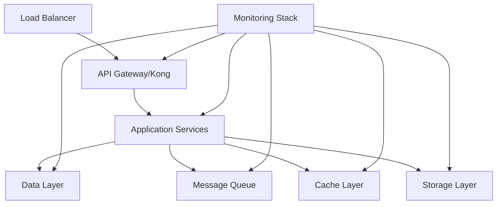

# 🏗️ Infrastructure Documentation

## Overview

This document provides comprehensive documentation for Auterity's infrastructure components, including monitoring, security, deployment configurations, and operational procedures.

## Table of Contents

1. [Architecture Overview](#architecture-overview)
2. [Infrastructure Components](#infrastructure-components)
3. [Deployment Configurations](#deployment-configurations)
4. [Monitoring & Observability](#monitoring--observability)
5. [Security Infrastructure](#security-infrastructure)
6. [Scaling & Performance](#scaling--performance)
7. [Disaster Recovery](#disaster-recovery)
8. [Operations Guide](#operations-guide)

## Architecture Overview

### Infrastructure Stack


### Component Locations
```
infrastructure/
├── docker/
│   ├── kong/
│   ├── postgres/
│   ├── redis/
│   ├── rabbitmq/
│   ├── monitoring/
│   └── storage/
├── kubernetes/
│   ├── base/
│   ├── overlays/
│   └── charts/
└── terraform/
    ├── modules/
    ├── environments/
    └── variables/
```

## Infrastructure Components

### Core Services

#### Kong API Gateway
**Location**: `infrastructure/docker/kong/`
**Purpose**: API management and routing
**Configuration**:
```yaml
# infrastructure/docker/kong/kong.yml
services:
  kong:
    image: kong:3.0
    environment:
      KONG_DATABASE: postgres
      KONG_PG_HOST: kong-database
      KONG_PROXY_ACCESS_LOG: /dev/stdout
      KONG_ADMIN_ACCESS_LOG: /dev/stdout
      KONG_PROXY_ERROR_LOG: /dev/stderr
      KONG_ADMIN_ERROR_LOG: /dev/stderr
      KONG_ADMIN_LISTEN: 0.0.0.0:8001
    ports:
      - "8000:8000"
      - "8001:8001"
      - "8443:8443"
      - "8444:8444"
```

#### PostgreSQL Database
**Location**: `infrastructure/docker/postgres/`
**Purpose**: Primary data storage
**Configuration**:
```yaml
# infrastructure/docker/postgres/postgres.yml
services:
  postgres:
    image: postgres:15
    environment:
      POSTGRES_DB: auterity
      POSTGRES_USER: auterity
      POSTGRES_PASSWORD_FILE: /run/secrets/db_password
    volumes:
      - postgres_data:/var/lib/postgresql/data
    ports:
      - "5432:5432"
```

#### Redis Cache
**Location**: `infrastructure/docker/redis/`
**Purpose**: Caching and session management
**Configuration**:
```yaml
# infrastructure/docker/redis/redis.yml
services:
  redis:
    image: redis:7.0
    command: redis-server --requirepass ${REDIS_PASSWORD}
    volumes:
      - redis_data:/data
    ports:
      - "6379:6379"
```

### Message Queue System

#### RabbitMQ
**Location**: `infrastructure/docker/rabbitmq/`
**Purpose**: Message queuing and event handling
**Configuration**:
```yaml
# infrastructure/docker/rabbitmq/rabbitmq.yml
services:
  rabbitmq:
    image: rabbitmq:3.9-management
    environment:
      RABBITMQ_DEFAULT_USER: auterity
      RABBITMQ_DEFAULT_PASS_FILE: /run/secrets/rabbitmq_password
    ports:
      - "5672:5672"
      - "15672:15672"
```

### Monitoring Stack

#### Prometheus
**Location**: `infrastructure/docker/monitoring/prometheus/`
**Purpose**: Metrics collection
**Configuration**:
```yaml
# infrastructure/docker/monitoring/prometheus/prometheus.yml
global:
  scrape_interval: 15s
  evaluation_interval: 15s

scrape_configs:
  - job_name: 'auterity'
    static_configs:
      - targets: ['localhost:8000']
```

#### Grafana
**Location**: `infrastructure/docker/monitoring/grafana/`
**Purpose**: Metrics visualization
**Configuration**:
```yaml
# infrastructure/docker/monitoring/grafana/grafana.yml
services:
  grafana:
    image: grafana/grafana:9.0.0
    environment:
      GF_SECURITY_ADMIN_PASSWORD: ${GRAFANA_PASSWORD}
    ports:
      - "3000:3000"
```

## Deployment Configurations

### Docker Compose
```yaml
# docker-compose.prod.yml
version: '3.8'

services:
  api-gateway:
    image: kong:3.0
    configs:
      - source: kong_config
        target: /etc/kong/kong.yml
    secrets:
      - kong_database_password
    deploy:
      replicas: 2
      update_config:
        parallelism: 1
        delay: 10s

  application:
    image: auterity/app:${VERSION}
    secrets:
      - app_secrets
    deploy:
      replicas: 4
      resources:
        limits:
          cpus: '2'
          memory: 4G
```

### Kubernetes Deployment
```yaml
# kubernetes/base/deployment.yaml
apiVersion: apps/v1
kind: Deployment
metadata:
  name: auterity-app
spec:
  replicas: 4
  selector:
    matchLabels:
      app: auterity
  template:
    metadata:
      labels:
        app: auterity
    spec:
      containers:
      - name: auterity
        image: auterity/app:${VERSION}
        resources:
          requests:
            memory: "2Gi"
            cpu: "1"
          limits:
            memory: "4Gi"
            cpu: "2"
```

### Terraform Infrastructure
```hcl
# terraform/modules/app/main.tf
module "vpc" {
  source = "../vpc"
  cidr_block = var.vpc_cidr
}

module "ecs" {
  source = "../ecs"
  vpc_id = module.vpc.vpc_id
  container_insights = true
}

module "rds" {
  source = "../rds"
  vpc_id = module.vpc.vpc_id
  multi_az = true
}
```

## Monitoring & Observability

### Metrics Collection
```yaml
# infrastructure/monitoring/prometheus/rules.yml
groups:
  - name: auterity
    rules:
      - record: job:request_latency_seconds:mean5m
        expr: rate(http_request_duration_seconds_sum[5m])
          / rate(http_request_duration_seconds_count[5m])
```

### Logging Configuration
```yaml
# infrastructure/monitoring/loki/loki.yml
auth_enabled: false

server:
  http_listen_port: 3100

ingester:
  lifecycler:
    address: 127.0.0.1
    ring:
      kvstore:
        store: inmemory
      replication_factor: 1
    final_sleep: 0s
  chunk_idle_period: 5m
  chunk_retain_period: 30s
```

### Alert Configuration
```yaml
# infrastructure/monitoring/alertmanager/alertmanager.yml
route:
  group_by: ['alertname']
  group_wait: 30s
  group_interval: 5m
  repeat_interval: 1h
  receiver: 'web.hook'
receivers:
  - name: 'web.hook'
    webhook_configs:
      - url: 'http://127.0.0.1:5001/'
```

## Security Infrastructure

### Network Security
```yaml
# infrastructure/security/network-policies.yml
apiVersion: networking.k8s.io/v1
kind: NetworkPolicy
metadata:
  name: default-deny-ingress
spec:
  podSelector: {}
  policyTypes:
  - Ingress
```

### Secrets Management
```yaml
# infrastructure/security/vault-config.hcl
storage "file" {
  path = "/vault/file"
}

listener "tcp" {
  address = "0.0.0.0:8200"
  tls_disable = 1
}

api_addr = "http://0.0.0.0:8200"
cluster_addr = "https://0.0.0.0:8201"
```

## Scaling & Performance

### Autoscaling Configuration
```yaml
# kubernetes/base/hpa.yaml
apiVersion: autoscaling/v2
kind: HorizontalPodAutoscaler
metadata:
  name: auterity-app
spec:
  scaleTargetRef:
    apiVersion: apps/v1
    kind: Deployment
    name: auterity-app
  minReplicas: 2
  maxReplicas: 10
  metrics:
  - type: Resource
    resource:
      name: cpu
      target:
        type: Utilization
        averageUtilization: 80
```

### Load Balancer Configuration
```yaml
# infrastructure/docker/nginx/nginx.conf
upstream backend {
    least_conn;
    server backend1.example.com:8080;
    server backend2.example.com:8080;
    keepalive 32;
}

server {
    listen 80;
    location / {
        proxy_pass http://backend;
        proxy_http_version 1.1;
        proxy_set_header Connection "";
    }
}
```

## Disaster Recovery

### Backup Configuration
```yaml
# infrastructure/backup/backup-config.yml
schedule: "0 2 * * *"
retention:
  daily: 7
  weekly: 4
  monthly: 6
destinations:
  - type: s3
    bucket: auterity-backups
    region: us-west-2
  - type: gcs
    bucket: auterity-dr
    project: auterity-prod
```

### Recovery Procedures
```bash
# infrastructure/scripts/disaster-recovery.sh
#!/bin/bash

# Database recovery
restore_database() {
    pg_restore -h $DB_HOST -U $DB_USER -d $DB_NAME $BACKUP_FILE
}

# Service recovery
restore_services() {
    kubectl apply -f kubernetes/base/
    kubectl apply -f kubernetes/overlays/production/
}
```

## Operations Guide

### Deployment Process
```bash
# infrastructure/scripts/deploy.sh
#!/bin/bash

# Build and push Docker images
docker-compose -f docker-compose.build.yml build
docker-compose -f docker-compose.build.yml push

# Deploy to Kubernetes
kubectl apply -f kubernetes/overlays/production/
```

### Monitoring Checklist
```yaml
# infrastructure/monitoring/checklist.yml
daily:
  - name: Check system metrics
    command: grafana-dashboard daily-metrics
  - name: Review error logs
    command: loki-query "level=error"
  - name: Verify backup completion
    command: backup-status-check

weekly:
  - name: Performance analysis
    command: analyze-performance-metrics
  - name: Security audit
    command: security-compliance-check
```

### Troubleshooting Guide
```yaml
# infrastructure/docs/troubleshooting.yml
common_issues:
  high_latency:
    checks:
      - Database connection pool
      - Cache hit ratio
      - Network latency
    solutions:
      - Increase connection pool size
      - Optimize cache settings
      - Scale resources

  memory_pressure:
    checks:
      - Container memory usage
      - JVM heap metrics
      - System swap usage
    solutions:
      - Adjust memory limits
      - Optimize garbage collection
      - Scale vertically
```

## Development Guidelines

### Local Environment Setup
```bash
# infrastructure/scripts/local-setup.sh
#!/bin/bash

# Install dependencies
brew install kubectl helm terraform

# Set up local Kubernetes cluster
kind create cluster --name auterity-dev

# Deploy local services
helm install auterity-dev infrastructure/helm/auterity
```

### CI/CD Pipeline
```yaml
# .github/workflows/infrastructure.yml
name: Infrastructure CI/CD

on:
  push:
    paths:
      - 'infrastructure/**'

jobs:
  validate:
    runs-on: ubuntu-latest
    steps:
      - uses: actions/checkout@v2
      - name: Terraform Format
        run: terraform fmt -check
      - name: Terraform Validate
        run: terraform validate

  deploy:
    needs: validate
    runs-on: ubuntu-latest
    steps:
      - uses: actions/checkout@v2
      - name: Deploy Infrastructure
        run: terraform apply -auto-approve
```

This documentation provides a comprehensive overview of Auterity's infrastructure components. For specific implementation details or advanced configurations, refer to the individual component documentation or contact the infrastructure team.
