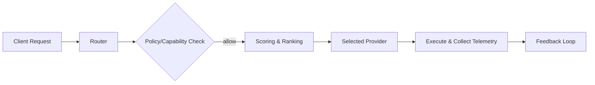

# 🧠 Intelligent Router for AI Request

s

#

# Overvie

w

The Intelligent Router selects the optimal AI provider/model per request based on cost, latency, capability, and policy constraints.

#

# Component

s

- Frontend: `src/services/intelligentRouter.ts`, `src/services/intelligentRouterExample.ts

`

- Docs: `src/services/intelligent-router-README.md

`

- Backend: RelayCore / AI Orchestrator, provider adapter

s

#

# Input

s

- Task metadata (priority, max cost, latency target

)

- Policy (PII allowed? region lock?

)

- Capability requirements (function calling, vision, long context

)

#

# Decision Signal

s

- Historical latency and error rate

s

- Current provider healt

h

- Price per token / per 1k token

s

- Model-specific strength

s

#

# Flo

w

#

# Telemetry & Feedbac

k

- Capture cost, tokens, latency, quality signal

s

- Update rolling metrics to refine future choice

s

#

# Failove

r

- Retry with next-ranked model when errors/timeout

s

- Circuit breaker per-provide

r

