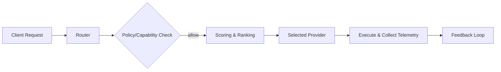

# 🧠 Intelligent Router for AI Requests

## Overview

The Intelligent Router selects the optimal AI provider/model per request based on cost, latency, capability, and policy constraints.

## Components

- Frontend: `src/services/intelligentRouter.ts`, `src/services/intelligentRouterExample.ts`
- Docs: `src/services/intelligent-router-README.md`
- Backend: RelayCore / AI Orchestrator, provider adapters

## Inputs

- Task metadata (priority, max cost, latency target)
- Policy (PII allowed? region lock?)
- Capability requirements (function calling, vision, long context)

## Decision Signals

- Historical latency and error rates
- Current provider health
- Price per token / per 1k tokens
- Model-specific strengths

## Flow

## Telemetry & Feedback

- Capture cost, tokens, latency, quality signals
- Update rolling metrics to refine future choices

## Failover

- Retry with next-ranked model when errors/timeouts
- Circuit breaker per-provider

