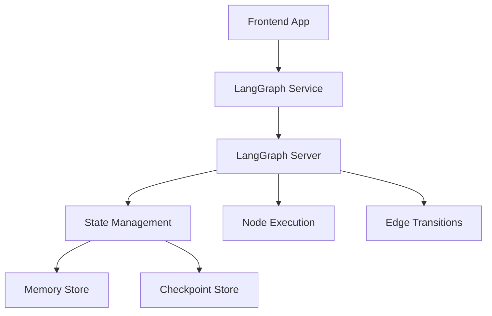

# LangGraph API Documentation

## Overview

LangGraph is a powerful framework for building stateful, multi-actor applications with LLMs. This documentation covers the integration of LangGraph within the Auterity Unified AI Platform, providing comprehensive API documentation for developers.

## Architecture

### Core Components



### Service Architecture

```
┌─────────────────┐    ┌─────────────────┐    ┌─────────────────┐
│   Frontend      │    │  LangGraph      │    │   Backend       │
│   Components    │◄──►│   Service       │◄──►│   Services      │
└─────────────────┘    └─────────────────┘    └─────────────────┘
         │                       │                       │
         └───────────────────────┼───────────────────────┘
                                 │
                    ┌─────────────────┐
                    │   LangGraph     │
                    │   Engine        │
                    │   (Python)      │
                    └─────────────────┘
```

## API Reference

### Base URL

```
https://api.auterity.com/v1/ai/langgraph
```

### Authentication

All API requests require authentication using Bearer tokens:

```bash
Authorization: Bearer <your_api_token>
```

### Error Handling

All endpoints return standard HTTP status codes with detailed error messages:

```json
{
  "error": {
    "code": "VALIDATION_ERROR",
    "message": "Invalid graph configuration",
    "details": {
      "field": "nodes",
      "issue": "Missing required node properties"
    }
  },
  "timestamp": "2024-01-15T10:30:00Z",
  "request_id": "req_123456789"
}
```

## Graph Management APIs

### Create Graph

Create a new LangGraph instance with specified configuration.

```http
POST /graphs
```

**Request Body:**

```json
{
  "name": "Customer Support Agent",
  "description": "Multi-agent system for customer support automation",
  "version": "1.0.0",
  "configuration": {
    "interrupt_before": ["human_review"],
    "interrupt_after": ["tool_execution"],
    "checkpointer": {
      "type": "memory",
      "config": {
        "max_history": 100
      }
    },
    "store": {
      "type": "in_memory",
      "config": {}
    }
  },
  "nodes": [
    {
      "id": "initial_analysis",
      "type": "agent",
      "name": "Initial Analysis Agent",
      "config": {
        "model": "gpt-4",
        "temperature": 0.3,
        "system_prompt": "You are a customer support analyst...",
        "tools": ["search_kb", "check_status"]
      }
    },
    {
      "id": "escalation_check",
      "type": "conditional",
      "name": "Escalation Decision",
      "config": {
        "condition": "message.priority === 'high' || sentiment === 'negative'",
        "true_next": "human_review",
        "false_next": "auto_resolve"
      }
    },
    {
      "id": "human_review",
      "type": "human",
      "name": "Human Review Node",
      "config": {
        "timeout": 3600,
        "approval_required": true,
        "reviewer_roles": ["supervisor", "manager"]
      }
    }
  ],
  "edges": [
    {
      "source": "initial_analysis",
      "target": "escalation_check",
      "condition": null
    },
    {
      "source": "escalation_check",
      "target": "human_review",
      "condition": "escalate"
    },
    {
      "source": "escalation_check",
      "target": "auto_resolve",
      "condition": "auto_resolve"
    }
  ],
  "metadata": {
    "created_by": "user123",
    "tags": ["customer-support", "automation"],
    "business_unit": "customer_success"
  }
}
```

**Response:**

```json
{
  "graph_id": "graph_123456789",
  "status": "created",
  "created_at": "2024-01-15T10:30:00Z",
  "graph_url": "/graphs/graph_123456789",
  "execution_url": "/graphs/graph_123456789/execute",
  "configuration": {
    "interrupt_before": ["human_review"],
    "interrupt_after": ["tool_execution"]
  }
}
```

### Get Graph

Retrieve a specific graph configuration and metadata.

```http
GET /graphs/{graph_id}
```

**Response:**

```json
{
  "graph_id": "graph_123456789",
  "name": "Customer Support Agent",
  "description": "Multi-agent system for customer support automation",
  "version": "1.0.0",
  "status": "active",
  "created_at": "2024-01-15T10:30:00Z",
  "updated_at": "2024-01-15T10:35:00Z",
  "configuration": { ... },
  "nodes": [ ... ],
  "edges": [ ... ],
  "metadata": { ... },
  "stats": {
    "total_executions": 1250,
    "successful_executions": 1180,
    "failed_executions": 70,
    "average_execution_time": 45.2,
    "last_execution": "2024-01-15T10:25:00Z"
  }
}
```

### Update Graph

Update an existing graph's configuration.

```http
PUT /graphs/{graph_id}
```

**Request Body:** (same as create, but all fields optional)

### Delete Graph

Delete a graph and all its associated data.

```http
DELETE /graphs/{graph_id}
```

### List Graphs

Retrieve a paginated list of graphs.

```http
GET /graphs
```

**Query Parameters:**

- `page`: Page number (default: 1)
- `limit`: Items per page (default: 20, max: 100)
- `status`: Filter by status (active, inactive, archived)
- `tags`: Filter by tags (comma-separated)
- `created_by`: Filter by creator
- `search`: Search in name and description

**Response:**

```json
{
  "graphs": [
    {
      "graph_id": "graph_123456789",
      "name": "Customer Support Agent",
      "status": "active",
      "created_at": "2024-01-15T10:30:00Z",
      "updated_at": "2024-01-15T10:35:00Z",
      "tags": ["customer-support", "automation"]
    }
  ],
  "pagination": {
    "page": 1,
    "limit": 20,
    "total": 45,
    "total_pages": 3
  }
}
```

## Execution APIs

### Execute Graph

Execute a graph with the provided input.

```http
POST /graphs/{graph_id}/execute
```

**Request Body:**

```json
{
  "input": {
    "customer_message": "My order #12345 hasn't arrived yet",
    "customer_id": "cust_987654",
    "priority": "medium",
    "channel": "email"
  },
  "config": {
    "configurable": {
      "thread_id": "thread_123",
      "checkpoint_ns": "customer_support"
    },
    "recursion_limit": 50
  },
  "metadata": {
    "source": "api",
    "user_id": "user456",
    "correlation_id": "req_789"
  }
}
```

**Response:**

```json
{
  "execution_id": "exec_987654321",
  "status": "completed",
  "output": {
    "response": "I've located your order and it will arrive tomorrow...",
    "actions_taken": [
      {
        "type": "kb_search",
        "query": "shipping delays",
        "results": ["Shipping delay policy", "Tracking updates"]
      },
      {
        "type": "status_check",
        "order_id": "12345",
        "status": "in_transit"
      }
    ],
    "confidence": 0.92,
    "escalation_required": false
  },
  "execution_time": 2.34,
  "tokens_used": 1250,
  "cost": 0.012,
  "thread_id": "thread_123",
  "completed_at": "2024-01-15T10:30:02Z"
}
```

### Execute Graph Streaming

Execute a graph with real-time streaming of intermediate results.

```http
POST /graphs/{graph_id}/execute/stream
```

**Response:** Server-Sent Events (SSE) stream

```javascript
// Event: node_start
{
  "event": "node_start",
  "execution_id": "exec_987654321",
  "node_id": "initial_analysis",
  "timestamp": "2024-01-15T10:30:00Z"
}

// Event: node_output
{
  "event": "node_output",
  "execution_id": "exec_987654321",
  "node_id": "initial_analysis",
  "output": {
    "analysis": "Customer reporting delayed order...",
    "sentiment": "frustrated",
    "intent": "status_inquiry"
  },
  "timestamp": "2024-01-15T10:30:01Z"
}

// Event: node_complete
{
  "event": "node_complete",
  "execution_id": "exec_987654321",
  "node_id": "initial_analysis",
  "timestamp": "2024-01-15T10:30:01Z"
}

// Event: execution_complete
{
  "event": "execution_complete",
  "execution_id": "exec_987654321",
  "final_output": { ... },
  "execution_time": 2.34,
  "timestamp": "2024-01-15T10:30:02Z"
}
```

### Get Execution Status

Check the status of a running execution.

```http
GET /executions/{execution_id}
```

**Response:**

```json
{
  "execution_id": "exec_987654321",
  "graph_id": "graph_123456789",
  "status": "running",
  "current_node": "human_review",
  "progress": 0.75,
  "started_at": "2024-01-15T10:30:00Z",
  "estimated_completion": "2024-01-15T10:32:30Z",
  "thread_id": "thread_123",
  "input": { ... },
  "current_state": {
    "messages": [...],
    "next_node": "human_review",
    "interrupted": true
  }
}
```

### Resume Execution

Resume a paused or interrupted execution.

```http
POST /executions/{execution_id}/resume
```

**Request Body:**

```json
{
  "input": {
    "human_decision": "escalate_to_supervisor",
    "comments": "Customer is very frustrated and demands immediate resolution"
  },
  "config": {
    "configurable": {
      "thread_id": "thread_123"
    }
  }
}
```

### Cancel Execution

Cancel a running execution.

```http
POST /executions/{execution_id}/cancel
```

### List Executions

Get execution history for a graph.

```http
GET /graphs/{graph_id}/executions
```

**Query Parameters:**

- `status`: Filter by status (completed, failed, running, cancelled)
- `start_date`: Filter by start date
- `end_date`: Filter by end date
- `user_id`: Filter by user who initiated execution

## State Management APIs

### Get Thread State

Retrieve the current state of a conversation thread.

```http
GET /threads/{thread_id}
```

**Response:**

```json
{
  "thread_id": "thread_123",
  "graph_id": "graph_123456789",
  "state": {
    "messages": [
      {
        "id": "msg_1",
        "type": "human",
        "content": "My order hasn't arrived",
        "timestamp": "2024-01-15T10:30:00Z"
      },
      {
        "id": "msg_2",
        "type": "ai",
        "content": "Let me check your order status...",
        "timestamp": "2024-01-15T10:30:01Z"
      }
    ],
    "next_node": "human_review",
    "interrupted": true,
    "checkpoint": {
      "id": "checkpoint_456",
      "timestamp": "2024-01-15T10:30:01Z"
    }
  },
  "created_at": "2024-01-15T10:30:00Z",
  "updated_at": "2024-01-15T10:30:01Z"
}
```

### Update Thread State

Update the state of a conversation thread.

```http
PUT /threads/{thread_id}
```

### Delete Thread

Delete a conversation thread and all its state.

```http
DELETE /threads/{thread_id}
```

## Tool Integration APIs

### Register Tool

Register a custom tool for use in graphs.

```http
POST /tools
```

**Request Body:**

```json
{
  "name": "search_knowledge_base",
  "description": "Search the company knowledge base for relevant information",
  "parameters": {
    "type": "object",
    "properties": {
      "query": {
        "type": "string",
        "description": "Search query"
      },
      "category": {
        "type": "string",
        "description": "Knowledge base category",
        "enum": ["shipping", "returns", "products", "policies"]
      },
      "limit": {
        "type": "integer",
        "description": "Maximum number of results",
        "default": 5
      }
    },
    "required": ["query"]
  },
  "implementation": {
    "type": "http",
    "endpoint": "https://kb.company.com/api/search",
    "method": "POST",
    "headers": {
      "Authorization": "Bearer ${KB_API_KEY}",
      "Content-Type": "application/json"
    },
    "timeout": 30
  },
  "metadata": {
    "tags": ["knowledge", "search"],
    "category": "information_retrieval",
    "cost_per_call": 0.001
  }
}
```

### List Tools

Get all available tools.

```http
GET /tools
```

### Get Tool

Get details of a specific tool.

```http
GET /tools/{tool_id}
```

### Update Tool

Update a tool's configuration.

```http
PUT /tools/{tool_id}
```

### Delete Tool

Delete a tool.

```http
DELETE /tools/{tool_id}
```

## Node Types

### Agent Nodes

```json
{
  "id": "customer_agent",
  "type": "agent",
  "name": "Customer Support Agent",
  "config": {
    "model": "gpt-4",
    "temperature": 0.3,
    "max_tokens": 1000,
    "system_prompt": "You are a helpful customer support agent...",
    "tools": ["search_kb", "check_order_status", "create_ticket"],
    "memory": {
      "type": "conversation",
      "max_messages": 50
    }
  }
}
```

### Tool Nodes

```json
{
  "id": "kb_search",
  "type": "tool",
  "name": "Knowledge Base Search",
  "config": {
    "tool_id": "search_knowledge_base",
    "input_mapping": {
      "query": "$.customer_message",
      "category": "$.detected_category"
    },
    "output_mapping": {
      "kb_results": "$.results"
    }
  }
}
```

### Conditional Nodes

```json
{
  "id": "escalation_check",
  "type": "conditional",
  "name": "Check if Escalation Needed",
  "config": {
    "condition": "input.priority === 'high' || sentiment_score < 0.3",
    "true_next": "human_escalation",
    "false_next": "auto_resolve",
    "evaluation_context": {
      "sentiment_score": "$.sentiment_analysis.score",
      "priority": "$.customer.priority"
    }
  }
}
```

### Human Nodes

```json
{
  "id": "human_review",
  "type": "human",
  "name": "Human Review Required",
  "config": {
    "timeout": 3600,
    "approval_required": true,
    "reviewer_roles": ["supervisor", "manager"],
    "instructions": "Please review the customer's issue and decide on next steps",
    "options": [
      { "label": "Escalate to Manager", "value": "escalate" },
      { "label": "Resolve Automatically", "value": "auto_resolve" },
      { "label": "Request More Information", "value": "need_info" }
    ]
  }
}
```

### Custom Nodes

```json
{
  "id": "sentiment_analysis",
  "type": "custom",
  "name": "Sentiment Analysis",
  "config": {
    "function_name": "analyze_sentiment",
    "parameters": {
      "text": "$.customer_message",
      "model": "distilbert-sentiment"
    },
    "output_schema": {
      "score": "number",
      "label": "string",
      "confidence": "number"
    }
  }
}
```

## SDK Integration

### JavaScript/TypeScript SDK

```typescript
import { LangGraphClient } from '@auterity/langgraph-sdk';

const client = new LangGraphClient({
  apiKey: 'your_api_key',
  baseUrl: 'https://api.auterity.com/v1/ai/langgraph'
});

// Create a graph
const graph = await client.graphs.create({
  name: 'Customer Support Agent',
  nodes: [...],
  edges: [...]
});

// Execute the graph
const result = await client.graphs.execute(graph.id, {
  input: { customer_message: 'My order is delayed' }
});

// Stream execution results
const stream = await client.graphs.executeStream(graph.id, {
  input: { customer_message: 'My order is delayed' }
});

for await (const event of stream) {
  console.log(event.event, event.data);
}
```

### Python SDK

```python
from auterity_langgraph import LangGraphClient

client = LangGraphClient(
    api_key='your_api_key',
    base_url='https://api.auterity.com/v1/ai/langgraph'
)

# Create a graph
graph = client.graphs.create(
    name='Customer Support Agent',
    nodes=[...],
    edges=[...]
)

# Execute the graph
result = client.graphs.execute(
    graph_id=graph.id,
    input={'customer_message': 'My order is delayed'}
)

# Stream execution results
for event in client.graphs.execute_stream(
    graph_id=graph.id,
    input={'customer_message': 'My order is delayed'}
):
    print(event['event'], event['data'])
```

## Monitoring and Analytics

### Get Graph Analytics

```http
GET /graphs/{graph_id}/analytics
```

**Response:**

```json
{
  "graph_id": "graph_123456789",
  "time_range": {
    "start": "2024-01-01T00:00:00Z",
    "end": "2024-01-15T23:59:59Z"
  },
  "metrics": {
    "total_executions": 1250,
    "successful_executions": 1180,
    "failed_executions": 70,
    "average_execution_time": 45.2,
    "median_execution_time": 38.5,
    "p95_execution_time": 120.0,
    "success_rate": 0.944,
    "error_rate": 0.056
  },
  "node_metrics": [
    {
      "node_id": "initial_analysis",
      "executions": 1250,
      "average_time": 12.3,
      "success_rate": 0.98,
      "errors": 25
    },
    {
      "node_id": "human_review",
      "executions": 125,
      "average_time": 1800.0,
      "success_rate": 1.0,
      "errors": 0
    }
  ],
  "cost_metrics": {
    "total_cost": 125.50,
    "average_cost_per_execution": 0.100,
    "cost_by_node": {
      "initial_analysis": 75.30,
      "human_review": 50.20
    }
  }
}
```

### Get System Health

```http
GET /health
```

**Response:**

```json
{
  "status": "healthy",
  "version": "1.0.0",
  "uptime": 86400,
  "services": {
    "graph_execution": "healthy",
    "state_management": "healthy",
    "tool_registry": "healthy",
    "monitoring": "healthy"
  },
  "metrics": {
    "active_executions": 5,
    "queued_executions": 2,
    "total_graphs": 45,
    "total_tools": 23
  }
}
```

## Rate Limiting

API rate limits are enforced per organization:

- **Free Tier**: 100 requests/hour, 1,000 executions/month
- **Pro Tier**: 1,000 requests/hour, 10,000 executions/month
- **Enterprise Tier**: 10,000 requests/hour, unlimited executions

Rate limit headers are included in all responses:

```http
X-RateLimit-Limit: 1000
X-RateLimit-Remaining: 950
X-RateLimit-Reset: 1640995200
X-RateLimit-Retry-After: 60
```

## Webhook Integration

### Register Webhook

```http
POST /webhooks
```

**Request Body:**

```json
{
  "url": "https://your-app.com/webhooks/langgraph",
  "events": [
    "execution.completed",
    "execution.failed",
    "execution.interrupted",
    "graph.updated"
  ],
  "secret": "your_webhook_secret",
  "active": true
}
```

### Webhook Payload

```json
{
  "event": "execution.completed",
  "timestamp": "2024-01-15T10:30:02Z",
  "data": {
    "execution_id": "exec_987654321",
    "graph_id": "graph_123456789",
    "status": "completed",
    "output": { ... },
    "execution_time": 2.34,
    "metadata": { ... }
  },
  "signature": "sha256=..."
}
```

## Error Codes

| Code | Description | HTTP Status |
|------|-------------|-------------|
| `VALIDATION_ERROR` | Invalid request parameters | 400 |
| `GRAPH_NOT_FOUND` | Graph does not exist | 404 |
| `EXECUTION_NOT_FOUND` | Execution does not exist | 404 |
| `EXECUTION_FAILED` | Graph execution failed | 500 |
| `RATE_LIMIT_EXCEEDED` | Rate limit exceeded | 429 |
| `AUTHENTICATION_ERROR` | Invalid API key | 401 |
| `AUTHORIZATION_ERROR` | Insufficient permissions | 403 |
| `SERVICE_UNAVAILABLE` | Service temporarily unavailable | 503 |

## Best Practices

### Graph Design

1. **Keep graphs focused**: Each graph should have a single, well-defined purpose
2. **Use appropriate node types**: Choose the right node type for each step
3. **Handle errors gracefully**: Include error handling paths in your graphs
4. **Monitor performance**: Regularly review execution metrics and optimize

### Execution

1. **Use streaming**: For long-running executions, use streaming to provide real-time feedback
2. **Handle interruptions**: Design graphs to handle human interruptions gracefully
3. **Set timeouts**: Configure appropriate timeouts for different types of executions
4. **Use threads**: Leverage conversation threads for multi-turn interactions

### Security

1. **Validate inputs**: Always validate and sanitize user inputs
2. **Use HTTPS**: Ensure all webhook endpoints use HTTPS
3. **Secure secrets**: Store API keys and secrets securely
4. **Audit logs**: Regularly review execution logs for security issues

## Support

For additional support:

- **Documentation**: https://docs.auterity.com/langgraph
- **API Reference**: https://api.auterity.com/docs/langgraph
- **Community Forum**: https://community.auterity.com/langgraph
- **Support Email**: support@auterity.com

---

*Last updated: January 15, 2024*

