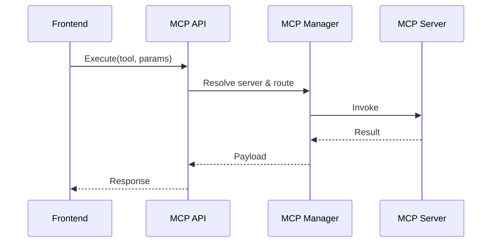

# 🧩 MCP Orchestrator Integration

## Overview

This document describes the MCP (Model/Capability/Control) orchestrator integration across backend and frontend, including schemas, APIs, and flows.

## Components

- Backend:
  - `services/api/src/app/api/mcp_routes.py`
  - `services/api/src/app/services/mcp_server_manager.py`
  - `services/api/src/app/models/mcp_server.py`
  - Alembic migrations adding MCP tables
- Systems:
  - `systems/mcp/orchestrator.ts` (node-based tools/workflows)
- Frontend:
  - `src/services/mcpProtocolService.ts`

## APIs (Conceptual)

- `GET /api/v1/mcp/servers` — list servers
- `POST /api/v1/mcp/servers` — register server
- `POST /api/v1/mcp/execute` — execute MCP tool/capability

## Flow

## Storage & Models

- Servers, capabilities, executions with audit metadata

## Security

- Per-tool RBAC, input validation, rate limits

