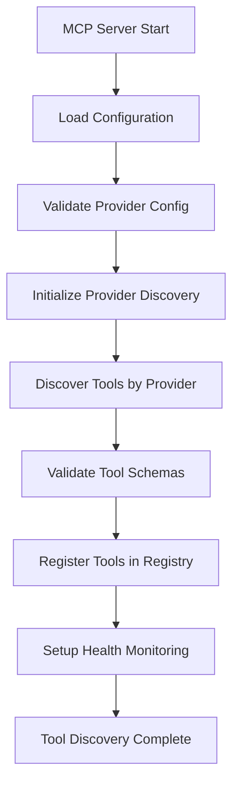

# MCP Tool Discovery Specificatio

n

#

# Overvie

w

This document provides a comprehensive specification for the Model Context Protocol (MCP) tool discovery system implemented in the Auterity platform. The tool discovery mechanism enables automatic detection, registration, and management of AI tools across multiple providers and frameworks.

#

# Architectur

e

#

## Core Component

s

1. **MCPServerManage

r

* *

- Main orchestrator for tool discover

y

2. **ToolRegistr

y

* *

- Central repository for discovered tool

s

3. **Provider-Specific Discovery Engine

s

* *

- Specialized discovery logic per AI provide

r

4. **Configuration Validatio

n

* *

- Ensures proper provider setu

p

5. **Health Monitorin

g

* *

- Maintains tool availability statu

s

#

# Provider Support Matri

x

The MCP tool discovery system supports the following AI providers and frameworks:

| Provider | Status | Discovery Method | Tool Types |
|----------|--------|------------------|------------|

| OpenAI | ✅ Implemented | API Schema Analysis | Function Calling, JSON Mode |
| Anthropic | ✅ Implemented | Tool-Use API | Claude Tools, Message Tools |

| Google Vertex AI | ✅ Implemented | Function Declarations | Gemini Tools, Vertex Functions |
| Cohere | ✅ Implemented | Tools API | Command Tools, Chat Tools |
| Azure OpenAI | ✅ Implemented | Functions API | Azure Functions, Cognitive Services |
| CrewAI | ✅ Implemented | Crew Configuration | Agent Tools, Task Tools |
| LangGraph | ✅ Implemented | Node Analysis | Workflow Nodes, State Tools |
| NeuroWeaver | ✅ Implemented | Model Registry | Training Tools, Deployment Tools |
| vLLM | ✅ Implemented | Server Introspection | Inference Tools, Model Tools |
| Generic/Custom | ✅ Implemented | Schema Discovery | Custom Tools, Legacy APIs |

#

# Discovery Process Flo

w



#

# Provider-Specific Implementati

o

n

#

## OpenAI Function Callin

g

**Discovery Method**: Analyzes OpenAI API function schemas and capabilitie

s

**Tool Schema Example**

:

```

json
{
  "name": "openai_function_call",
  "type": "function",
  "description": "Execute OpenAI function calls with structured parameters",
  "schema": {
    "type": "object",
    "properties": {
      "function_name": {
        "type": "string",
        "description": "Name of the function to call"
      },
      "parameters": {
        "type": "object",
        "description": "Function parameters"
      },
      "model": {
        "type": "string",
        "enum": ["gpt-4", "gpt-3.5-turbo"]

,

        "default": "gpt-4"

      }
    },
    "required": ["function_name"]
  },
  "capabilities": ["function_calling", "structured_output", "json_mode"]
}

```

**Configuration Requirements**

:

- `api_key`: OpenAI API ke

y

- `model`: Target model (gpt-4, gpt-3.5-turbo, etc

.

)

- `endpoint`: API endpoint (optional, defaults to OpenAI

)

#

## Anthropic Tool-U

s

e

**Discovery Method**: Analyzes Claude's tool-use capabilities and message format

s

**Tool Schema Example**

:

```

json
{
  "name": "anthropic_tool_use",
  "type": "tool_use",
  "description": "Execute Anthropic tool-use with Claude models",

  "schema": {
    "type": "object",
    "properties": {
      "tool_name": {
        "type": "string",
        "description": "Name of the tool to use"
      },
      "tool_input": {
        "type": "object",
        "description": "Tool input parameters"
      },
      "model": {
        "type": "string",
        "enum": ["claude-3-opus", "claude-3-sonnet", "claude-3-haiku"],

        "default": "claude-3-sonnet"

      }
    },
    "required": ["tool_name", "tool_input"]
  },
  "capabilities": ["tool_use", "message_tools", "structured_reasoning"]
}

```

#

## Google Vertex A

I

**Discovery Method**: Analyzes Vertex AI function declarations and Gemini capabilitie

s

**Tool Schema Example**

:

```

json
{
  "name": "vertex_function_declaration",
  "type": "function_declaration",
  "description": "Execute Google Vertex AI function declarations",
  "schema": {
    "type": "object",
    "properties": {
      "function_name": {
        "type": "string",
        "description": "Name of the function to declare"
      },
      "parameters": {
        "type": "object",
        "description": "Function parameters schema"
      },
      "model": {
        "type": "string",
        "enum": ["gemini-pro", "gemini-pro-vision"],

        "default": "gemini-pro"

      }
    },
    "required": ["function_name", "parameters"]
  },
  "capabilities": ["function_declarations", "multimodal", "reasoning"]
}

```

#

## CrewAI Framewor

k

**Discovery Method**: Analyzes crew configurations, agent definitions, and task tool

s

**Tool Schema Example**

:

```

json
{
  "name": "crewai_crew_execution",
  "type": "crew_tool",
  "description": "Execute CrewAI crew with multiple agents and tasks",
  "schema": {
    "type": "object",
    "properties": {
      "crew_config": {
        "type": "object",
        "description": "Crew configuration with agents and tasks"
      },
      "execution_mode": {
        "type": "string",
        "enum": ["sequential", "parallel", "hierarchical"],
        "default": "sequential"
      },
      "verbose": {
        "type": "boolean",
        "default": true
      }
    },
    "required": ["crew_config"]
  },
  "capabilities": ["multi_agent", "task_execution", "crew_coordination"]
}

```

#

## LangGraph Workflow

s

**Discovery Method**: Analyzes graph nodes, edges, and state management tool

s

**Tool Schema Example**

:

```

json
{
  "name": "langgraph_workflow_execution",
  "type": "workflow_tool",
  "description": "Execute LangGraph workflow with state management",
  "schema": {
    "type": "object",
    "properties": {
      "workflow_config": {
        "type": "object",
        "description": "Workflow graph configuration"
      },
      "initial_state": {
        "type": "object",
        "description": "Initial workflow state"
      },
      "execution_mode": {
        "type": "string",
        "enum": ["sync", "async", "streaming"],
        "default": "async"
      }
    },
    "required": ["workflow_config"]
  },
  "capabilities": ["workflow_execution", "state_management", "graph_processing"]
}

```

#

## NeuroWeaver Syste

m

**Discovery Method**: Analyzes model registry, training pipelines, and deployment tool

s

**Tool Schema Example**

:

```

json
{
  "name": "neuroweaver_model_training",
  "type": "ml_tool",
  "description": "Train and deploy models using NeuroWeaver",
  "schema": {
    "type": "object",
    "properties": {
      "model_config": {
        "type": "object",
        "description": "Model architecture and training configuration"
      },
      "dataset_path": {
        "type": "string",
        "description": "Path to training dataset"
      },
      "training_params": {
        "type": "object",
        "description": "Training hyperparameters"
      }
    },
    "required": ["model_config", "dataset_path"]
  },
  "capabilities": ["model_training", "deployment", "inference"]
}

```

#

## vLLM Inferenc

e

**Discovery Method**: Introspects vLLM server capabilities and model endpoint

s

**Tool Schema Example**

:

```

json
{
  "name": "vllm_inference",
  "type": "inference_tool",
  "description": "Perform inference using vLLM server",
  "schema": {
    "type": "object",
    "properties": {
      "model_name": {
        "type": "string",
        "description": "Name of the model to use for inference"
      },
      "prompt": {
        "type": "string",
        "description": "Input prompt for inference"
      },
      "generation_params": {
        "type": "object",
        "description": "Generation parameters (temperature, top_p, etc.)"
      }
    },
    "required": ["model_name", "prompt"]
  },
  "capabilities": ["inference", "streaming", "batched_inference"]
}

```

#

# Configuration Validatio

n

Each provider has specific configuration validation requirements:

#

## Validation Rule

s

1. **API Keys**: Validate format and test authenticati

o

n

2. **Endpoints**: Verify URL accessibility and SSL certificat

e

s

3. **Models**: Confirm model availability and permissio

n

s

4. **Schemas**: Validate JSON schema complian

c

e

5. **Capabilities**: Test feature availabili

t

y

#

## Example Validation Implementatio

n

```

python
async def validate_config(self, server) -> dict:

    """Validate server configuration based on provider."""
    config = server.config or {}
    provider = config.get("provider", "").lower()

    validation_result = {
        "valid": False,
        "errors": [],
        "warnings": []
    }


# General validation

    if not config.get("api_key") and provider != "generic":
        validation_result["errors"].append("API key is required")


# Provider-specific validatio

n

    if "openai" in provider:
        validation_result.update(await self._validate_openai_config(config))
    elif "anthropic" in provider:
        validation_result.update(await self._validate_anthropic_config(config))


# ... other providers


    validation_result["valid"] = len(validation_result["errors"]) == 0
    return validation_result

```

#

# Health Monitorin

g

The system continuously monitors tool health and availability:

#

## Health Check Component

s

1. **Provider API Health**: Test API endpoint accessibili

t

y

2. **Authentication Status**: Verify API key validi

t

y

3. **Model Availability**: Check model endpoint stat

u

s

4. **Rate Limit Status**: Monitor usage quot

a

s

5. **Error Rate Tracking**: Track failed reques

t

s

#

## Health Check Implementatio

n

```

python
async def health_check(self, server) -> dict:

    """Perform comprehensive health check."""
    config = server.config or {}
    provider = config.get("provider", "").lower()

    health_status = {
        "healthy": False,
        "provider": provider,
        "checks": {},
        "timestamp": datetime.utcnow().isoformat()
    }

    try:


# Provider-specific health check

s

        if "openai" in provider:
            health_status.update(await self._health_check_openai(config))
        elif "anthropic" in provider:
            health_status.update(await self._health_check_anthropic(config))


# ... other providers


        health_status["healthy"] = all(
            check.get("status") == "healthy"
            for check in health_status["checks"].values()
        )
    except Exception as e:
        health_status["checks"]["general"] = {
            "status": "unhealthy",
            "error": str(e)
        }

    return health_status

```

#

# Tool Registry Integratio

n

Discovered tools are automatically registered in the central ToolRegistry:

#

## Registration Proces

s

1. **Schema Validation**: Ensure tool schema complian

c

e

2. **Capability Mapping**: Map provider capabilities to standard form

a

t

3. **Metadata Enrichment**: Add discovery timestamp and provider in

f

o

4. **Conflict Resolution**: Handle duplicate tool nam

e

s

5. **Index Updates**: Update search and discovery indic

e

s

#

## Registry Schem

a

```

python
@dataclass
class DiscoveredTool:
    name: str
    provider: str
    type: str
    description: str
    schema: dict
    capabilities: List[str]
    discovery_timestamp: datetime
    health_status: str
    configuration: dict
    metadata: dict

```

#

# API Endpoint

s

The MCP tool discovery system exposes the following API endpoints:

#

## Discovery Endpoint

s

- `POST /api/v1/mcp/servers/{id}/discover-tools

`

 - Trigger tool discover

y

- `GET /api/v1/mcp/servers/{id}/tools

`

 - List discovered tool

s

- `POST /api/v1/mcp/servers/{id}/validate-config

`

 - Validate configuratio

n

- `GET /api/v1/mcp/servers/{id}/health

`

 - Check server healt

h

#

## Tool Management Endpoint

s

- `GET /api/v1/mcp/tools

`

 - List all registered tool

s

- `GET /api/v1/mcp/tools/{tool_id}

`

 - Get specific tool detail

s

- `POST /api/v1/mcp/tools/{tool_id}/execute

`

 - Execute too

l

- `DELETE /api/v1/mcp/tools/{tool_id}

`

 - Remove tool from registr

y

#

# Error Handlin

g

The system implements comprehensive error handling:

#

## Error Categorie

s

1. **Configuration Errors**: Invalid or missing configurati

o

n

2. **Authentication Errors**: API key or credential issu

e

s

3. **Network Errors**: Connectivity and timeout issu

e

s

4. **Schema Errors**: Invalid tool schema definitio

n

s

5. **Provider Errors**: Provider-specific API erro

r

s

#

## Error Response Forma

t

```

json
{
  "error": {
    "code": "DISCOVERY_FAILED",
    "message": "Failed to discover tools for provider",
    "details": {
      "provider": "openai",
      "reason": "Invalid API key",
      "retry_after": 300
    },
    "timestamp": "2024-01-15T10:30:00Z"

  }
}

```

#

# Security Consideration

s

#

## API Key Managemen

t

- Secure storage of provider API key

s

- Encryption at rest and in transi

t

- Regular key rotation policie

s

- Access logging and monitorin

g

#

## Schema Validatio

n

- Strict JSON schema validatio

n

- Input sanitization and validatio

n

- Protection against schema injection attack

s

- Rate limiting on discovery operation

s

#

## Network Securit

y

- TLS/SSL for all external communication

s

- Certificate validation and pinnin

g

- Network isolation for discovery operation

s

- Firewall rules for provider endpoint

s

#

# Performance Optimizatio

n

#

## Caching Strateg

y

- Tool schema caching with TT

L

- Provider capability cachin

g

- Health check result cachin

g

- Discovery result memoizatio

n

#

## Batch Processin

g

- Parallel tool discovery across provider

s

- Batch health checks for multiple tool

s

- Asynchronous registry update

s

- Connection pooling for HTTP request

s

#

# Monitoring and Observabilit

y

#

## Metric

s

- Tool discovery success/failure rate

s

- Provider response time

s

- Health check frequencie

s

- Registry growth and usage pattern

s

#

## Loggin

g

- Structured logging with correlation ID

s

- Provider-specific log categorie

s

- Error aggregation and alertin

g

- Performance monitorin

g

#

## Dashboard

s

- Real-time tool discovery statu

s

- Provider health overvie

w

- Registry statistics and trend

s

- Error rate monitorin

g

#

# Future Enhancement

s

#

## Planned Feature

s

1. **Dynamic Schema Evolutio

n

* *

- Automatic schema update

s

2. **Tool Versionin

g

* *

- Support for tool version managemen

t

3. **A/B Testin

g

* *

- Tool performance compariso

n

4. **Auto-scalin

g

* *

- Dynamic provider scalin

g

5. **ML-based Discover

y

* *

- Intelligent tool recommendatio

n

#

## Integration Roadma

p

- Enhanced MCP protocol suppor

t

- Additional AI provider integration

s

- Improved observability feature

s

- Advanced security control

s

- Performance optimization

s

#

# Related Documentatio

n

- [MCP Comprehensive Specification](./MCP_COMPREHENSIVE_SPECIFICATION.md

)

- [MCP Integration Documentation](./MCP_INTEGRATION_DOCUMENTATION.md

)

- [AI Standardization Registry Master Taxonomy](./AI_STANDARDIZATION_REGISTRY_MASTER_TAXONOMY.md

)

--

- *This specification provides the technical foundation for implementing comprehensive tool discovery across the AI ecosystem, enabling automatic detection, validation, and management of AI tools and capabilities

.

*
