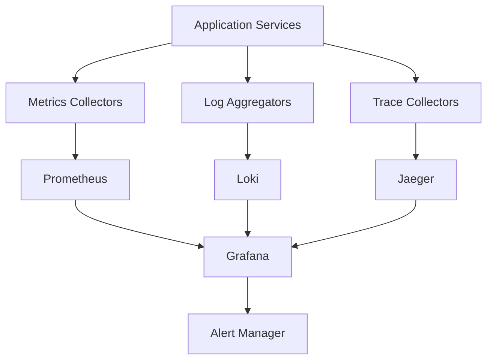

# 📊 Monitoring & Observability Documentatio

n

#

# Overvie

w

This document provides comprehensive documentation for Auterity's monitoring and observability infrastructure, including metrics collection, logging, alerting, and performance monitoring.

#

# Table of Content

s

1. [Monitoring Architecture]

(

#monitoring-architecture

)

2. [Metrics Collection]

(

#metrics-collection

)

3. [Logging System]

(

#logging-system

)

4. [Alerting System]

(

#alerting-system

)

5. [Performance Monitoring]

(

#performance-monitoring

)

6. [Tracing System]

(

#tracing-system

)

7. [Dashboards]

(

#dashboards)

8. [Incident Response]

(

#incident-respons

e

)

#

# Monitoring Architectur

e

#

## Overview Diagram



#

## Component Locations

```

infrastructure/
├── monitoring/
│   ├── prometheus/
│   │   ├── prometheus.yml
│   │   └── rules/
│   ├── grafana/
│   │   ├── dashboards/
│   │   └── datasources/
│   ├── loki/
│   │   └── loki.yml
│   ├── jaeger/
│   │   └── jaeger.yml
│   └── alertmanager/
│       └── alertmanager.yml

```

#

# Metrics Collectio

n

#

## Prometheus Configuration

**Location**: `infrastructure/monitoring/prometheus/prometheus.yml

`
**Purpose**: Metrics collection and storag

e
**Configuration**

:

```

yaml
global:
  scrape_interval: 15s
  evaluation_interval: 15s

scrape_configs:

  - job_name: 'auterity'

    static_configs:

      - targets: ['localhost:8000']

    metrics_path: '/metrics'
    scheme: 'http'
    basic_auth:
      username: 'prometheus'
      password: '${PROMETHEUS_PASSWORD}'

  - job_name: 'node-exporter'

    static_configs:

      - targets: ['node-exporter:9100'

]

  - job_name: 'cadvisor'

    static_configs:

      - targets: ['cadvisor:8080'

]

```

#

## Metric Collection

```

python
from app.monitoring.metrics import MetricsCollector

class MetricsCollector:
    async def collect_metrics(
        self,
        metric_type: str,
        value: float,
        labels: dict = None
    ) -> None:

        """Collect application metrics"""
        metric = self.get_metric(metric_type)
        if labels:
            metric = metric.labels(**labels)


        if metric_type == 'counter':
            metric.inc(value)
        elif metric_type == 'gauge':
            metric.set(value)
        elif metric_type == 'histogram':
            metric.observe(value)

```

#

## Custom Metrics

```

python
from prometheus_client import Counter, Gauge, Histogram

# Request metrics

request_counter = Counter(
    'http_requests_total',
    'Total HTTP requests',
    ['method', 'endpoint', 'status']
)

# Response time metrics

response_time = Histogram(
    'http_request_duration_seconds',
    'HTTP request duration',
    ['method', 'endpoint'],
    buckets=[0.1, 0.5, 1.0, 2.0, 5.0]

)

# Resource metrics

memory_usage = Gauge(
    'memory_usage_bytes',
    'Memory usage in bytes',
    ['service', 'type']
)

```

#

# Logging Syste

m

#

## Loki Configuration

**Location**: `infrastructure/monitoring/loki/loki.yml

`
**Purpose**: Log aggregation and queryin

g
**Configuration**

:

```

yaml
auth_enabled: false

server:
  http_listen_port: 3100

ingester:
  lifecycler:
    address: 127.0.0.1

    ring:
      kvstore:
        store: inmemory
      replication_factor: 1
  chunk_idle_period: 5m
  chunk_retain_period: 30s

schema_config:
  configs:

    - from: 2020-01-01

      store: boltdb
      object_store: filesystem
      schema: v11
      index:
        prefix: index_
        period: 24h

```

#

## Structured Logging

```

python
from app.monitoring.logging import Logger

class Logger:
    async def log_event(
        self,
        level: str,
        message: str,
        context: dict = None
    ) -> None:

        """Log structured event"""
        event = {
            'timestamp': datetime.utcnow().isoformat(),
            'level': level,
            'message': message,
            'service': self.service_name,
            'context': context or {}
        }

        await self.log_handler.handle(event)

```

#

## Log Querying

```

python
from app.monitoring.logging import LogQuery

class LogQuery:
    async def query_logs(
        self,
        query: str,
        start_time: datetime,
        end_time: datetime,
        limit: int = 1000
    ) -> List[LogEntry]:

        """Query logs from Loki"""
        response = await self.loki_client.query_range(
            query=query,
            start=start_time,
            end=end_time,
            limit=limit
        )

        return [
            LogEntry.from_loki(entry)
            for entry in response['data']['result']
        ]

```

#

# Alerting Syste

m

#

## AlertManager Configuration

**Location**: `infrastructure/monitoring/alertmanager/alertmanager.yml

`
**Purpose**: Alert routing and notificatio

n
**Configuration**

:

```

yaml
global:
  resolve_timeout: 5m
  slack_api_url: '${SLACK_WEBHOOK_URL}'

route:
  group_by: ['alertname', 'cluster', 'service']
  group_wait: 30s
  group_interval: 5m
  repeat_interval: 4h
  receiver: 'slack-notifications

'

receivers:

- name: 'slack-notifications'

  slack_configs:

  - channel:

'

#alerts'

    title: '{{ template "slack.title" . }}'
    text: '{{ template "slack.text" . }}'

```

#

## Alert Rules

```

yaml

# infrastructure/monitoring/prometheus/rules/alerts.yml

groups:

- name: auterity

  rules:

  - alert: HighErrorRate

    expr: |
      sum(rate(http_requests_total{status=~"5.."}[5m]))

      /
      sum(rate(http_requests_total[5m]))
      > 0.01

    for: 5m
    labels:
      severity: critical
    annotations:
      summary: High HTTP error rate
      description: Error rate is above 1% for 5 minutes

  - alert: HighLatency

    expr: |
      histogram_quantile(0.95,

        sum(rate(http_request_duration_seconds_bucket[5m]))
        by (le)
      ) > 1
    for: 5m
    labels:
      severity: warning
    annotations:
      summary: High latency
      description: 95th percentile latency is above 1s

```

#

## Alert Handling

```

python
from app.monitoring.alerts import AlertHandler

class AlertHandler:
    async def handle_alert(
        self,
        alert: Alert
    ) -> None:

        """Handle incoming alert"""
        severity = alert.labels.get('severity', 'warning')

        if severity == 'critical':
            await self.handle_critical(alert)
        else:
            await self.handle_warning(alert)

        await self.store_alert(alert)

```

#

# Performance Monitorin

g

#

## Resource Monitoring

```

python
from app.monitoring.performance import ResourceMonitor

class ResourceMonitor:
    async def monitor_resources(self) -> None:

        """Monitor system resources"""
        metrics = await self.collect_resource_metrics()

        await self.gauge_metrics.memory_usage.set(
            metrics['memory_used'],
            labels={'type': 'used'}
        )

        await self.gauge_metrics.cpu_usage.set(
            metrics['cpu_percent'],
            labels={'type': 'used'}
        )

```

#

## Performance Tracking

```

python
from app.monitoring.performance import PerformanceTracker

class PerformanceTracker:
    async def track_operation(
        self,
        operation: str,
        labels: dict = None
    ) -> ContextManager:

        """Track operation performance"""
        start_time = time.time()
        try:
            yield
        finally:
            duration = time.time()

 - start_time

            await self.histogram_metrics.operation_duration.observe(
                duration,
                labels={'operation': operation, **labels}

            )

```

#

# Tracing Syste

m

#

## Jaeger Configuration

**Location**: `infrastructure/monitoring/jaeger/jaeger.yml

`
**Purpose**: Distributed tracin

g
**Configuration**

:

```

yaml
agent:
  enabled: true
  daemonset:
    useHostPort: false
  service:
    annotations: {}

collector:
  enabled: true
  service:
    type: ClusterIP
  config:
    sampling:
      type: probabilistic
      param: 1.0

query:
  enabled: true
  service:
    type: ClusterIP
    annotations: {}

```

#

## Trace Collection

```

python
from app.monitoring.tracing import TraceCollector

class TraceCollector:
    async def start_span(
        self,
        operation: str,
        parent_span: Optional[Span] = None,
        tags: dict = None
    ) -> Span:

        """Start new trace span"""
        span = self.tracer.start_span(
            operation_name=operation,
            child_of=parent_span,
            tags=tags
        )

        return span

```

#

# Dashboard

s

#

## Grafana Dashboard Configuration

**Location**: `infrastructure/monitoring/grafana/dashboards/

`
**Purpose**: Metrics visualizatio

n
**Configuration**

:

```

yaml

# infrastructure/monitoring/grafana/dashboards/service-health.jso

n

{
  "title": "Service Health Dashboard",
  "panels": [
    {
      "title": "Request Rate",
      "type": "graph",
      "datasource": "Prometheus",
      "targets": [
        {
          "expr": "sum(rate(http_requests_total[5m])) by (service)",
          "legendFormat": "{{service}}"
        }
      ]
    },
    {
      "title": "Error Rate",
      "type": "graph",
      "datasource": "Prometheus",
      "targets": [
        {
          "expr": "sum(rate(http_requests_total{status=~\"5..\"}[5m])) by (service) / sum(rate(http_requests_total[5m])) by (service)",

          "legendFormat": "{{service}}"
        }
      ]
    }
  ]
}

```

#

## Dashboard Access

```

python
from app.monitoring.dashboards import DashboardService

class DashboardService:
    async def get_dashboard(
        self,
        name: str,
        variables: dict = None
    ) -> Dashboard:

        """Get dashboard configuration"""
        dashboard = await self.load_dashboard(name)
        if variables:
            dashboard = await self.apply_variables(
                dashboard,
                variables
            )
        return dashboard

```

#

# Incident Respons

e

#

## Incident Management

```

python
from app.monitoring.incidents import IncidentManager

class IncidentManager:
    async def create_incident(
        self,
        alert: Alert,
        severity: str,
        details: dict = None
    ) -> Incident:

        """Create and manage incident"""
        incident = await self.incident_store.create(
            type=alert.name,
            severity=severity,
            details=details
        )

        await self.notify_team(incident)
        await self.start_investigation(incident)

        return incident

```

#

## Runbook Automation

```

python
from app.monitoring.runbooks import RunbookExecutor

class RunbookExecutor:
    async def execute_runbook(
        self,
        incident: Incident
    ) -> RunbookResult:

        """Execute incident runbook"""
        runbook = await self.get_runbook(incident.type)

        steps = []
        for step in runbook.steps:
            result = await self.execute_step(step, incident)
            steps.append(result)

            if not result.success:
                break

        return RunbookResult(
            incident=incident,
            steps=steps
        )

```

#

# Development Guideline

s

#

## Monitoring Integration

```

python

# Example monitoring integration

from app.monitoring import monitoring

@monitoring.trace("process_request")
async def process_request(request: Request) -> Response:

    """Process incoming request with monitoring"""
    with monitoring.track_operation(
        "request_processing",
        labels={"endpoint": request.path}
    ):
        try:
            response = await handle_request(request)
            monitoring.request_counter.inc(
                labels={
                    "method": request.method,
                    "status": response.status_code
                }
            )
            return response
        except Exception as e:
            monitoring.error_counter.inc(
                labels={"type": type(e).__name__}
            )
            raise

```

#

## Testing Monitoring

```

python

# Example monitoring test

from app.tests.monitoring import MonitoringTestCase

class TestMonitoring(MonitoringTestCase):
    async def test_metric_collection(self):
        """Test metric collection"""


# Generate test metrics

        await self.metrics_collector.collect_metrics(
            "test_counter",
            1.0,

            labels={"test": "true"}
        )


# Verify metrics

        metrics = await self.get_metrics()
        self.assertIn("test_counter", metrics)
        self.assertEqual(
            metrics["test_counter"].value,
            1.0

        )

```

This documentation provides a comprehensive overview of monitoring and observability in the Auterity platform. For specific implementation details or monitoring configurations, refer to the individual service documentation or contact the operations team.
