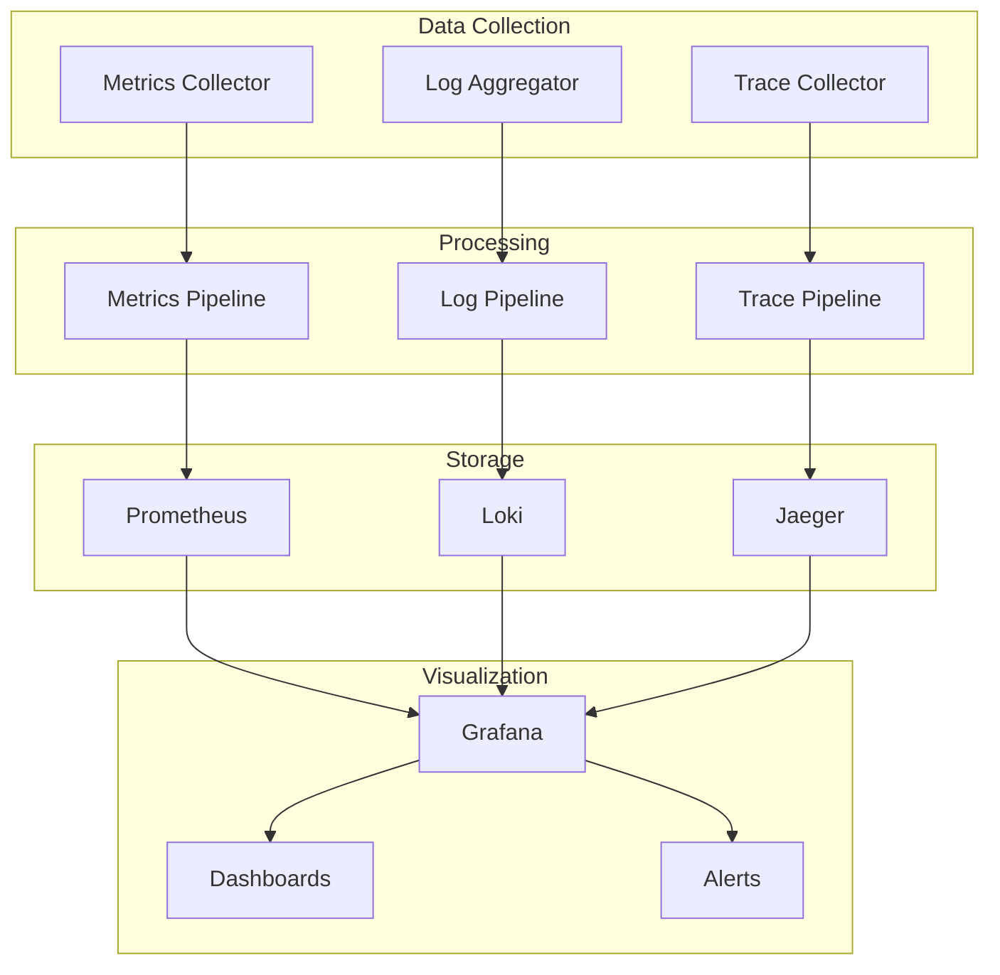
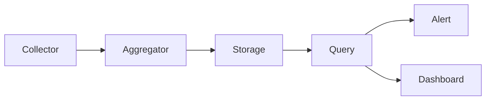
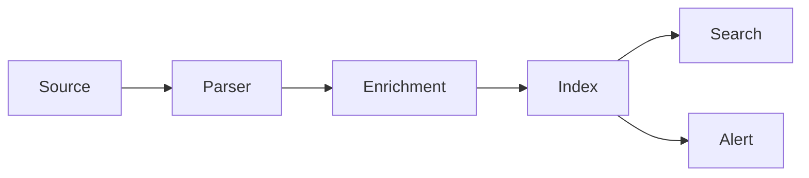
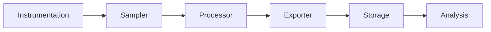
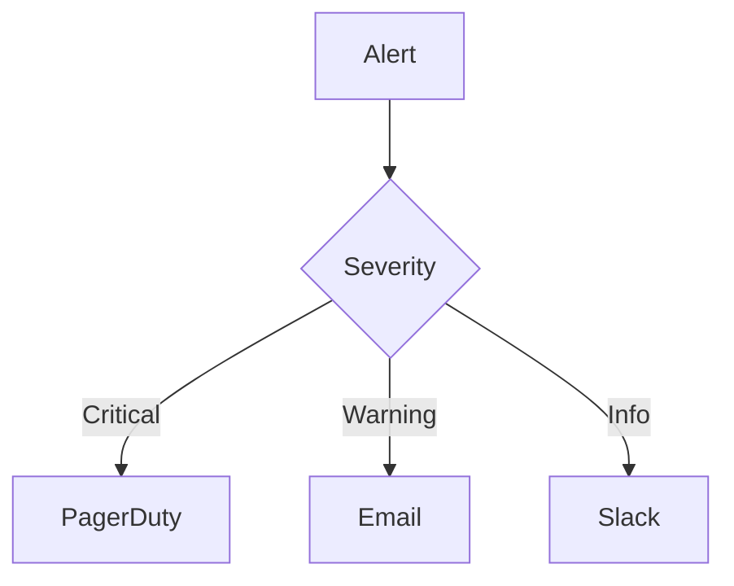
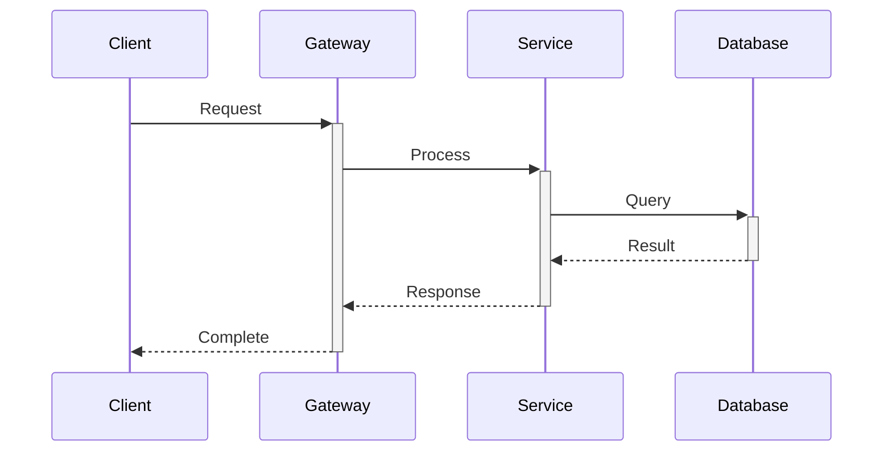

# 📊 Monitoring Stack & Observability Patterns

## Overview

The Monitoring & Observability system provides comprehensive visibility into platform health, performance, and behavior through metrics, logging, tracing, and alerting capabilities.

## Architecture

### System Components


## Core Components

### Metrics Collection
```typescript
interface MetricsConfig {
  collectors: MetricsCollector[];
  scrape_configs: ScrapeConfig[];
  recording_rules: RecordingRule[];
  alert_rules: AlertRule[];
}

interface MetricsCollector {
  type: 'prometheus' | 'statsd' | 'custom';
  endpoint: string;
  interval: number;
  labels: Record<string, string>;
}
```

### Logging System
```typescript
interface LoggingConfig {
  aggregators: LogAggregator[];
  parsers: LogParser[];
  retention: RetentionPolicy;
  indexes: LogIndex[];
}

interface LogEntry {
  timestamp: string;
  level: string;
  service: string;
  trace_id: string;
  message: string;
  metadata: Record<string, any>;
}
```

### Tracing System
```typescript
interface TracingConfig {
  samplers: Sampler[];
  exporters: SpanExporter[];
  processors: SpanProcessor[];
}

interface Span {
  trace_id: string;
  span_id: string;
  parent_id: string;
  name: string;
  start_time: number;
  end_time: number;
  attributes: Record<string, any>;
}
```

## Observability Patterns

### Metrics Pipeline


### Logging Pipeline


### Tracing Pipeline


## Monitoring Components

### Service Health
```typescript
interface HealthCheck {
  service: string;
  endpoint: string;
  interval: number;
  timeout: number;
  thresholds: {
    latency: number;
    success_rate: number;
    error_rate: number;
  };
}
```

### Resource Metrics
- CPU utilization
- Memory usage
- Disk I/O
- Network traffic
- Queue depth

### Business Metrics
- Request rate
- Error rate
- Response time
- Success rate
- User activity

## Alerting System

### Alert Rules
```typescript
interface AlertRule {
  name: string;
  query: string;
  duration: string;
  labels: Record<string, string>;
  annotations: Record<string, string>;
  severity: 'critical' | 'warning' | 'info';
}
```

### Alert Routing


## Visualization

### Dashboard Types
- System dashboards
- Service dashboards
- Business dashboards
- SLO dashboards
- Custom dashboards

### Panel Types
- Time series
- Gauges
- Tables
- Heatmaps
- Logs view

## Performance Analysis

### Latency Analysis


### Error Analysis
- Error rates
- Error types
- Error patterns
- Impact analysis
- Root cause

## SLO Monitoring

### SLO Definition
```typescript
interface SLO {
  name: string;
  target: number;
  window: string;
  indicator: {
    metric: string;
    success_criteria: string;
  };
  error_budget: {
    policy: string;
    burn_rate_threshold: number;
  };
}
```

### Budget Tracking
- Error budget
- Burn rate
- Budget alerts
- Trend analysis

## Related Documentation
- [Metrics Documentation](METRICS_DOCUMENTATION.md)
- [Logging Documentation](LOGGING_DOCUMENTATION.md)
- [Tracing Documentation](TRACING_DOCUMENTATION.md)
- [Alerting Documentation](ALERTING_DOCUMENTATION.md)
