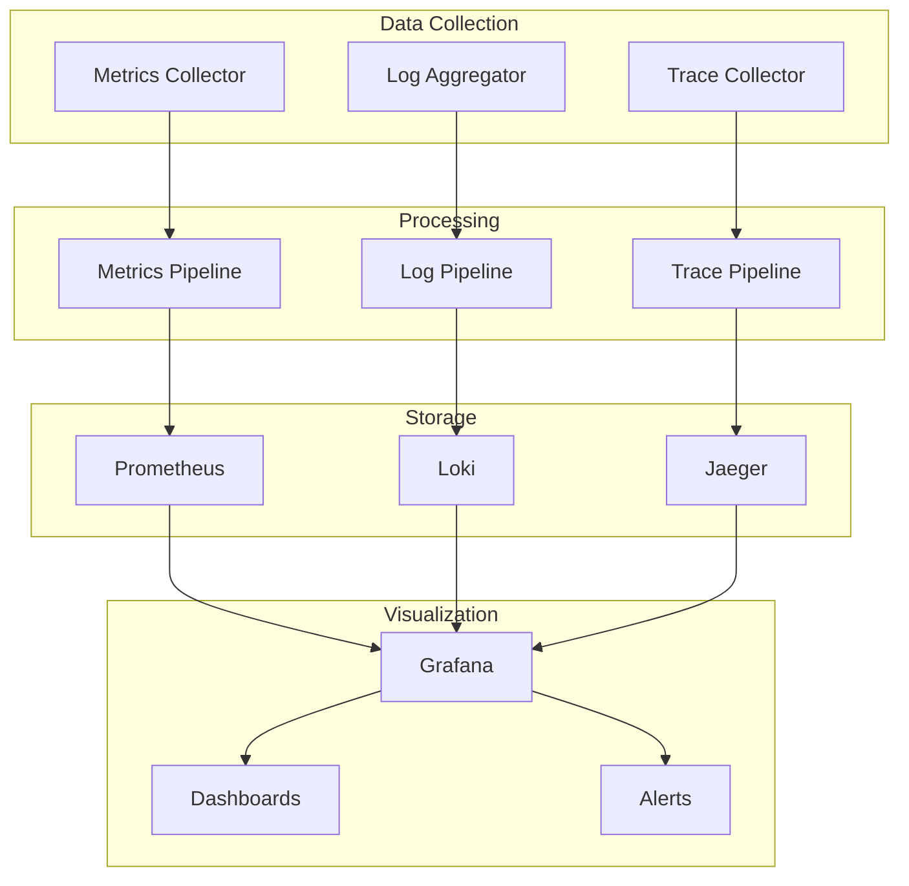

# 📊 Monitoring Stack & Observability Pattern

s

#

# Overvie

w

The Monitoring & Observability system provides comprehensive visibility into platform health, performance, and behavior through metrics, logging, tracing, and alerting capabilities.

#

# Architectur

e

#

## System Components



#

# Core Component

s

#

## Metrics Collection

```

typescript
interface MetricsConfig {
  collectors: MetricsCollector[];
  scrape_configs: ScrapeConfig[];
  recording_rules: RecordingRule[];
  alert_rules: AlertRule[];
}

interface MetricsCollector {
  type: 'prometheus' | 'statsd' | 'custom';
  endpoint: string;
  interval: number;
  labels: Record<string, string>;
}

```

#

## Logging System

```

typescript
interface LoggingConfig {
  aggregators: LogAggregator[];
  parsers: LogParser[];
  retention: RetentionPolicy;
  indexes: LogIndex[];
}

interface LogEntry {
  timestamp: string;
  level: string;
  service: string;
  trace_id: string;
  message: string;
  metadata: Record<string, any>;
}

```

#

## Tracing System

```

typescript
interface TracingConfig {
  samplers: Sampler[];
  exporters: SpanExporter[];
  processors: SpanProcessor[];
}

interface Span {
  trace_id: string;
  span_id: string;
  parent_id: string;
  name: string;
  start_time: number;
  end_time: number;
  attributes: Record<string, any>;
}

```

#

# Observability Pattern

s

#

## Metrics Pipeline

```

mermaid
graph LR
    A[Collector] --> B[Aggregator]

    B --> C[Storage]

    C --> D[Query]

    D --> E[Alert]

    D --> F[Dashboard

]

```

#

## Logging Pipeline

```

mermaid
graph LR
    A[Source] --> B[Parser]

    B --> C[Enrichment]

    C --> D[Index]

    D --> E[Search]

    D --> F[Alert

]

```

#

## Tracing Pipeline

```

mermaid
graph LR
    A[Instrumentation] --> B[Sampler]

    B --> C[Processor]

    C --> D[Exporter]

    D --> E[Storage]

    E --> F[Analysis

]

```

#

# Monitoring Component

s

#

## Service Health

```

typescript
interface HealthCheck {
  service: string;
  endpoint: string;
  interval: number;
  timeout: number;
  thresholds: {
    latency: number;
    success_rate: number;
    error_rate: number;
  };
}

```

#

## Resource Metrics

- CPU utilizatio

n

- Memory usag

e

- Disk I/

O

- Network traffi

c

- Queue dept

h

#

## Business Metrics

- Request rat

e

- Error rat

e

- Response tim

e

- Success rat

e

- User activit

y

#

# Alerting Syste

m

#

## Alert Rules

```

typescript
interface AlertRule {
  name: string;
  query: string;
  duration: string;
  labels: Record<string, string>;
  annotations: Record<string, string>;
  severity: 'critical' | 'warning' | 'info';
}

```

#

## Alert Routing

```

mermaid
graph TD
    A[Alert] --> B{Severity}

    B -->|Critical| C[PagerDuty]

    B -->|Warning| D[Email]

    B -->|Info| E[Slack

]

```

#

# Visualizatio

n

#

## Dashboard Types

- System dashboard

s

- Service dashboard

s

- Business dashboard

s

- SLO dashboard

s

- Custom dashboard

s

#

## Panel Types

- Time serie

s

- Gauge

s

- Table

s

- Heatmap

s

- Logs vie

w

#

# Performance Analysi

s

#

## Latency Analysis

```

mermaid
sequenceDiagram
    participant C as Client
    participant G as Gateway
    participant S as Service
    participant D as Database

    C->>+G: Request

    G->>+S: Process

    S->>+D: Query

    D-->>-S: Result

    S-->>-G: Response

    G-->>-C: Complet

e

```

#

## Error Analysis

- Error rate

s

- Error type

s

- Error pattern

s

- Impact analysi

s

- Root caus

e

#

# SLO Monitorin

g

#

## SLO Definition

```

typescript
interface SLO {
  name: string;
  target: number;
  window: string;
  indicator: {
    metric: string;
    success_criteria: string;
  };
  error_budget: {
    policy: string;
    burn_rate_threshold: number;
  };
}

```

#

## Budget Tracking

- Error budge

t

- Burn rat

e

- Budget alert

s

- Trend analysi

s

#

# Related Documentation

- [Metrics Documentation](METRICS_DOCUMENTATION.md

)

- [Logging Documentation](LOGGING_DOCUMENTATION.md

)

- [Tracing Documentation](TRACING_DOCUMENTATION.md

)

- [Alerting Documentation](ALERTING_DOCUMENTATION.md

)
