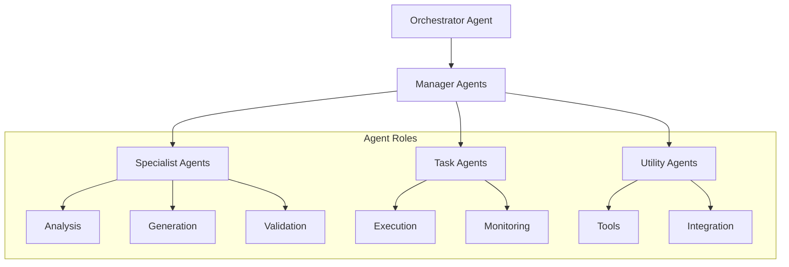
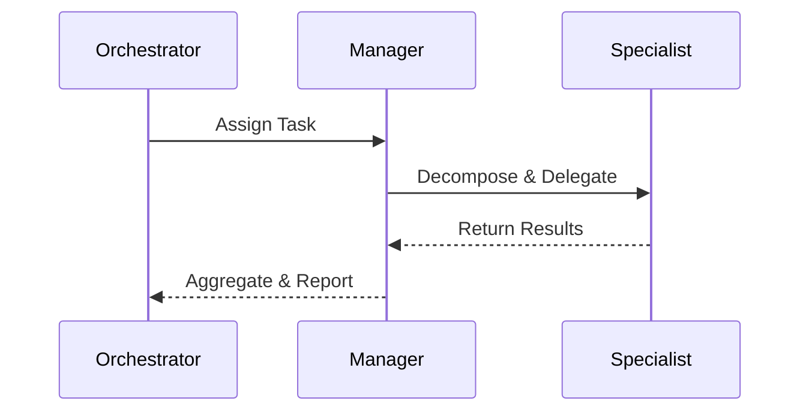
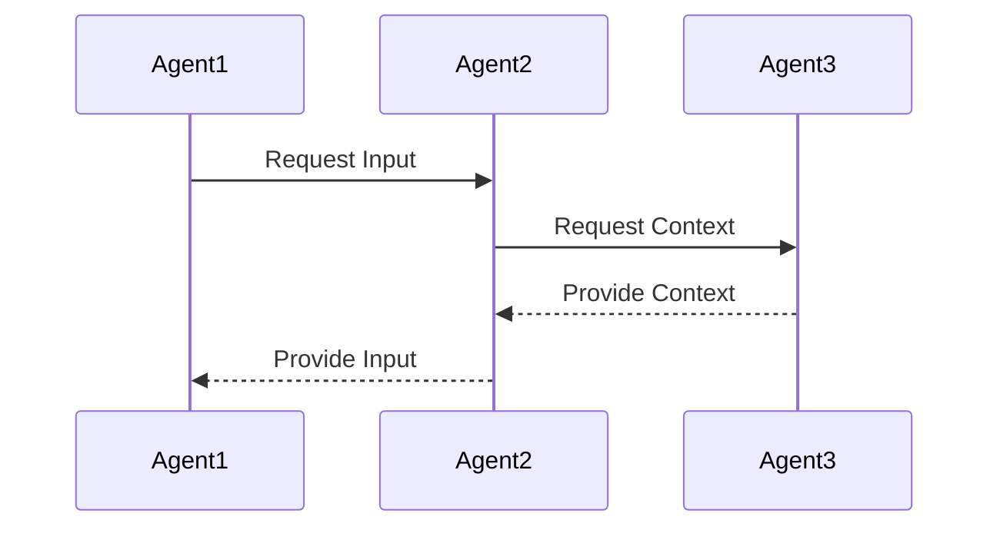

# 🤖 Multi-Agent Collaboration System

## Overview

The Multi-Agent Collaboration System (MACS) enables coordinated problem-solving through specialized AI agents working together in hierarchical and peer-to-peer configurations.

## Architecture

### Agent Types


### Communication Patterns

#### Hierarchical


#### Peer-to-Peer


## Core Components

### Agent Framework
- Base agent class with common capabilities
- Specialized agent implementations
- Tool integration interface
- Communication protocols

### Orchestration Engine
- Task decomposition
- Agent selection
- Resource allocation
- Progress tracking

### Communication Bus
- Message routing
- State synchronization
- Event propagation
- Error handling

## Agent Capabilities

### Base Capabilities
- Natural language understanding
- Context management
- Tool usage
- Error recovery
- Self-monitoring

### Specialized Functions
- Task decomposition
- Resource optimization
- Quality validation
- Integration handling

## Integration Points

### Tool Integration
```python
from auterity.agents import BaseAgent

class ToolAgent(BaseAgent):
    def execute_tool(self, tool_name: str, params: dict) -> dict:
        return self.tool_registry.execute(tool_name, params)
```

### Communication Protocol
```python
class AgentMessage:
    def __init__(self, sender: str, intent: str, payload: dict):
        self.sender = sender
        self.intent = intent
        self.payload = payload
        self.conversation_id = generate_id()
```

## Performance & Scaling

### Metrics
- Response latency: p95 < 200ms
- Task completion rate: > 95%
- Resource utilization: < 80%
- Error rate: < 1%

### Scaling Strategy
- Horizontal agent scaling
- Load-based orchestration
- Resource pooling
- State distribution

## Security & Governance

### Access Control
- Agent authentication
- Permission scoping
- Action auditing
- Resource limits

### Monitoring
- Agent health checks
- Performance metrics
- Error tracking
- Usage analytics

## Related Documentation
- [ML Governance Handbook](ml/ML_GOVERNANCE_HANDBOOK.md)
- [Predictive Analytics Platform](PREDICTIVE_ANALYTICS_PLATFORM.md)
- [Cost Optimization](COST_OPTIMIZATION_AND_TRACKING.md)
