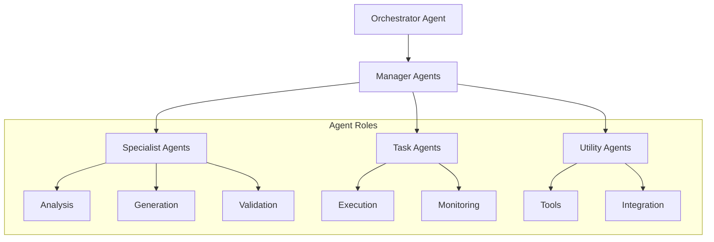

# 🤖 Multi-Agent Collaboration Syst

e

m

#

# Overvie

w

The Multi-Agent Collaboration System (MACS) enables coordinated problem-solving through specialized AI agents working together in hierarchical and peer-to-peer configurations

.

#

# Architectur

e

#

## Agent Types



#

## Communication Pattern

s

#

### Hierarchical

```

mermaid
sequenceDiagram
    participant O as Orchestrator
    participant M as Manager
    participant S as Specialist

    O->>M: Assign Task

    M->>S: Decompose & Delegate

    S-->>M: Return Results

    M-->>O: Aggregate & Repor

t

```

#

### Peer-to-Pee

r

```

mermaid
sequenceDiagram
    participant A as Agent1
    participant B as Agent2
    participant C as Agent3

    A->>B: Request Input

    B->>C: Request Context

    C-->>B: Provide Context

    B-->>A: Provide Inpu

t

```

#

# Core Component

s

#

## Agent Framework

- Base agent class with common capabilitie

s

- Specialized agent implementation

s

- Tool integration interfac

e

- Communication protocol

s

#

## Orchestration Engine

- Task decompositio

n

- Agent selectio

n

- Resource allocatio

n

- Progress trackin

g

#

## Communication Bus

- Message routin

g

- State synchronizatio

n

- Event propagatio

n

- Error handlin

g

#

# Agent Capabilitie

s

#

## Base Capabilities

- Natural language understandin

g

- Context managemen

t

- Tool usag

e

- Error recover

y

- Self-monitorin

g

#

## Specialized Functions

- Task decompositio

n

- Resource optimizatio

n

- Quality validatio

n

- Integration handlin

g

#

# Integration Point

s

#

## Tool Integration

```

python
from auterity.agents import BaseAgent

class ToolAgent(BaseAgent):
    def execute_tool(self, tool_name: str, params: dict) -> dict:

        return self.tool_registry.execute(tool_name, params)

```

#

## Communication Protocol

```

python
class AgentMessage:
    def __init__(self, sender: str, intent: str, payload: dict):
        self.sender = sender
        self.intent = intent
        self.payload = payload
        self.conversation_id = generate_id()

```

#

# Performance & Scalin

g

#

## Metrics

- Response latency: p95 < 200m

s

- Task completion rate: > 95

%

- Resource utilization: < 80

%

- Error rate: < 1

%

#

## Scaling Strategy

- Horizontal agent scalin

g

- Load-based orchestratio

n

- Resource poolin

g

- State distributio

n

#

# Security & Governanc

e

#

## Access Control

- Agent authenticatio

n

- Permission scopin

g

- Action auditin

g

- Resource limit

s

#

## Monitoring

- Agent health check

s

- Performance metric

s

- Error trackin

g

- Usage analytic

s

#

# Related Documentation

- [ML Governance Handbook](ml/ML_GOVERNANCE_HANDBOOK.md

)

- [Predictive Analytics Platform](PREDICTIVE_ANALYTICS_PLATFORM.md

)

- [Cost Optimization](COST_OPTIMIZATION_AND_TRACKING.md

)
