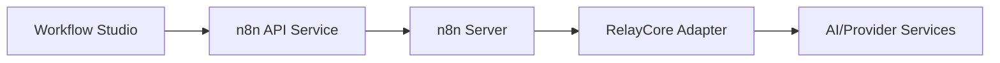

# 🔄 n8n Integration & AI-Enhanced Workflo

w

s

#

# Overvie

w

Documentation for n8n integration in Workflow Studio and system services.

#

# Component

s

- Frontend (Workflow Studio)

:

  - `apps/workflow-studio/src/components/n8n/AIEnhancedWorkflowEditor.tsx

`

  - `apps/workflow-studio/src/components/n8n/AIWorkflowAssistant.tsx

`

  - `apps/workflow-studio/src/services/n8n/n8nAIService.ts

`

  - `apps/workflow-studio/src/services/n8n/n8nApiService.ts

`

  - `apps/workflow-studio/src/services/n8n/n8nConfig.ts

`

- Systems

:

  - `systems/relaycore/src/services/n8n/n8nRelayCoreAdapter.ts

`

  - `systems/neuroweaver/src/services/n8n/n8nNeuroweaverConnector.ts

`

#

# Flow

s

#

# Capabilitie

s

- Generate/modify workflows with AI assistanc

e

- Execute and monitor workflow

s

- Template nodes and trigger

s

#

# Securit

y

- API auth, per-tenant credentials, audit log

s

