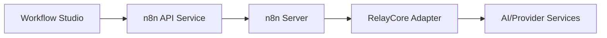

# 🔄 n8n Integration & AI-Enhanced Workflows

## Overview

Documentation for n8n integration in Workflow Studio and system services.

## Components

- Frontend (Workflow Studio):
  - `apps/workflow-studio/src/components/n8n/AIEnhancedWorkflowEditor.tsx`
  - `apps/workflow-studio/src/components/n8n/AIWorkflowAssistant.tsx`
  - `apps/workflow-studio/src/services/n8n/n8nAIService.ts`
  - `apps/workflow-studio/src/services/n8n/n8nApiService.ts`
  - `apps/workflow-studio/src/services/n8n/n8nConfig.ts`
- Systems:
  - `systems/relaycore/src/services/n8n/n8nRelayCoreAdapter.ts`
  - `systems/neuroweaver/src/services/n8n/n8nNeuroweaverConnector.ts`

## Flows

## Capabilities

- Generate/modify workflows with AI assistance
- Execute and monitor workflows
- Template nodes and triggers

## Security

- API auth, per-tenant credentials, audit logs

