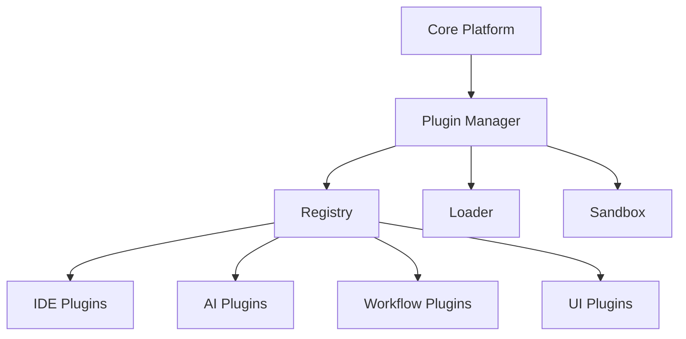

# 🧩 Plugin Architecture & Extension Point

s

#

# Overvie

w

Defines a modular plugin system enabling safe extension of IDE, AI, workflow, and UI capabilities without modifying core services.

#

# Architectur

e



#

# Plugin Manifes

t

```

json
{
  "name": "example-plugin",

  "version": "1.0.0",

  "type": "workflow",
  "entry": "dist/index.js",
  "permissions": ["network", "filesystem:read"],
  "capabilities": {"steps": ["custom.step"], "tools": ["http.request"]}
}

```

#

# Lifecycl

e

- Registration -> Validation -> Installation -> Activation -> Deactivation -> Remova

l

- Version checks and capability negotiation at activatio

n

#

# Security & Sandboxin

g

- Capability-scoped permission

s

- Network and filesystem guard

s

- Resource quotas and timeout

s

- Structured error boundarie

s

#

# Extension Point

s

#

## IDE

- Panels (Explorer, Git, Terminal

)

- Commands and keybinding

s

- Code actions and diagnostic

s

#

## AI

- Tool adapters (HTTP, SQL, files, vector stores

)

- Prompt templates and chain

s

- Result post-processor

s

#

## Workflow

- Custom steps and executor

s

- Triggers and event handler

s

- Validators and policy hook

s

#

## UI

- Widgets and dashboard

s

- Routes and navigatio

n

- Theming tokens and component

s

#

# Plugin API (TypeScript

)

```

typescript
export interface PluginContext {
  logger: Logger;
  storage: KeyValueStore;
  events: EventBus;
  http: HttpClient;
  capabilities: CapabilityRegistry;
}

export interface AuterityPlugin {
  activate(ctx: PluginContext): Promise<void>;
  deactivate(): Promise<void>;
}

```

#

# Packaging & Distributio

n

- Package as npm tarballs or OCI artifact

s

- Signed manifests; integrity checks on instal

l

- Private registry support with scope

s

#

# Versioning & Compatibilit

y

- SemVer; peerDependency ranges for platform API

s

- Feature flags for preview capabilitie

s

#

# Testing & Q

A

- Contract tests for extension point

s

- Sandbox tests for permission enforcemen

t

- Performance budgets and memory leak check

s

#

# Observabilit

y

- Per-plugin metrics: activation time, errors, resource usag

e

- Event logs with correlation id

s

#

# Governanc

e

- Review and approval workflow for publishin

g

- Security scans and automatic revocation on CVE

s

#

# Related Documentatio

n

- Plugin System Documentatio

n

- IDE Documentatio

n

- Workflow Engine Documentatio

n
