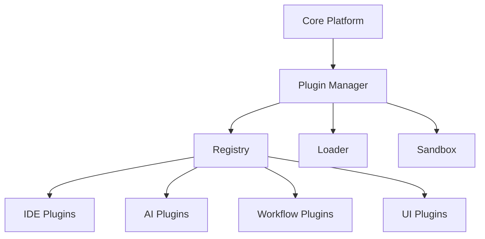

# 🧩 Plugin Architecture & Extension Points

## Overview

Defines a modular plugin system enabling safe extension of IDE, AI, workflow, and UI capabilities without modifying core services.

## Architecture



## Plugin Manifest

```json
{
  "name": "example-plugin",
  "version": "1.0.0",
  "type": "workflow",
  "entry": "dist/index.js",
  "permissions": ["network", "filesystem:read"],
  "capabilities": {"steps": ["custom.step"], "tools": ["http.request"]}
}
```

## Lifecycle

- Registration -> Validation -> Installation -> Activation -> Deactivation -> Removal
- Version checks and capability negotiation at activation

## Security & Sandboxing

- Capability-scoped permissions
- Network and filesystem guards
- Resource quotas and timeouts
- Structured error boundaries

## Extension Points

### IDE
- Panels (Explorer, Git, Terminal)
- Commands and keybindings
- Code actions and diagnostics

### AI
- Tool adapters (HTTP, SQL, files, vector stores)
- Prompt templates and chains
- Result post-processors

### Workflow
- Custom steps and executors
- Triggers and event handlers
- Validators and policy hooks

### UI
- Widgets and dashboards
- Routes and navigation
- Theming tokens and components

## Plugin API (TypeScript)

```typescript
export interface PluginContext {
  logger: Logger;
  storage: KeyValueStore;
  events: EventBus;
  http: HttpClient;
  capabilities: CapabilityRegistry;
}

export interface AuterityPlugin {
  activate(ctx: PluginContext): Promise<void>;
  deactivate(): Promise<void>;
}
```

## Packaging & Distribution

- Package as npm tarballs or OCI artifacts
- Signed manifests; integrity checks on install
- Private registry support with scopes

## Versioning & Compatibility

- SemVer; peerDependency ranges for platform APIs
- Feature flags for preview capabilities

## Testing & QA

- Contract tests for extension points
- Sandbox tests for permission enforcement
- Performance budgets and memory leak checks

## Observability

- Per-plugin metrics: activation time, errors, resource usage
- Event logs with correlation ids

## Governance

- Review and approval workflow for publishing
- Security scans and automatic revocation on CVEs

## Related Documentation

- Plugin System Documentation
- IDE Documentation
- Workflow Engine Documentation
