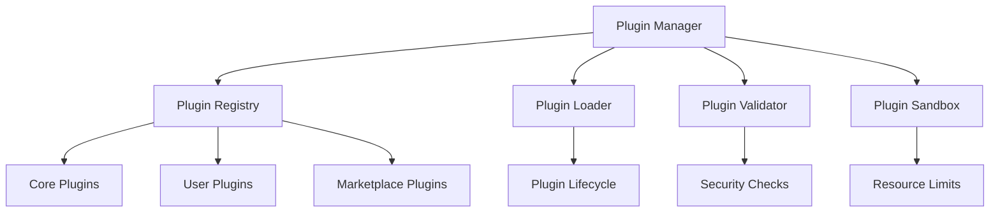

# 🔌 Plugin System Documentation

## Overview

This document provides comprehensive documentation for Auterity's plugin system, which enables extensibility across the platform through a modular architecture.

## Table of Contents

1. [Plugin Architecture](#plugin-architecture)
2. [Core Plugin Types](#core-plugin-types)
3. [Plugin Development](#plugin-development)
4. [Plugin Management](#plugin-management)
5. [Security & Sandboxing](#security--sandboxing)
6. [Performance Considerations](#performance-considerations)
7. [Testing Guidelines](#testing-guidelines)
8. [Distribution & Marketplace](#distribution--marketplace)

## Plugin Architecture

### System Overview


### Component Locations
```
frontend/src/
├── plugins/
│   ├── core/
│   │   ├── git/
│   │   ├── terminal/
│   │   └── ai/
│   ├── marketplace/
│   │   └── community/
│   └── system/
│       ├── loader.ts
│       ├── registry.ts
│       └── sandbox.ts
```

## Core Plugin Types

### IDE Plugins
**Location**: `frontend/src/plugins/core/ide/`
**Purpose**: Extend IDE functionality
**Features**:
- Custom editors
- Tool panels
- Command palette
- Keybindings

```typescript
// IDE Plugin Architecture
interface IDEPlugin extends Plugin {
    type: 'ide';
    contributes: {
        editors?: EditorContribution[];
        panels?: PanelContribution[];
        commands?: CommandContribution[];
        keybindings?: KeybindingContribution[];
    };
}

class CustomEditorPlugin implements IDEPlugin {
    type = 'ide';
    id = 'custom.editor';
    name = 'Custom Editor';
    version = '1.0.0';
    
    contributes = {
        editors: [{
            id: 'custom.editor',
            name: 'Custom Editor',
            filetypes: ['.custom'],
            component: CustomEditorComponent
        }]
    };
    
    activate(context: PluginContext): void {
        context.registerEditor(
            this.contributes.editors[0]
        );
    }
    
    deactivate(): void {
        // Cleanup
    }
}
```

### AI Plugins
**Location**: `frontend/src/plugins/core/ai/`
**Purpose**: Extend AI capabilities
**Features**:
- Custom models
- Prompt templates
- Tool integrations
- Analysis pipelines

```typescript
// AI Plugin Architecture
interface AIPlugin extends Plugin {
    type: 'ai';
    contributes: {
        models?: ModelContribution[];
        prompts?: PromptContribution[];
        tools?: ToolContribution[];
        pipelines?: PipelineContribution[];
    };
}

class CustomAIPlugin implements AIPlugin {
    type = 'ai';
    id = 'custom.ai';
    name = 'Custom AI';
    version = '1.0.0';
    
    contributes = {
        models: [{
            id: 'custom.model',
            name: 'Custom Model',
            provider: 'custom',
            endpoint: 'https://api.custom.ai'
        }],
        tools: [{
            id: 'custom.tool',
            name: 'Custom Tool',
            description: 'Custom AI tool',
            execute: async (params) => {
                // Tool implementation
            }
        }]
    };
    
    activate(context: PluginContext): void {
        context.registerModel(
            this.contributes.models[0]
        );
        context.registerTool(
            this.contributes.tools[0]
        );
    }
}
```

### Workflow Plugins
**Location**: `frontend/src/plugins/core/workflow/`
**Purpose**: Extend workflow capabilities
**Features**:
- Custom nodes
- Validators
- Executors
- Visualizations

```typescript
// Workflow Plugin Architecture
interface WorkflowPlugin extends Plugin {
    type: 'workflow';
    contributes: {
        nodes?: NodeContribution[];
        validators?: ValidatorContribution[];
        executors?: ExecutorContribution[];
        visualizers?: VisualizerContribution[];
    };
}

class CustomWorkflowPlugin implements WorkflowPlugin {
    type = 'workflow';
    id = 'custom.workflow';
    name = 'Custom Workflow';
    version = '1.0.0';
    
    contributes = {
        nodes: [{
            id: 'custom.node',
            name: 'Custom Node',
            category: 'Custom',
            component: CustomNodeComponent,
            executor: CustomNodeExecutor
        }],
        validators: [{
            id: 'custom.validator',
            name: 'Custom Validator',
            validate: async (workflow) => {
                // Validation logic
            }
        }]
    };
    
    activate(context: PluginContext): void {
        context.registerNode(
            this.contributes.nodes[0]
        );
        context.registerValidator(
            this.contributes.validators[0]
        );
    }
}
```

## Plugin Development

### Plugin Template
```typescript
// Plugin Template
abstract class BasePlugin implements Plugin {
    abstract id: string;
    abstract name: string;
    abstract version: string;
    abstract type: PluginType;
    
    dependencies?: string[];
    contributes?: any;
    
    async initialize(
        context: PluginContext
    ): Promise<void> {
        await this.validateDependencies(context);
        await this.loadResources();
        await this.activate(context);
    }
    
    abstract activate(
        context: PluginContext
    ): Promise<void>;
    
    async deactivate(): Promise<void> {
        await this.cleanup();
    }
    
    protected async validateDependencies(
        context: PluginContext
    ): Promise<void> {
        if (!this.dependencies) return;
        
        for (const dep of this.dependencies) {
            if (!context.hasPlugin(dep)) {
                throw new Error(
                    `Missing dependency: ${dep}`
                );
            }
        }
    }
}
```

### Plugin Context
```typescript
// Plugin Context
interface PluginContext {
    // Plugin Management
    registerPlugin(plugin: Plugin): void;
    unregisterPlugin(id: string): void;
    getPlugin(id: string): Plugin;
    hasPlugin(id: string): boolean;
    
    // Feature Registration
    registerCommand(command: Command): void;
    registerEditor(editor: Editor): void;
    registerPanel(panel: Panel): void;
    registerTool(tool: Tool): void;
    
    // Resource Access
    getResource(id: string): Resource;
    getConfiguration(): Configuration;
    getWorkspace(): Workspace;
    
    // Event Handling
    on(event: string, handler: Handler): void;
    off(event: string, handler: Handler): void;
    emit(event: string, data: any): void;
}
```

## Plugin Management

### Plugin Registry
```typescript
// Plugin Registry
class PluginRegistry {
    private plugins: Map<string, Plugin> = new Map();
    private dependencies: Graph = new Graph();
    
    async registerPlugin(
        plugin: Plugin
    ): Promise<void> {
        await this.validatePlugin(plugin);
        await this.checkDependencies(plugin);
        
        this.plugins.set(plugin.id, plugin);
        await this.updateDependencyGraph(plugin);
    }
    
    async unregisterPlugin(
        id: string
    ): Promise<void> {
        const plugin = this.plugins.get(id);
        if (!plugin) return;
        
        await this.checkDependents(plugin);
        await plugin.deactivate();
        
        this.plugins.delete(id);
        await this.updateDependencyGraph();
    }
    
    private async validatePlugin(
        plugin: Plugin
    ): Promise<void> {
        // Validation logic
    }
}
```

### Plugin Loader
```typescript
// Plugin Loader
class PluginLoader {
    private registry: PluginRegistry;
    private validator: PluginValidator;
    private sandbox: PluginSandbox;
    
    async loadPlugin(
        source: PluginSource
    ): Promise<Plugin> {
        const plugin = await this.loadSource(source);
        await this.validator.validate(plugin);
        
        const sandboxed = await this.sandbox.create(
            plugin
        );
        
        await this.registry.registerPlugin(sandboxed);
        return sandboxed;
    }
    
    private async loadSource(
        source: PluginSource
    ): Promise<Plugin> {
        switch (source.type) {
            case 'file':
                return this.loadFromFile(source.path);
            case 'url':
                return this.loadFromUrl(source.url);
            case 'npm':
                return this.loadFromNpm(source.package);
        }
    }
}
```

## Security & Sandboxing

### Plugin Validator
```typescript
// Plugin Validator
class PluginValidator {
    async validate(
        plugin: Plugin
    ): Promise<void> {
        await this.validateManifest(plugin);
        await this.validatePermissions(plugin);
        await this.validateCode(plugin);
        await this.validateResources(plugin);
    }
    
    private async validatePermissions(
        plugin: Plugin
    ): Promise<void> {
        const required = this.getRequiredPermissions(
            plugin
        );
        
        for (const perm of required) {
            if (!this.isPermissionAllowed(perm)) {
                throw new Error(
                    `Permission not allowed: ${perm}`
                );
            }
        }
    }
}
```

### Plugin Sandbox
```typescript
// Plugin Sandbox
class PluginSandbox {
    async create(
        plugin: Plugin
    ): Promise<Plugin> {
        const sandbox = await this.createSandbox(
            plugin
        );
        
        return new Proxy(plugin, {
            get: (target, prop) => {
                this.validateAccess(target, prop);
                return sandbox.get(target, prop);
            },
            set: (target, prop, value) => {
                this.validateMutation(target, prop);
                return sandbox.set(target, prop, value);
            }
        });
    }
    
    private async createSandbox(
        plugin: Plugin
    ): Promise<Sandbox> {
        return {
            memory: this.createMemoryLimits(),
            cpu: this.createCPULimits(),
            network: this.createNetworkLimits(),
            fs: this.createFSLimits()
        };
    }
}
```

## Performance Considerations

### Resource Management
```typescript
// Resource Management
class PluginResourceManager {
    private limits: ResourceLimits = {
        memory: 100 * 1024 * 1024, // 100MB
        cpu: 0.1, // 10% CPU
        storage: 50 * 1024 * 1024 // 50MB
    };
    
    async allocateResources(
        plugin: Plugin
    ): Promise<Resources> {
        const usage = await this.getCurrentUsage(
            plugin
        );
        
        if (this.exceedsLimits(usage)) {
            throw new Error('Resource limits exceeded');
        }
        
        return this.createResources(plugin);
    }
    
    private async getCurrentUsage(
        plugin: Plugin
    ): Promise<ResourceUsage> {
        return {
            memory: await this.getMemoryUsage(plugin),
            cpu: await this.getCPUUsage(plugin),
            storage: await this.getStorageUsage(plugin)
        };
    }
}
```

### Performance Monitoring
```typescript
// Performance Monitoring
class PluginPerformanceMonitor {
    private metrics: MetricsCollector;
    
    async trackPerformance(
        plugin: Plugin,
        operation: string
    ): Promise<void> {
        const start = performance.now();
        
        try {
            await operation();
        } finally {
            const duration = performance.now() - start;
            await this.recordMetrics(
                plugin,
                operation,
                duration
            );
        }
    }
    
    private async recordMetrics(
        plugin: Plugin,
        operation: string,
        duration: number
    ): Promise<void> {
        await this.metrics.record({
            plugin: plugin.id,
            operation,
            duration,
            timestamp: new Date()
        });
    }
}
```

## Testing Guidelines

### Plugin Testing
```typescript
// Plugin Testing
class PluginTestSuite {
    private context: TestContext;
    
    async testPlugin(
        plugin: Plugin
    ): Promise<TestResults> {
        const results = [];
        
        // Test lifecycle
        results.push(
            await this.testLifecycle(plugin)
        );
        
        // Test features
        results.push(
            await this.testFeatures(plugin)
        );
        
        // Test performance
        results.push(
            await this.testPerformance(plugin)
        );
        
        return this.aggregateResults(results);
    }
    
    private async testLifecycle(
        plugin: Plugin
    ): Promise<TestResult> {
        // Lifecycle tests
        await plugin.initialize(this.context);
        await plugin.activate(this.context);
        await plugin.deactivate();
    }
}
```

### Integration Testing
```typescript
// Integration Testing
class PluginIntegrationTest {
    private system: TestSystem;
    
    async testIntegration(
        plugin: Plugin
    ): Promise<TestResults> {
        // Setup test environment
        await this.system.setup();
        
        try {
            // Load plugin
            await this.system.loadPlugin(plugin);
            
            // Test interactions
            await this.testSystemInteractions(plugin);
            
            // Test with other plugins
            await this.testPluginInteractions(plugin);
            
        } finally {
            await this.system.cleanup();
        }
    }
}
```

## Distribution & Marketplace

### Plugin Package
```typescript
// Plugin Package
interface PluginPackage {
    manifest: {
        id: string;
        name: string;
        version: string;
        description: string;
        author: string;
        license: string;
        repository: string;
    };
    files: {
        main: string;
        types?: string;
        resources?: string[];
    };
    dependencies: {
        required: string[];
        optional: string[];
    };
    marketplace: {
        category: string;
        tags: string[];
        pricing?: PricingInfo;
        support?: SupportInfo;
    };
}
```

### Plugin Publisher
```typescript
// Plugin Publisher
class PluginPublisher {
    private marketplace: MarketplaceAPI;
    
    async publishPlugin(
        plugin: Plugin,
        package: PluginPackage
    ): Promise<PublishResult> {
        // Validate package
        await this.validatePackage(package);
        
        // Build distribution
        const dist = await this.buildDistribution(
            plugin,
            package
        );
        
        // Publish to marketplace
        return await this.marketplace.publish({
            package,
            distribution: dist
        });
    }
    
    private async buildDistribution(
        plugin: Plugin,
        package: PluginPackage
    ): Promise<Distribution> {
        return {
            files: await this.bundleFiles(plugin),
            manifest: await this.generateManifest(
                plugin,
                package
            ),
            signature: await this.signPackage(
                plugin,
                package
            )
        };
    }
}
```

This documentation provides a comprehensive overview of Auterity's plugin system. For specific implementation details or advanced patterns, refer to the individual component documentation or contact the development team.
