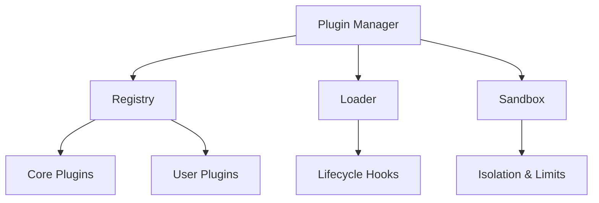

# 🔌 Plugin System Overview

## Overview

High-level overview of plugin architecture, registries, and extension points across IDE, AI, and workflow features.

## Architecture

## Extension Points

- IDE panes, AI tools, workflow nodes, dashboards widgets
- Validation and manifest format

## Security

- Capability-based permissions, sandboxing, resource quotas

