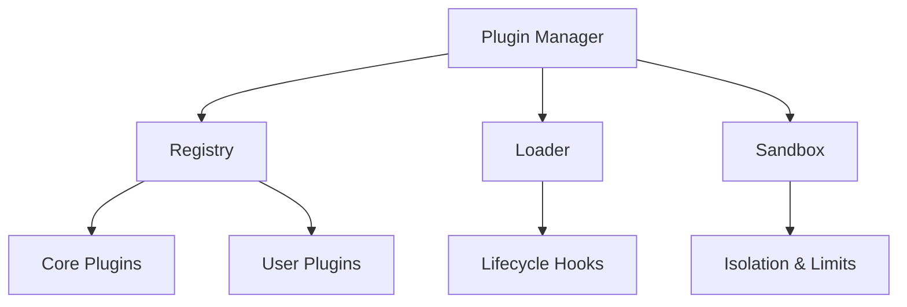

# 🔌 Plugin System Overvie

w

#

# Overvie

w

High-level overview of plugin architecture, registries, and extension points across IDE, AI, and workflow features

.

#

# Architectur

e

#

# Extension Point

s

- IDE panes, AI tools, workflow nodes, dashboards widget

s

- Validation and manifest forma

t

#

# Securit

y

- Capability-based permissions, sandboxing, resource quota

s

