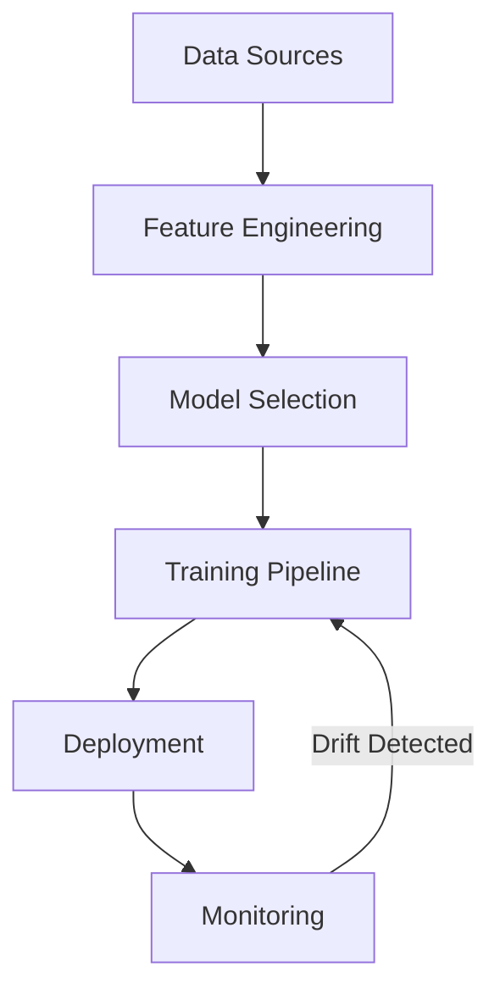

# 🔮 Predictive Analytics Platform

## Overview

Auterity's predictive analytics platform provides a domain-agnostic foundation for ML optimization, real-time analytics, and automated insights generation. The platform is designed to be extensible for domain-specific implementations while maintaining core functionality.

## Core Capabilities

### ML Optimization Engine


### Base Model Types
- Time Series Prediction
- Classification
- Anomaly Detection
- Entity Resolution
- Sequence Modeling

### Real-time Analytics
- Streaming data processing
- Online model serving
- Real-time dashboards
- Automated alerts

## Integration Points

### Data Sources
- Event streams (Kafka)
- Time series DB
- Data warehouse
- External APIs

### Model Registry
- Version control
- A/B testing
- Deployment management
- Performance tracking

### Optimization Service
- Resource allocation
- Cost optimization
- Model selection
- Batch scheduling

## Usage Example

```python
from auterity.predictive import BasePredictor

predictor = BasePredictor(model_type='classification')
prediction = predictor.predict({
    'features': feature_vector,
    'context': context_data
})
```

## Performance & SLAs

### Latency Targets
- Real-time predictions: p95 < 100ms
- Batch predictions: p95 < 1s
- Model training: < 4 hours

### Accuracy Requirements
- Base models: > 85% accuracy
- Drift threshold: < 5% deviation

## Related Documentation
- [ML Governance Handbook](ml/ML_GOVERNANCE_HANDBOOK.md)
- [Data Analytics Governance](data/DATA_AND_ANALYTICS_GOVERNANCE.md)
- [Real-time Updates & Streaming](REAL_TIME_UPDATES_AND_STREAMING.md)
- [Domain-Specific Extensions](DOMAIN_EXTENSIONS.md) (Future Development)
