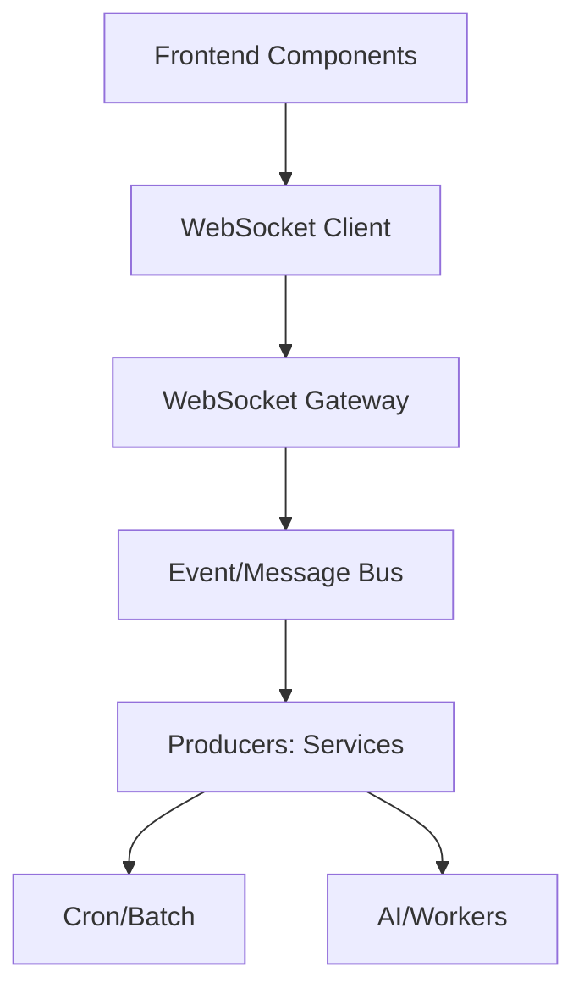

# 🔌 Real-time Updates & Streaming Patter

n

s

#

# Overvie

w

End-to-end guidance for implementing and documenting real-time experiences across dashboards, charts, and collaboration features using WebSockets and streaming APIs

.

#

# Architectur

e



#

# Frontend Pattern

s

- Connection lifecycle: auto-reconnect, exponential backoff, heartbeat/pin

g

- Channel namespacing: `dashboard:{id}`, `chart:{metric}`, `workflow:{id}

`

- Throttling: debounce renders, drop late frames, cap point array

s

- State: append-only ring buffers for time series; fixed windows for chart

s

#

# Implementation Sketch (Client

)

```

ts
// Pseudocode hook
export function useStream<T>(channel: string) {
  const [data, setData] = useState<T[]>([]);
  useEffect(() => {
    const ws = connect(`/ws?channel=${encodeURIComponent(channel)}`);
    ws.onmessage = (e) => {
      const msg = JSON.parse(e.data);
      setData(prev => [...prev.slice(-999), msg]); // cap length

    };
    return () => ws.close();
  }, [channel]);
  return data;
}

```

#

# Backend Consideration

s

- Backpressure: fan-out via Redis/Kafka; avoid slow client blockin

g

- Auth: JWT on connect, per-channel authorizatio

n

- QoS: delivery modes (at-most-once for metrics; at-least-once for logs

)

#

# Testin

g

- Simulate bursts and drops; verify UI stabilit

y

- Contract tests for channel schema

s

