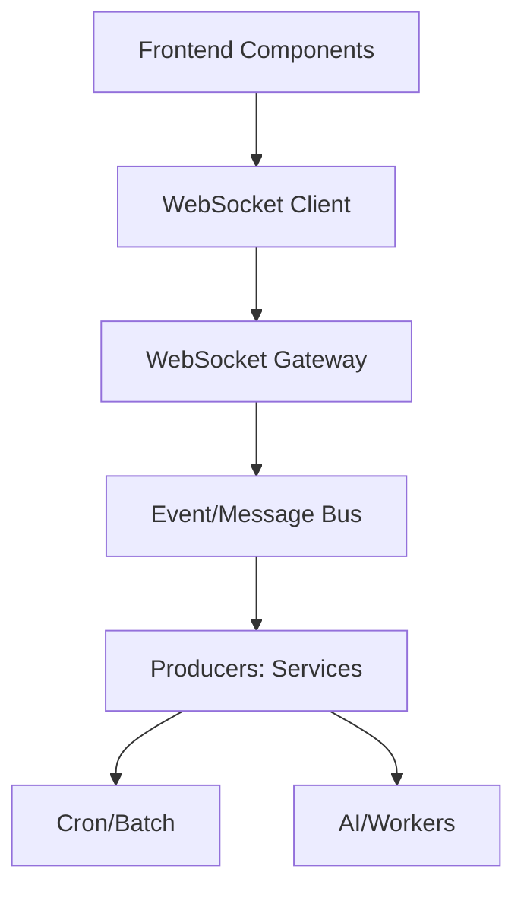

# 🔌 Real-time Updates & Streaming Patterns

## Overview

End-to-end guidance for implementing and documenting real-time experiences across dashboards, charts, and collaboration features using WebSockets and streaming APIs.

## Architecture



## Frontend Patterns

- Connection lifecycle: auto-reconnect, exponential backoff, heartbeat/ping
- Channel namespacing: `dashboard:{id}`, `chart:{metric}`, `workflow:{id}`
- Throttling: debounce renders, drop late frames, cap point arrays
- State: append-only ring buffers for time series; fixed windows for charts

## Implementation Sketch (Client)

```ts
// Pseudocode hook
export function useStream<T>(channel: string) {
  const [data, setData] = useState<T[]>([]);
  useEffect(() => {
    const ws = connect(`/ws?channel=${encodeURIComponent(channel)}`);
    ws.onmessage = (e) => {
      const msg = JSON.parse(e.data);
      setData(prev => [...prev.slice(-999), msg]); // cap length
    };
    return () => ws.close();
  }, [channel]);
  return data;
}
```

## Backend Considerations

- Backpressure: fan-out via Redis/Kafka; avoid slow client blocking
- Auth: JWT on connect, per-channel authorization
- QoS: delivery modes (at-most-once for metrics; at-least-once for logs)

## Testing

- Simulate bursts and drops; verify UI stability
- Contract tests for channel schemas


