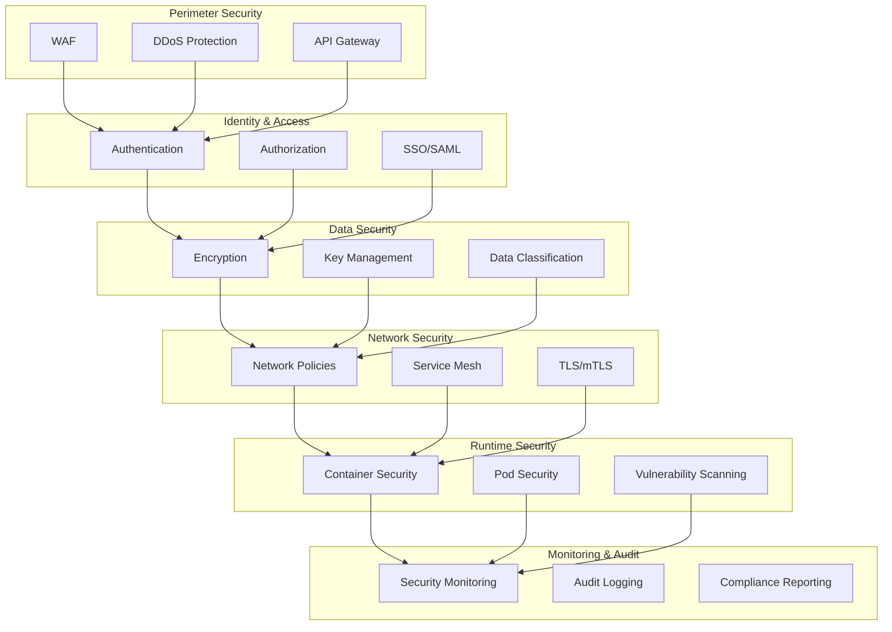

# 🔒 Security Architecture & Compliance Framewor

k

#

# Overvie

w

The Security Architecture provides a comprehensive framework for protecting platform resources, data, and operations while ensuring compliance with industry standards and regulations.

#

# Architectur

e

#

## Security Layers



#

# Core Component

s

#

## Authentication System

```

typescript
interface AuthConfig {
  providers: AuthProvider[];
  session_config: SessionConfig;
  mfa_config: MFAConfig;
  token_config: TokenConfig;
}

interface AuthProvider {
  type: 'oauth' | 'saml' | 'local';
  config: ProviderConfig;
  mappings: AttributeMapping[];
}

```

#

## Authorization Framework

```

typescript
interface AuthorizationPolicy {
  resources: Resource[];
  roles: Role[];
  permissions: Permission[];
  conditions: Condition[];
}

interface Resource {
  type: string;
  actions: string[];
  attributes: string[];
}

```

#

## Encryption System

```

typescript
interface EncryptionConfig {
  algorithms: Algorithm[];
  key_rotation: RotationPolicy;
  data_classification: Classification[];
}

interface Algorithm {
  name: string;
  key_size: number;
  mode: string;
  purpose: string[];
}

```

#

# Security Pattern

s

#

## Authentication Flow

```

mermaid
sequenceDiagram
    participant U as User
    participant G as Gateway
    participant A as Auth
    participant K as KeyStore

    U->>G: Request

    G->>A: Authenticate

    A->>K: Get Keys

    K-->>A: Keys

    A-->>G: Token

    G-->>U: Respons

e

 + Toke

n

```

#

## Authorization Flow

```

mermaid
sequenceDiagram
    participant S as Service
    participant P as Policy
    participant E as Enforcer
    participant A as Audit

    S->>P: Check Permission

    P->>E: Evaluate Policy

    E->>A: Log Decision

    E-->>P: Decision

    P-->>S: Allow/Den

y

```

#

# Compliance Framewor

k

#

## Audit System

```

typescript
interface AuditEvent {
  timestamp: number;
  actor: Actor;
  action: string;
  resource: Resource;
  outcome: 'success' | 'failure';
  context: AuditContext;
}

interface AuditContext {
  ip_address: string;
  user_agent: string;
  session_id: string;
  trace_id: string;
}

```

#

## Compliance Controls

- Access control matri

x

- Data handling policie

s

- Security monitorin

g

- Incident respons

e

- Change managemen

t

#

# Network Securit

y

#

## Network Policies

```

yaml
apiVersion: networking.k8s.io/v1
kind: NetworkPolicy
metadata:
  name: secure-policy

spec:
  podSelector:
    matchLabels:
      app: secure-app

  policyTypes:

  - Ingres

s

  - Egress

  ingress:

  - from

:

    - podSelector:

        matchLabels:
          role: frontend
    ports:

    - protocol: TCP

      port: 8080

```

#

## Service Mesh

- mTLS enforcemen

t

- Traffic encryptio

n

- Access contro

l

- Traffic monitorin

g

#

# Data Protectio

n

#

## Encryption at Rest

- Database encryptio

n

- File system encryptio

n

- Backup encryptio

n

- Key rotatio

n

#

## Encryption in Transit

- TLS configuratio

n

- Certificate managemen

t

- Protocol securit

y

- Forward secrec

y

#

# Monitoring & Detectio

n

#

## Security Monitoring

```

typescript
interface SecurityMetrics {
  authentication_failures: number;
  authorization_failures: number;
  suspicious_activities: Activity[];
  policy_violations: Violation[];
}

```

#

## Threat Detection

- Anomaly detectio

n

- Behavior analysi

s

- Pattern matchin

g

- Alert correlatio

n

#

# Incident Respons

e

#

## Response Framework

```

mermaid
graph TD
    A[Detection] --> B[Triage]

    B --> C[Analysis]

    C --> D[Containment]

    D --> E[Eradication]

    E --> F[Recovery]

    F --> G[Post-Mortem

]

```

#

## Response Actions

- Incident classificatio

n

- Communication pla

n

- Containment step

s

- Recovery procedure

s

#

# Related Documentation

- [Authentication Documentation](AUTHENTICATION_DOCUMENTATION.md

)

- [Network Security](NETWORK_SECURITY_DOCUMENTATION.md

)

- [Compliance Handbook](security/SECURITY_AND_COMPLIANCE_HANDBOOK.md

)

- [Monitoring Documentation](MONITORING_DOCUMENTATION.md

)
