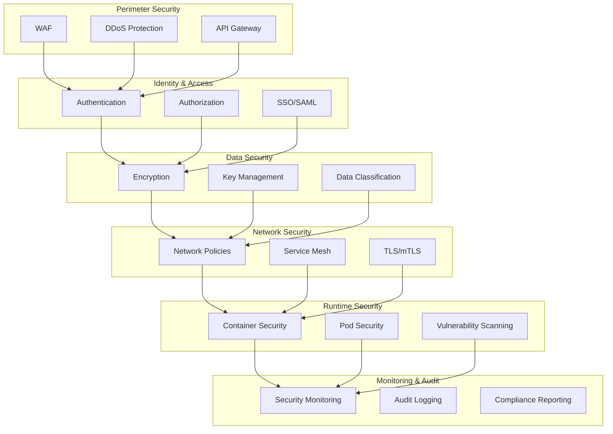
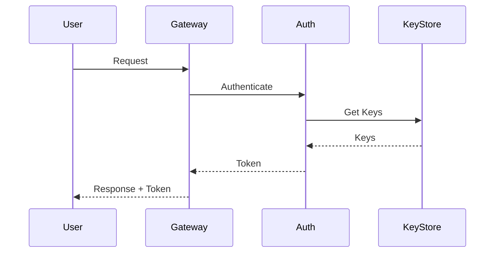
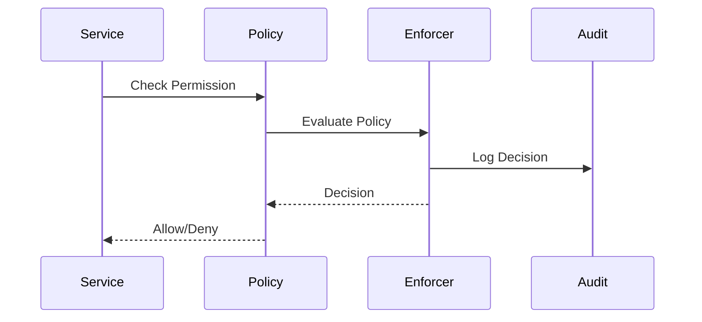
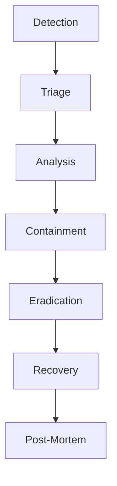

# 🔒 Security Architecture & Compliance Framework

## Overview

The Security Architecture provides a comprehensive framework for protecting platform resources, data, and operations while ensuring compliance with industry standards and regulations.

## Architecture

### Security Layers


## Core Components

### Authentication System
```typescript
interface AuthConfig {
  providers: AuthProvider[];
  session_config: SessionConfig;
  mfa_config: MFAConfig;
  token_config: TokenConfig;
}

interface AuthProvider {
  type: 'oauth' | 'saml' | 'local';
  config: ProviderConfig;
  mappings: AttributeMapping[];
}
```

### Authorization Framework
```typescript
interface AuthorizationPolicy {
  resources: Resource[];
  roles: Role[];
  permissions: Permission[];
  conditions: Condition[];
}

interface Resource {
  type: string;
  actions: string[];
  attributes: string[];
}
```

### Encryption System
```typescript
interface EncryptionConfig {
  algorithms: Algorithm[];
  key_rotation: RotationPolicy;
  data_classification: Classification[];
}

interface Algorithm {
  name: string;
  key_size: number;
  mode: string;
  purpose: string[];
}
```

## Security Patterns

### Authentication Flow


### Authorization Flow


## Compliance Framework

### Audit System
```typescript
interface AuditEvent {
  timestamp: number;
  actor: Actor;
  action: string;
  resource: Resource;
  outcome: 'success' | 'failure';
  context: AuditContext;
}

interface AuditContext {
  ip_address: string;
  user_agent: string;
  session_id: string;
  trace_id: string;
}
```

### Compliance Controls
- Access control matrix
- Data handling policies
- Security monitoring
- Incident response
- Change management

## Network Security

### Network Policies
```yaml
apiVersion: networking.k8s.io/v1
kind: NetworkPolicy
metadata:
  name: secure-policy
spec:
  podSelector:
    matchLabels:
      app: secure-app
  policyTypes:
  - Ingress
  - Egress
  ingress:
  - from:
    - podSelector:
        matchLabels:
          role: frontend
    ports:
    - protocol: TCP
      port: 8080
```

### Service Mesh
- mTLS enforcement
- Traffic encryption
- Access control
- Traffic monitoring

## Data Protection

### Encryption at Rest
- Database encryption
- File system encryption
- Backup encryption
- Key rotation

### Encryption in Transit
- TLS configuration
- Certificate management
- Protocol security
- Forward secrecy

## Monitoring & Detection

### Security Monitoring
```typescript
interface SecurityMetrics {
  authentication_failures: number;
  authorization_failures: number;
  suspicious_activities: Activity[];
  policy_violations: Violation[];
}
```

### Threat Detection
- Anomaly detection
- Behavior analysis
- Pattern matching
- Alert correlation

## Incident Response

### Response Framework


### Response Actions
- Incident classification
- Communication plan
- Containment steps
- Recovery procedures

## Related Documentation
- [Authentication Documentation](AUTHENTICATION_DOCUMENTATION.md)
- [Network Security](NETWORK_SECURITY_DOCUMENTATION.md)
- [Compliance Handbook](security/SECURITY_AND_COMPLIANCE_HANDBOOK.md)
- [Monitoring Documentation](MONITORING_DOCUMENTATION.md)
