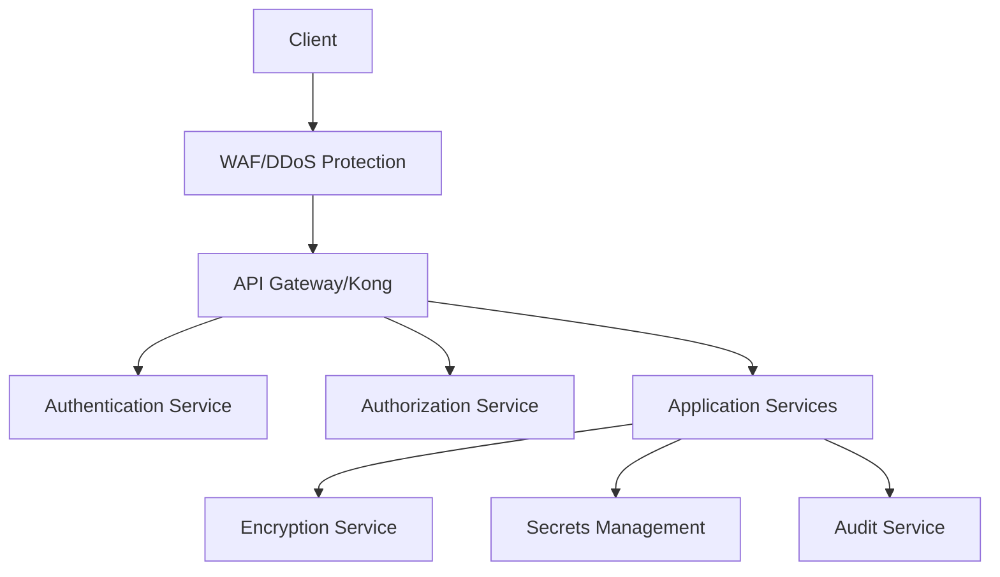

# 🔒 Security Documentation

## Overview

This document provides comprehensive documentation for Auterity's security infrastructure, including authentication, authorization, data protection, and security best practices.

## Table of Contents

1. [Security Architecture](#security-architecture)
2. [Authentication](#authentication)
3. [Authorization](#authorization)
4. [Data Protection](#data-protection)
5. [Network Security](#network-security)
6. [Secrets Management](#secrets-management)
7. [Security Monitoring](#security-monitoring)
8. [Compliance & Auditing](#compliance--auditing)

## Security Architecture

### Overview Diagram


### Component Locations
```
services/
├── security/
│   ├── authentication/
│   │   ├── jwt_service.py
│   │   └── oauth_service.py
│   ├── authorization/
│   │   ├── rbac_service.py
│   │   └── policy_service.py
│   ├── encryption/
│   │   ├── encryption_service.py
│   │   └── key_management.py
│   └── audit/
│       ├── audit_service.py
│       └── compliance_service.py
```

## Authentication

### JWT Authentication
**Location**: `services/security/authentication/jwt_service.py`
**Purpose**: Token-based authentication
**Configuration**:
```python
# JWT configuration
jwt_config = {
    "algorithm": "RS256",
    "private_key_path": "/etc/keys/private.pem",
    "public_key_path": "/etc/keys/public.pem",
    "token_expiry": 3600,  # 1 hour
    "refresh_token_expiry": 2592000,  # 30 days
    "issuer": "auterity.security"
}
```

### Token Generation
```python
from app.security.authentication import JWTService

class JWTService:
    async def generate_token(
        self,
        user_id: str,
        scopes: List[str],
        metadata: dict = None
    ) -> TokenPair:
        """Generate JWT token pair"""
        access_token = await self.create_access_token(
            user_id=user_id,
            scopes=scopes,
            metadata=metadata
        )
        
        refresh_token = await self.create_refresh_token(
            user_id=user_id
        )
        
        return TokenPair(
            access_token=access_token,
            refresh_token=refresh_token
        )
```

### OAuth Integration
```python
from app.security.authentication import OAuthService

class OAuthService:
    async def authenticate(
        self,
        provider: str,
        code: str
    ) -> AuthResult:
        """Authenticate with OAuth provider"""
        provider_config = await self.get_provider_config(provider)
        token = await self.exchange_code(
            provider_config,
            code
        )
        
        user_info = await self.get_user_info(
            provider_config,
            token
        )
        
        return await self.create_session(user_info)
```

## Authorization

### RBAC Service
**Location**: `services/security/authorization/rbac_service.py`
**Purpose**: Role-based access control
**Configuration**:
```python
# RBAC configuration
rbac_config = {
    "default_role": "user",
    "super_admin_role": "super_admin",
    "role_hierarchy": {
        "super_admin": ["admin", "user"],
        "admin": ["user"],
        "user": []
    }
}
```

### Permission Checking
```python
from app.security.authorization import RBACService

class RBACService:
    async def check_permission(
        self,
        user_id: str,
        resource: str,
        action: str
    ) -> bool:
        """Check if user has permission"""
        user_roles = await self.get_user_roles(user_id)
        required_permissions = await self.get_required_permissions(
            resource,
            action
        )
        
        return await self.validate_permissions(
            user_roles,
            required_permissions
        )
```

### Policy Enforcement
```python
from app.security.authorization import PolicyService

class PolicyService:
    async def enforce_policy(
        self,
        user: User,
        resource: Resource,
        action: str
    ) -> bool:
        """Enforce security policy"""
        policy = await self.load_policy(resource.type)
        context = await self.build_context(user, resource)
        
        decision = await self.evaluate_policy(
            policy,
            context,
            action
        )
        
        await self.audit_decision(decision, context)
        return decision.allowed
```

## Data Protection

### Encryption Service
**Location**: `services/security/encryption/encryption_service.py`
**Purpose**: Data encryption and decryption
**Configuration**:
```python
# Encryption configuration
encryption_config = {
    "algorithm": "AES-256-GCM",
    "key_rotation_interval": 30,  # days
    "key_derivation": "PBKDF2",
    "min_key_length": 32
}
```

### Data Encryption
```python
from app.security.encryption import EncryptionService

class EncryptionService:
    async def encrypt_data(
        self,
        data: bytes,
        context: dict = None
    ) -> EncryptedData:
        """Encrypt sensitive data"""
        key = await self.key_service.get_current_key()
        nonce = secrets.token_bytes(12)
        
        cipher = AES.new(key, AES.MODE_GCM, nonce=nonce)
        if context:
            cipher.update(json.dumps(context).encode())
            
        ciphertext, tag = cipher.encrypt_and_digest(data)
        
        return EncryptedData(
            ciphertext=ciphertext,
            nonce=nonce,
            tag=tag
        )
```

### Key Management
```python
from app.security.encryption import KeyManagementService

class KeyManagementService:
    async def rotate_keys(self) -> None:
        """Rotate encryption keys"""
        new_key = await self.generate_key()
        current_key = await self.get_current_key()
        
        await self.set_current_key(new_key)
        await self.archive_key(current_key)
        
        await self.notify_key_rotation(new_key.id)
```

## Network Security

### WAF Configuration
```yaml
# infrastructure/security/waf-rules.yml
rules:
  - id: REQUEST-920-PROTOCOL-ENFORCEMENT
    phase: request
    actions:
      - block
    conditions:
      - method: !rx ^(?:GET|POST|PUT|DELETE)$
      - protocol: !rx ^HTTP/[12]\.[01]$

  - id: REQUEST-930-APPLICATION-ATTACK-LFI
    phase: request
    actions:
      - block
    conditions:
      - args: !rx (?:\.\./|\.\.\\)
```

### Network Policies
```yaml
# infrastructure/security/network-policies.yml
apiVersion: networking.k8s.io/v1
kind: NetworkPolicy
metadata:
  name: default-deny-all
spec:
  podSelector: {}
  policyTypes:
  - Ingress
  - Egress
```

## Secrets Management

### Vault Integration
**Location**: `services/security/secrets/vault_service.py`
**Purpose**: Secure secrets storage and management
**Configuration**:
```python
# Vault configuration
vault_config = {
    "address": "https://vault.service:8200",
    "auth_method": "kubernetes",
    "role": "auterity-service",
    "mount_point": "auterity",
    "key_rotation": {
        "enabled": true,
        "interval": "24h"
    }
}
```

### Secrets Management
```python
from app.security.secrets import VaultService

class VaultService:
    async def get_secret(
        self,
        path: str,
        version: int = None
    ) -> Secret:
        """Get secret from vault"""
        client = await self.get_client()
        mount_point = self.get_mount_point(path)
        
        response = await client.read_secret(
            path=path,
            mount_point=mount_point,
            version=version
        )
        
        return Secret(
            data=response['data'],
            metadata=response['metadata']
        )
```

## Security Monitoring

### Security Events
```python
from app.security.monitoring import SecurityMonitor

class SecurityMonitor:
    async def track_security_event(
        self,
        event_type: str,
        severity: str,
        details: dict
    ) -> None:
        """Track security event"""
        event = SecurityEvent(
            type=event_type,
            severity=severity,
            details=details,
            timestamp=datetime.utcnow()
        )
        
        await self.store_event(event)
        await self.process_alerts(event)
```

### Threat Detection
```python
from app.security.monitoring import ThreatDetector

class ThreatDetector:
    async def analyze_activity(
        self,
        activity: Activity
    ) -> ThreatAssessment:
        """Analyze activity for threats"""
        patterns = await self.load_threat_patterns()
        matches = await self.match_patterns(
            activity,
            patterns
        )
        
        if matches:
            await self.handle_threats(matches)
            
        return ThreatAssessment(
            activity=activity,
            threats=matches
        )
```

## Compliance & Auditing

### Audit Logging
```python
from app.security.audit import AuditService

class AuditService:
    async def log_audit_event(
        self,
        event_type: str,
        user: User,
        resource: Resource,
        action: str,
        result: str
    ) -> None:
        """Log audit event"""
        event = AuditEvent(
            type=event_type,
            user=user,
            resource=resource,
            action=action,
            result=result,
            timestamp=datetime.utcnow()
        )
        
        await self.store_event(event)
        await self.process_compliance(event)
```

### Compliance Checking
```python
from app.security.compliance import ComplianceService

class ComplianceService:
    async def check_compliance(
        self,
        resource: Resource,
        requirements: List[str]
    ) -> ComplianceResult:
        """Check resource compliance"""
        checkers = await self.get_compliance_checkers(
            requirements
        )
        
        results = []
        for checker in checkers:
            result = await checker.check(resource)
            results.append(result)
            
        return ComplianceResult(
            resource=resource,
            results=results
        )
```

## Development Guidelines

### Security Testing
```python
# Example security test
from app.tests.security import SecurityTestCase

class TestAuthentication(SecurityTestCase):
    async def test_token_validation(self):
        """Test JWT token validation"""
        # Generate token
        token = await self.jwt_service.generate_token(
            user_id="test_user",
            scopes=["read", "write"]
        )
        
        # Validate token
        validation = await self.jwt_service.validate_token(
            token.access_token
        )
        
        self.assertTrue(validation.is_valid)
        self.assertEqual(validation.user_id, "test_user")
```

### Security Headers
```python
from app.security.headers import SecurityHeaders

class SecurityHeaders:
    async def apply_headers(
        self,
        response: Response
    ) -> Response:
        """Apply security headers"""
        headers = {
            "Strict-Transport-Security": "max-age=31536000; includeSubDomains",
            "X-Content-Type-Options": "nosniff",
            "X-Frame-Options": "DENY",
            "X-XSS-Protection": "1; mode=block",
            "Content-Security-Policy": self.get_csp_policy()
        }
        
        for key, value in headers.items():
            response.headers[key] = value
            
        return response
```

This documentation provides a comprehensive overview of security measures in the Auterity platform. For specific implementation details or security configurations, refer to the individual service documentation or contact the security team.
