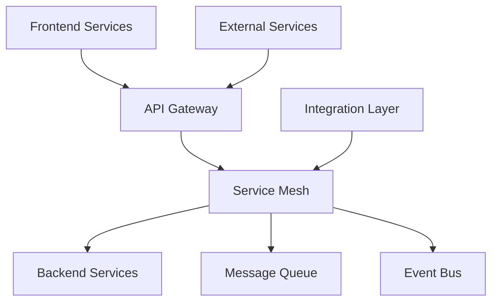

# 🔌 Service Integration Documentatio

n

#

# Overvie

w

This document provides comprehensive documentation for all integration points between services in the Auterity platform, including message queues, APIs, and cross-service communication patterns

.

#

# Table of Content

s

1. [Architecture Overview]

(

#architecture-overview

)

2. [Message Queue System]

(

#message-queue-system

)

3. [API Integration]

(

#api-integration

)

4. [Event System]

(

#event-system

)

5. [Service Discovery]

(

#service-discovery

)

6. [Cross-Service Communication

]

(

#cross-service-communication

)

7. [Integration Patterns]

(

#integration-patterns

)

8. [Security & Authentication]

(

#security--authenticatio

n

)

#

# Architecture Overvie

w

#

## Integration Architecture



#

## Component Locations

```

services/
├── integration/
│   ├── controllers/
│   │   ├── api_controller.py
│   │   └── event_controller.py
│   ├── adapters/
│   │   ├── rabbitmq_adapter.py
│   │   └── kafka_adapter.py
│   └── protocols/
│       ├── http_protocol.py
│       └── grpc_protocol.py

```

#

# Message Queue Syste

m

#

## RabbitMQ Integration

**Location**: `services/integration/adapters/rabbitmq_adapter.py

`
**Purpose**: Reliable message delivery and async processin

g
**Configuration**

:

```

python

# RabbitMQ connection configuration

rabbitmq_config = {
    "host": "rabbitmq.service",
    "port": 5672,
    "vhost": "/",
    "credentials": {
        "username": "auterity",
        "password": "${RABBITMQ_PASSWORD}"
    },
    "ssl": {
        "enabled": true,
        "verify": true,
        "ca_certs": "/etc/ssl/certs/ca-certificates.crt"

    }
}

```

#

## Message Publishing

```

python
from app.integration.messaging import MessagePublisher

class MessagePublisher:
    async def publish(
        self,
        exchange: str,
        routing_key: str,
        message: dict,
        headers: dict = None
    ) -> None:

        """Publish message to RabbitMQ"""
        await self.channel.basic_publish(
            exchange=exchange,
            routing_key=routing_key,
            body=json.dumps(message),
            properties=pika.BasicProperties(
                delivery_mode=2,

# persistent

                headers=headers
            )
        )

```

#

## Message Consumption

```

python
from app.integration.messaging import MessageConsumer

class MessageConsumer:
    async def consume(
        self,
        queue: str,
        callback: Callable,
        prefetch_count: int = 10
    ) -> None:

        """Consume messages from RabbitMQ"""
        await self.channel.basic_qos(
            prefetch_count=prefetch_count
        )
        await self.channel.basic_consume(
            queue=queue,
            on_message_callback=callback
        )

```

#

# API Integratio

n

#

## API Gateway Configuration

```

yaml

# infrastructure/kong/routes.yml

routes:

  - name: workflow-api

    paths: ["/api/v1/workflows"]
    strip_path: true
    service:
      name: workflow-service

      url: http://workflow-service:8000

    plugins:

      - name: key-aut

h

      - name: rate-limiting

        config:
          minute: 60

```

#

## Service Client

```

python
from app.integration.clients import ServiceClient

class ServiceClient:
    async def request(
        self,
        service: str,
        method: str,
        path: str,
        data: dict = None,
        headers: dict = None
    ) -> Response:

        """Make request to internal service"""
        url = await self.service_discovery.get_url(service)
        async with self.session.request(
            method,
            f"{url}{path}",
            json=data,
            headers=headers
        ) as response:
            return await response.json()

```

#

# Event Syste

m

#

## Kafka Integration

**Location**: `services/integration/adapters/kafka_adapter.py

`
**Purpose**: Real-time event streaming and processin

g
**Configuration**

:

```

python

# Kafka configuration

kafka_config = {
    "bootstrap_servers": ["kafka-1:9092", "kafka-2:9092"],

    "security_protocol": "SASL_SSL",
    "sasl_mechanism": "PLAIN",
    "sasl_plain_username": "${KAFKA_USERNAME}",
    "sasl_plain_password": "${KAFKA_PASSWORD}",
    "ssl_cafile": "/etc/kafka/secrets/ca.pem"
}

```

#

## Event Publishing

```

python
from app.integration.events import EventPublisher

class EventPublisher:
    async def publish_event(
        self,
        topic: str,
        event: dict,
        key: str = None
    ) -> None:

        """Publish event to Kafka"""
        await self.producer.send_and_wait(
            topic,
            value=event,
            key=key,
            headers=[
                ("event_type", event["type"].encode()),
                ("timestamp", str(time.time()).encode())
            ]
        )

```

#

## Event Consumption

```

python
from app.integration.events import EventConsumer

class EventConsumer:
    async def consume_events(
        self,
        topic: str,
        group_id: str,
        handler: Callable
    ) -> None:

        """Consume events from Kafka"""
        consumer = AIOKafkaConsumer(
            topic,
            group_id=group_id,
            **self.kafka_config

        )
        async for msg in consumer:
            await handler(msg.value)

```

#

# Service Discover

y

#

## Service Registry

```

python
from app.integration.discovery import ServiceRegistry

class ServiceRegistry:
    async def register_service(
        self,
        name: str,
        instance_id: str,
        url: str,
        metadata: dict = None
    ) -> None:

        """Register service in registry"""
        await self.consul.agent.service.register(
            name=name,
            service_id=instance_id,
            address=url,
            tags=["v1", "production"],
            meta=metadata
        )

```

#

## Service Discovery

```

python
from app.integration.discovery import ServiceDiscovery

class ServiceDiscovery:
    async def get_service(
        self,
        name: str,
        tag: str = None
    ) -> ServiceInstance:

        """Get service instance from registry"""
        services = await self.consul.health.service(
            service=name,
            tag=tag,
            passing=True
        )
        return self.load_balancer.select(services)

```

#

# Cross-Service Communicati

o

n

#

## gRPC Integration

```

python

# services/integration/protocols/grpc_protocol.py

from app.integration.protocols import GRPCClient

class GRPCClient:
    async def call_service(
        self,
        service: str,
        method: str,
        request: dict
    ) -> Response:

        """Make gRPC call to service"""
        channel = await self.get_channel(service)
        stub = self.get_stub(channel)
        return await stub.__getattribute__(method)(
            self.serialize_request(request)
        )

```

#

## HTTP Integration

```

python

# services/integration/protocols/http_protocol.py

from app.integration.protocols import HTTPClient

class HTTPClient:
    async def call_service(
        self,
        service: str,
        endpoint: str,
        method: str = "GET",
        data: dict = None
    ) -> Response:

        """Make HTTP call to service"""
        url = await self.service_discovery.get_url(service)
        async with self.session.request(
            method,
            f"{url}{endpoint}",
            json=data
        ) as response:
            return await response.json()

```

#

# Integration Pattern

s

#

## Circuit Breaker

```

python
from app.integration.patterns import CircuitBreaker

class CircuitBreaker:
    async def execute(
        self,
        command: Callable,
        fallback: Callable = None
    ) -> Any:

        """Execute with circuit breaker pattern"""
        if self.is_open:
            if await self.should_attempt_reset():
                return await self.attempt_reset(command)
            return await self.handle_open_circuit(fallback)

        try:
            result = await command()
            await self.handle_success()
            return result
        except Exception as e:
            await self.handle_failure(e)
            if fallback:
                return await fallback()
            raise

```

#

## Retry Pattern

```

python
from app.integration.patterns import RetryHandler

class RetryHandler:
    async def execute_with_retry(
        self,
        operation: Callable,
        max_attempts: int = 3,
        backoff_factor: float = 1.5

    ) -> Any:

        """Execute with retry pattern"""
        last_exception = None

        for attempt in range(max_attempts):
            try:
                return await operation()
            except RetryableError as e:
                last_exception = e
                if attempt < max_attempts

 - 1:

                    await self.wait_backoff(attempt, backoff_factor)

        raise last_exception

```

#

# Security & Authenticatio

n

#

## Service Authentication

```

python
from app.integration.security import ServiceAuthenticator

class ServiceAuthenticator:
    async def get_service_token(
        self,
        service_name: str,
        scope: List[str]
    ) -> str:

        """Get authentication token for service"""
        credentials = await self.vault.get_credentials(
            service_name
        )
        return await self.token_service.generate_token(
            service=service_name,
            credentials=credentials,
            scope=scope
        )

```

#

## Request Authentication

```

python
from app.integration.security import RequestAuthenticator

class RequestAuthenticator:
    async def authenticate_request(
        self,
        request: Request
    ) -> AuthResult:

        """Authenticate incoming request"""
        token = self.extract_token(request)
        if not token:
            raise AuthenticationError("Missing token")

        service = await self.token_service.validate_token(token)
        await self.authorize_service(service, request.path)
        return AuthResult(service=service)

```

#

# Development Guideline

s

#

## Integration Testing

```

python

# Example integration test

from app.tests.integration import IntegrationTestCase

class TestServiceIntegration(IntegrationTestCase):
    async def test_service_communication(self):
        """Test cross-service communication"""


# Publish event

        event = {"type": "test_event", "data": {}}
        await self.event_publisher.publish_event(
            "test_topic",
            event
        )


# Verify event received

        received = await self.event_consumer.get_event(
            timeout=5.0

        )
        self.assertEqual(received["type"], "test_event")

```

#

## Monitoring Integration

```

python
from app.integration.monitoring import IntegrationMonitor

class IntegrationMonitor:
    async def track_integration(
        self,
        integration_type: str,
        operation: str,
        duration: float,
        success: bool
    ) -> None:

        """Track integration metrics"""
        labels = {
            "type": integration_type,
            "operation": operation,
            "success": str(success)
        }

        self.metrics.observe(
            "integration_duration_seconds",
            duration,
            labels
        )

        self.metrics.increment(
            "integration_total",
            labels
        )

```

This documentation provides a comprehensive overview of service integration points in the Auterity platform. For specific implementation details or advanced patterns, refer to the individual service documentation or contact the development team.
