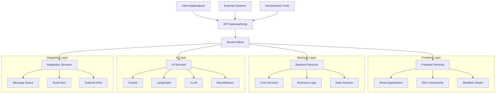
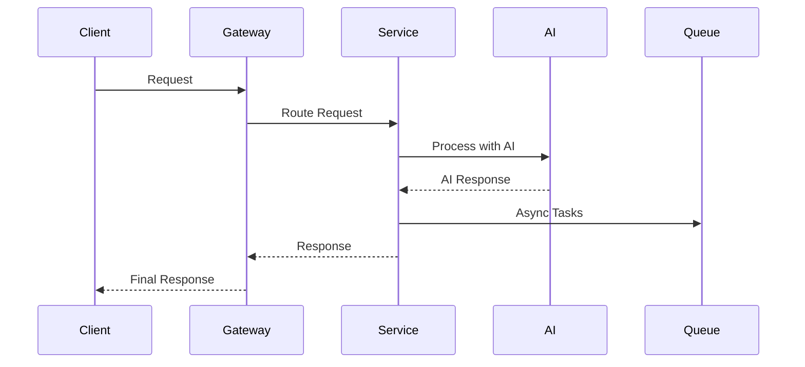
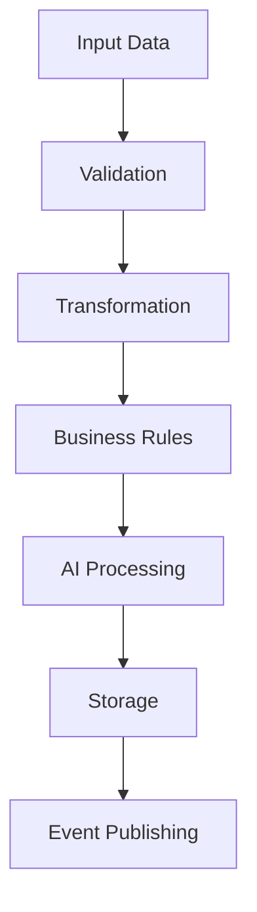
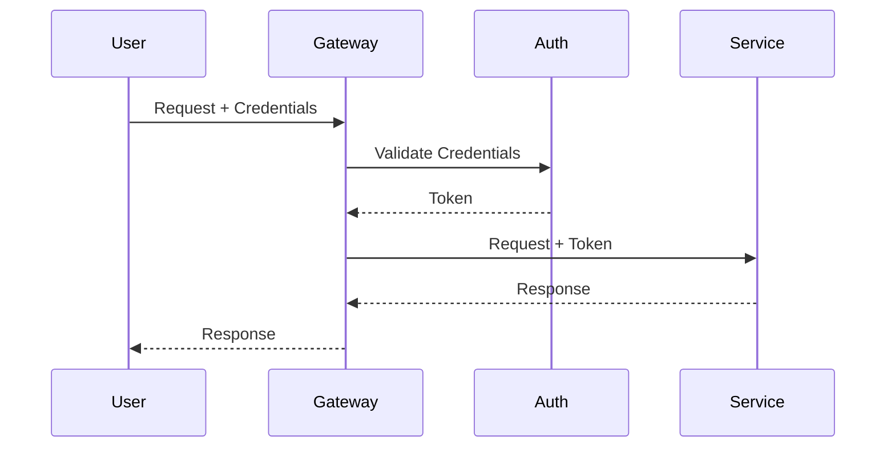

# 🏗️ System Design Documentation

## Overview

This document provides a comprehensive overview of Auterity's system architecture, including all major components, their interactions, and design decisions.

## Table of Contents

1. [System Architecture](#system-architecture)
2. [Core Components](#core-components)
3. [AI Integration](#ai-integration)
4. [Data Flow](#data-flow)
5. [Integration Points](#integration-points)
6. [Security Architecture](#security-architecture)
7. [Scalability Design](#scalability-design)
8. [Development Architecture](#development-architecture)

## System Architecture

### High-Level Architecture


### Component Locations
```
auterity/
├── frontend/
│   ├── src/
│   │   ├── components/
│   │   │   ├── ide/
│   │   │   ├── workflow/
│   │   │   └── ai/
│   │   ├── services/
│   │   └── utils/
├── backend/
│   ├── services/
│   │   ├── core/
│   │   ├── business/
│   │   └── data/
├── ai/
│   ├── crewai/
│   ├── langgraph/
│   ├── vllm/
│   └── neuroweaver/
└── integration/
    ├── queue/
    ├── events/
    └── apis/
```

## Core Components

### Frontend Services

#### IDE Integration
**Location**: `frontend/src/components/ide/`
**Purpose**: Integrated development environment
**Features**:
- Code editing
- Terminal integration
- Git operations
- AI assistance

```typescript
// IDE Component Architecture
interface IDEComponent {
    id: string;
    type: 'editor' | 'terminal' | 'panel';
    position: 'left' | 'right' | 'bottom';
    config: ComponentConfig;
}

class IDEManager {
    private components: Map<string, IDEComponent>;
    private layout: LayoutManager;
    private plugins: PluginManager;
    
    async initialize(): Promise<void> {
        await this.layout.initialize();
        await this.plugins.loadPlugins();
        await this.setupComponents();
    }
}
```

#### Workflow Studio
**Location**: `frontend/src/components/workflow/`
**Purpose**: Visual workflow designer
**Features**:
- Drag-and-drop interface
- Real-time collaboration
- AI-powered suggestions
- Version control

```typescript
// Workflow Component Architecture
interface WorkflowNode {
    id: string;
    type: string;
    position: Position;
    data: NodeData;
    connections: Connection[];
}

class WorkflowEngine {
    private nodes: Map<string, WorkflowNode>;
    private validator: WorkflowValidator;
    private executor: WorkflowExecutor;
    
    async executeWorkflow(id: string): Promise<Result> {
        const workflow = this.nodes.get(id);
        await this.validator.validate(workflow);
        return await this.executor.execute(workflow);
    }
}
```

### Backend Services

#### Core Services
**Location**: `backend/services/core/`
**Purpose**: Essential platform services
**Features**:
- Authentication
- Authorization
- Configuration
- Logging

```python
# Core Service Architecture
class CoreService:
    def __init__(self):
        self.auth = AuthenticationService()
        self.config = ConfigurationService()
        self.logger = LoggingService()
        
    async def initialize(self):
        await self.auth.initialize()
        await self.config.load()
        await self.logger.setup()
```

#### Business Services
**Location**: `backend/services/business/`
**Purpose**: Business logic implementation
**Features**:
- Workflow processing
- Data transformation
- Business rules
- Validation

```python
# Business Service Architecture
class BusinessService:
    def __init__(self):
        self.workflow = WorkflowProcessor()
        self.rules = BusinessRuleEngine()
        self.validator = DataValidator()
        
    async def process_workflow(self, workflow: Workflow):
        await self.validator.validate(workflow)
        await self.rules.apply(workflow)
        return await self.workflow.execute(workflow)
```

### AI Services

#### CrewAI Integration
**Location**: `ai/crewai/`
**Purpose**: Multi-agent collaboration
**Features**:
- Agent management
- Task coordination
- Knowledge sharing
- Goal optimization

```python
# CrewAI Architecture
class CrewAIService:
    def __init__(self):
        self.agents = AgentManager()
        self.coordinator = TaskCoordinator()
        self.knowledge = KnowledgeBase()
        
    async def execute_task(self, task: Task):
        crew = await self.agents.assemble_crew(task)
        plan = await self.coordinator.create_plan(crew, task)
        return await self.coordinator.execute_plan(plan)
```

#### LangGraph Integration
**Location**: `ai/langgraph/`
**Purpose**: AI workflow orchestration
**Features**:
- Graph-based workflows
- State management
- Decision making
- Error recovery

```python
# LangGraph Architecture
class LangGraphService:
    def __init__(self):
        self.graph = GraphManager()
        self.executor = GraphExecutor()
        self.state = StateManager()
        
    async def execute_graph(self, graph: Graph):
        validated = await self.graph.validate(graph)
        state = await self.state.initialize(validated)
        return await self.executor.execute(validated, state)
```

### Integration Services

#### Message Queue System
**Location**: `integration/queue/`
**Purpose**: Asynchronous communication
**Features**:
- Message routing
- Dead letter handling
- Priority queues
- Message persistence

```python
# Message Queue Architecture
class MessageQueueService:
    def __init__(self):
        self.broker = MessageBroker()
        self.router = MessageRouter()
        self.store = MessageStore()
        
    async def publish(self, message: Message):
        await self.router.route(message)
        await self.store.persist(message)
        await self.broker.publish(message)
```

#### Event System
**Location**: `integration/events/`
**Purpose**: Event-driven architecture
**Features**:
- Event publishing
- Subscription management
- Event processing
- Error handling

```python
# Event System Architecture
class EventSystem:
    def __init__(self):
        self.publisher = EventPublisher()
        self.subscriber = EventSubscriber()
        self.processor = EventProcessor()
        
    async def publish_event(self, event: Event):
        await self.publisher.publish(event)
        await self.processor.process(event)
        await self.notify_subscribers(event)
```

## Data Flow

### Request Flow


### Data Processing


## Integration Points

### External System Integration
```typescript
// Integration Architecture
interface SystemIntegration {
    connect(): Promise<Connection>;
    authenticate(): Promise<void>;
    execute(command: Command): Promise<Result>;
    disconnect(): Promise<void>;
}

class ExternalSystemIntegrator {
    private systems: Map<string, SystemIntegration>;
    private monitor: IntegrationMonitor;
    
    async executeCommand(
        system: string,
        command: Command
    ): Promise<Result> {
        const integration = this.systems.get(system);
        await integration.connect();
        await integration.authenticate();
        
        try {
            return await integration.execute(command);
        } finally {
            await integration.disconnect();
        }
    }
}
```

### API Integration
```typescript
// API Integration Architecture
interface APIIntegration {
    endpoint: string;
    method: string;
    auth: AuthConfig;
    transform: TransformConfig;
}

class APIIntegrator {
    private apis: Map<string, APIIntegration>;
    private client: HTTPClient;
    private transformer: DataTransformer;
    
    async callAPI(
        api: string,
        data: any
    ): Promise<any> {
        const config = this.apis.get(api);
        const transformed = await this.transformer.transform(
            data,
            config.transform
        );
        
        return await this.client.request({
            url: config.endpoint,
            method: config.method,
            data: transformed,
            auth: config.auth
        });
    }
}
```

## Security Architecture

### Authentication Flow


### Authorization System
```typescript
// Authorization Architecture
interface Permission {
    resource: string;
    action: string;
    conditions: Condition[];
}

class AuthorizationSystem {
    private permissions: Map<string, Permission[]>;
    private evaluator: ConditionEvaluator;
    
    async checkPermission(
        user: User,
        resource: string,
        action: string
    ): Promise<boolean> {
        const userPerms = this.permissions.get(user.role);
        const required = userPerms.find(p =>
            p.resource === resource &&
            p.action === action
        );
        
        if (!required) {
            return false;
        }
        
        return await this.evaluator.evaluate(
            required.conditions,
            user,
            resource
        );
    }
}
```

## Scalability Design

### Service Scaling
```yaml
# Kubernetes Scaling Configuration
apiVersion: apps/v1
kind: Deployment
metadata:
  name: auterity-service
spec:
  replicas: 3
  strategy:
    type: RollingUpdate
  template:
    spec:
      containers:
      - name: service
        image: auterity/service:latest
        resources:
          requests:
            cpu: 100m
            memory: 256Mi
          limits:
            cpu: 500m
            memory: 512Mi
```

### Load Balancing
```typescript
// Load Balancer Architecture
interface LoadBalancer {
    register(service: Service): void;
    unregister(service: Service): void;
    getNext(): Service;
}

class ServiceLoadBalancer {
    private services: Service[];
    private strategy: BalancingStrategy;
    private healthCheck: HealthChecker;
    
    async getService(): Promise<Service> {
        const available = await this.healthCheck.getHealthy(
            this.services
        );
        return this.strategy.select(available);
    }
}
```

## Development Architecture

### Development Environment
```typescript
// Development Environment Setup
interface DevEnvironment {
    services: ServiceConfig[];
    databases: DatabaseConfig[];
    tools: ToolConfig[];
}

class DevelopmentManager {
    private docker: DockerCompose;
    private services: ServiceManager;
    private databases: DatabaseManager;
    
    async setupEnvironment(
        config: DevEnvironment
    ): Promise<void> {
        await this.docker.up(config);
        await this.services.start(config.services);
        await this.databases.initialize(config.databases);
    }
}
```

### Testing Architecture
```typescript
// Testing Architecture
interface TestSuite {
    name: string;
    tests: Test[];
    setup(): Promise<void>;
    teardown(): Promise<void>;
}

class TestRunner {
    private suites: TestSuite[];
    private reporter: TestReporter;
    private coverage: CoverageCollector;
    
    async runTests(): Promise<TestResults> {
        const results = [];
        
        for (const suite of this.suites) {
            await suite.setup();
            const result = await this.runSuite(suite);
            await suite.teardown();
            results.push(result);
        }
        
        return this.reporter.generateReport(results);
    }
}
```

This documentation provides a comprehensive overview of Auterity's system architecture. For specific implementation details or advanced patterns, refer to the individual component documentation or contact the development team.
