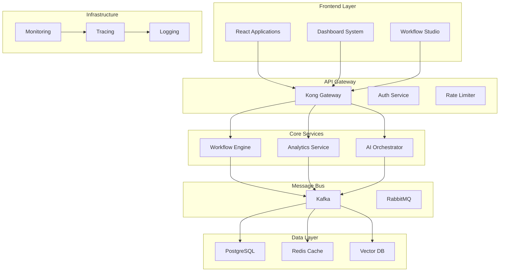
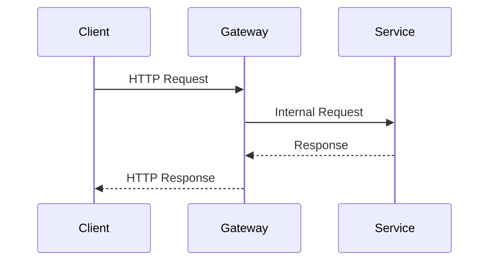
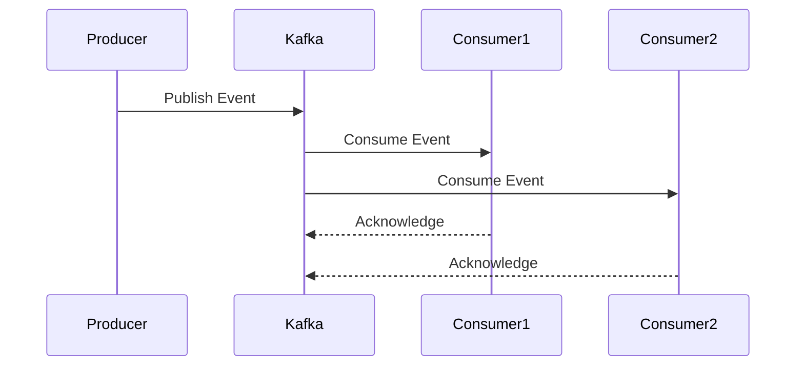
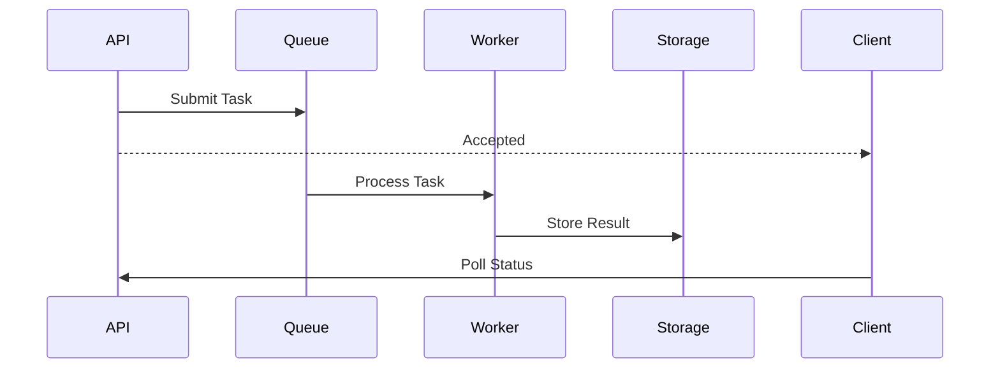
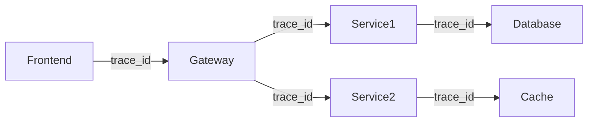
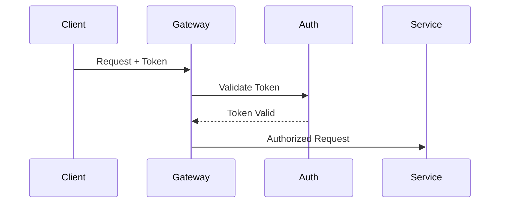

# 🔄 Unified Platform Integration

## Overview

The Unified Platform Integration (UPI) system provides seamless communication and data flow between all platform components, ensuring consistent behavior, reliable state management, and efficient resource utilization.

## Architecture

### System Topology


## Core Components

### Service Registry
- Service discovery
- Health checking
- Load balancing
- Circuit breaking

### Message Bus
- Event streaming
- Message queuing
- Pub/sub patterns
- Dead letter queues

### State Management
- Distributed caching
- Session handling
- Concurrency control
- Conflict resolution

## Integration Patterns

### Request-Response


### Event-Driven


### Async Processing


## Cross-Service Communication

### Protocol Standards
```typescript
interface ServiceMessage {
  id: string;
  type: MessageType;
  payload: any;
  metadata: {
    timestamp: number;
    source: string;
    correlation_id: string;
    trace_id: string;
  };
}
```

### Error Handling
```typescript
interface ServiceError {
  code: string;
  message: string;
  details?: any;
  retry_info?: {
    retry_after: number;
    max_retries: number;
  };
}
```

## Performance Optimization

### Caching Strategy
- Multi-level caching
- Cache invalidation
- Cache coherence
- Cache warming

### Connection Pooling
- Database pools
- HTTP keep-alive
- WebSocket management
- Resource limits

## Monitoring & Observability

### Metrics Collection
- Service metrics
- Business metrics
- System metrics
- Custom metrics

### Distributed Tracing


## Security & Compliance

### Authentication Flow


### Authorization
- Role-based access
- Resource policies
- Scope validation
- Token management

## Deployment & Scaling

### Service Deployment
- Blue-green deployment
- Canary releases
- Rolling updates
- Failover handling

### Auto-scaling
- Horizontal scaling
- Vertical scaling
- Load balancing
- Resource quotas

## Related Documentation
- [Cross System Protocol](CROSS_SYSTEM_PROTOCOL.md)
- [Message Queue Architecture](MESSAGE_QUEUE_ARCHITECTURE.md)
- [Monitoring Documentation](MONITORING_DOCUMENTATION.md)
- [Security Documentation](SECURITY_DOCUMENTATION.md)
