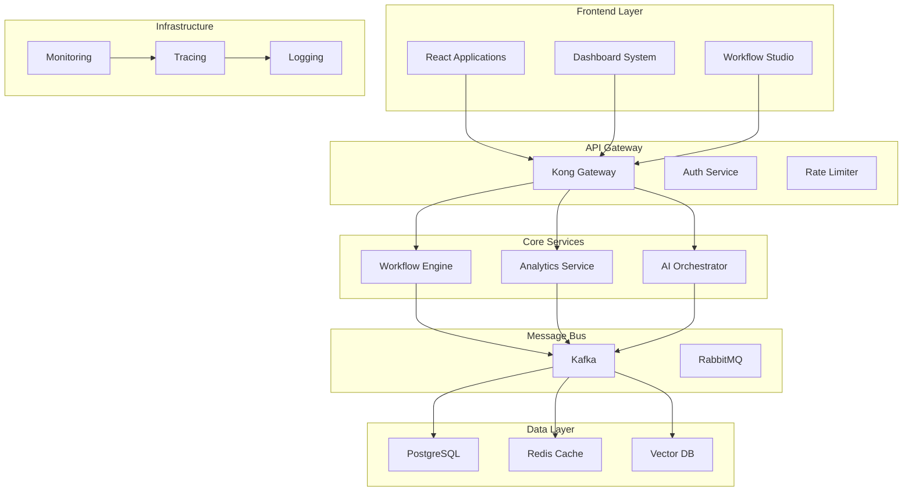

# 🔄 Unified Platform Integratio

n

#

# Overvie

w

The Unified Platform Integration (UPI) system provides seamless communication and data flow between all platform components, ensuring consistent behavior, reliable state management, and efficient resource utilization.

#

# Architectur

e

#

## System Topology



#

# Core Component

s

#

## Service Registry

- Service discover

y

- Health checkin

g

- Load balancin

g

- Circuit breakin

g

#

## Message Bus

- Event streamin

g

- Message queuin

g

- Pub/sub pattern

s

- Dead letter queue

s

#

## State Management

- Distributed cachin

g

- Session handlin

g

- Concurrency contro

l

- Conflict resolutio

n

#

# Integration Pattern

s

#

## Request-Respons

e

```

mermaid
sequenceDiagram
    participant C as Client
    participant G as Gateway
    participant S as Service

    C->>G: HTTP Request

    G->>S: Internal Request

    S-->>G: Response

    G-->>C: HTTP Respons

e

```

#

## Event-Drive

n

```

mermaid
sequenceDiagram
    participant P as Producer
    participant K as Kafka
    participant C1 as Consumer1
    participant C2 as Consumer2

    P->>K: Publish Event

    K->>C1: Consume Event

    K->>C2: Consume Event

    C1-->>K: Acknowledge

    C2-->>K: Acknowledg

e

```

#

## Async Processing

```

mermaid
sequenceDiagram
    participant A as API
    participant Q as Queue
    participant W as Worker
    participant S as Storage

    A->>Q: Submit Task

    A-->>Client: Accepted

    Q->>W: Process Task

    W->>S: Store Result

    Client->>A: Poll Statu

s

```

#

# Cross-Service Communicati

o

n

#

## Protocol Standards

```

typescript
interface ServiceMessage {
  id: string;
  type: MessageType;
  payload: any;
  metadata: {
    timestamp: number;
    source: string;
    correlation_id: string;
    trace_id: string;
  };
}

```

#

## Error Handling

```

typescript
interface ServiceError {
  code: string;
  message: string;
  details?: any;
  retry_info?: {
    retry_after: number;
    max_retries: number;
  };
}

```

#

# Performance Optimizatio

n

#

## Caching Strategy

- Multi-level cachin

g

- Cache invalidatio

n

- Cache coherenc

e

- Cache warmin

g

#

## Connection Pooling

- Database pool

s

- HTTP keep-aliv

e

- WebSocket managemen

t

- Resource limit

s

#

# Monitoring & Observabilit

y

#

## Metrics Collection

- Service metric

s

- Business metric

s

- System metric

s

- Custom metric

s

#

## Distributed Tracing

```

mermaid
graph LR
    A[Frontend] -->|trace_id| B[Gateway]

    B -->|trace_id| C[Service1]

    B -->|trace_id| D[Service2]

    C -->|trace_id| E[Database]

    D -->|trace_id| F[Cache

]

```

#

# Security & Complianc

e

#

## Authentication Flow

```

mermaid
sequenceDiagram
    participant C as Client
    participant G as Gateway
    participant A as Auth
    participant S as Service

    C->>G: Reques

t

 + Token

    G->>A: Validate Token

    A-->>G: Token Valid

    G->>S: Authorized Reques

t

```

#

## Authorization

- Role-based acces

s

- Resource policie

s

- Scope validatio

n

- Token managemen

t

#

# Deployment & Scalin

g

#

## Service Deployment

- Blue-green deploymen

t

- Canary release

s

- Rolling update

s

- Failover handlin

g

#

## Auto-scalin

g

- Horizontal scalin

g

- Vertical scalin

g

- Load balancin

g

- Resource quota

s

#

# Related Documentation

- [Cross System Protocol](CROSS_SYSTEM_PROTOCOL.md

)

- [Message Queue Architecture](MESSAGE_QUEUE_ARCHITECTURE.md

)

- [Monitoring Documentation](MONITORING_DOCUMENTATION.md

)

- [Security Documentation](SECURITY_DOCUMENTATION.md

)
