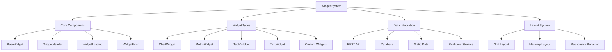

# 🧩 Widget System Documentation

## Overview

This document provides comprehensive documentation for Auterity's widget system, a flexible and extensible framework for building customizable dashboard components. The widget system enables users to create, configure, and interact with various data visualization and content display elements across the platform.

## Table of Contents

1. [Widget Architecture](#widget-architecture)
2. [Core Widget Components](#core-widget-components)
3. [Widget Types](#widget-types)
4. [Data Integration](#data-integration)
5. [Customization & Styling](#customization--styling)
6. [Widget Lifecycle](#widget-lifecycle)
7. [Advanced Features](#advanced-features)
8. [Developer Guide](#developer-guide)

## Widget Architecture

### System Overview


### Component Locations
```
frontend/
├── src/
│   ├── components/
│   │   └── widgets/
│   │       ├── core/
│   │       │   ├── ChartWidget.tsx
│   │       │   ├── MetricWidget.tsx
│   │       │   ├── TableWidget.tsx
│   │       │   ├── TextWidget.tsx
│   │       │   ├── WidgetHeader.tsx
│   │       │   ├── WidgetError.tsx
│   │       │   ├── WidgetLoading.tsx
│   │       │   ├── types.ts
│   │       │   └── index.ts
│   ├── types/
│   │   └── dashboard.ts
```

## Core Widget Components

### BaseWidget
The foundation for all widget types, providing common functionality and structure.

**Key Features**:
- Consistent layout and styling
- Error handling
- Loading states
- Configuration management

### WidgetHeader
**Location**: `frontend/src/components/widgets/core/WidgetHeader.tsx`
**Purpose**: Standard header for all widgets
**Features**:
- Title display
- Loading indicator
- Error notification
- Refresh button
- Action menu

```typescript
// Widget Header Component
export const WidgetHeader: React.FC<WidgetHeaderProps> = ({
  title,
  isLoading,
  error,
  onRefresh,
  actions
}) => {
  return (
    <div className="widget-header">
      <div className="widget-title">{title}</div>
      
      <div className="widget-actions">
        {isLoading && <Spinner size="small" />}
        {error && <ErrorIcon color="error" />}
        
        {onRefresh && (
          <IconButton 
            onClick={onRefresh}
            disabled={isLoading}
            aria-label="Refresh widget"
          >
            <RefreshIcon />
          </IconButton>
        )}
        
        {actions}
      </div>
    </div>
  );
};
```

### WidgetError
**Location**: `frontend/src/components/widgets/core/WidgetError.tsx`
**Purpose**: Error display for widgets
**Features**:
- Error message display
- Retry functionality
- Visual error indication

```typescript
// Widget Error Component
export const WidgetError: React.FC<WidgetErrorProps> = ({
  message,
  onRetry
}) => {
  return (
    <div className="widget-error">
      <ErrorIcon size="large" color="error" />
      <p className="error-message">{message}</p>
      
      {onRetry && (
        <Button 
          variant="outlined"
          onClick={onRetry}
          startIcon={<RefreshIcon />}
        >
          Retry
        </Button>
      )}
    </div>
  );
};
```

### WidgetLoading
**Location**: `frontend/src/components/widgets/core/WidgetLoading.tsx`
**Purpose**: Loading state for widgets
**Features**:
- Loading animation
- Optional loading message

```typescript
// Widget Loading Component
export const WidgetLoading: React.FC<WidgetLoadingProps> = ({
  message = 'Loading widget data...'
}) => {
  return (
    <div className="widget-loading">
      <Spinner size="large" />
      <p className="loading-message">{message}</p>
    </div>
  );
};
```

## Widget Types

### ChartWidget
**Location**: `frontend/src/components/widgets/core/ChartWidget.tsx`
**Purpose**: Data visualization through various chart types
**Features**:
- Multiple chart types (line, bar, pie, area)
- Customizable axes
- Legend support
- Color customization

```typescript
// Chart Widget Component
export const ChartWidget: React.FC<ChartWidgetProps> = ({
  id,
  title,
  config,
  dataSource,
  chartType,
  data,
  xAxis,
  yAxis,
  colors,
  showLegend,
  isLoading,
  error,
  onRefresh,
  onConfigChange
}) => {
  if (isLoading) {
    return <WidgetLoading />;
  }
  
  if (error) {
    return <WidgetError message={error} onRetry={onRefresh} />;
  }
  
  return (
    <div className="chart-widget">
      <WidgetHeader 
        title={title}
        isLoading={isLoading}
        error={error}
        onRefresh={onRefresh}
      />
      
      <div className="chart-container">
        {chartType === 'line' && (
          <LineChart 
            data={data}
            xAxis={xAxis}
            yAxis={yAxis}
            colors={colors}
            showLegend={showLegend}
          />
        )}
        
        {chartType === 'bar' && (
          <BarChart 
            data={data}
            xAxis={xAxis}
            yAxis={yAxis}
            colors={colors}
            showLegend={showLegend}
          />
        )}
        
        {chartType === 'pie' && (
          <PieChart 
            data={data}
            colors={colors}
            showLegend={showLegend}
          />
        )}
        
        {chartType === 'area' && (
          <AreaChart 
            data={data}
            xAxis={xAxis}
            yAxis={yAxis}
            colors={colors}
            showLegend={showLegend}
          />
        )}
      </div>
    </div>
  );
};
```

### MetricWidget
**Location**: `frontend/src/components/widgets/core/MetricWidget.tsx`
**Purpose**: Display key performance indicators and metrics
**Features**:
- Numeric value display
- Trend indicators
- Formatting options
- Prefix/suffix support

```typescript
// Metric Widget Component
export const MetricWidget: React.FC<MetricWidgetProps> = ({
  id,
  title,
  config,
  dataSource,
  value,
  previousValue,
  trend,
  format,
  prefix,
  suffix,
  isLoading,
  error,
  onRefresh
}) => {
  const formattedValue = useMemo(() => {
    if (format === 'currency') {
      return formatCurrency(value);
    } else if (format === 'percentage') {
      return formatPercentage(value);
    } else {
      return formatNumber(value);
    }
  }, [value, format]);
  
  const trendPercentage = useMemo(() => {
    if (previousValue && typeof value === 'number' && typeof previousValue === 'number') {
      return calculatePercentageChange(value, previousValue);
    }
    return null;
  }, [value, previousValue]);
  
  return (
    <div className="metric-widget">
      <WidgetHeader 
        title={title}
        isLoading={isLoading}
        error={error}
        onRefresh={onRefresh}
      />
      
      {isLoading ? (
        <WidgetLoading />
      ) : error ? (
        <WidgetError message={error} onRetry={onRefresh} />
      ) : (
        <div className="metric-content">
          <div className="metric-value">
            {prefix && <span className="metric-prefix">{prefix}</span>}
            <span className="value">{formattedValue}</span>
            {suffix && <span className="metric-suffix">{suffix}</span>}
          </div>
          
          {trend && (
            <div className={`metric-trend trend-${trend}`}>
              {trend === 'up' && <TrendUpIcon />}
              {trend === 'down' && <TrendDownIcon />}
              {trend === 'neutral' && <TrendNeutralIcon />}
              
              {trendPercentage && (
                <span className="trend-percentage">
                  {formatPercentage(Math.abs(trendPercentage))}
                </span>
              )}
            </div>
          )}
        </div>
      )}
    </div>
  );
};
```

### TableWidget
**Location**: `frontend/src/components/widgets/core/TableWidget.tsx`
**Purpose**: Tabular data display
**Features**:
- Sortable columns
- Pagination
- Column types
- Customizable widths

```typescript
// Table Widget Component
export const TableWidget: React.FC<TableWidgetProps> = ({
  id,
  title,
  config,
  dataSource,
  data,
  columns,
  pagination,
  onSort,
  onPageChange,
  isLoading,
  error,
  onRefresh
}) => {
  const [sortKey, setSortKey] = useState<string | null>(null);
  const [sortOrder, setSortOrder] = useState<'asc' | 'desc'>('asc');
  
  const handleSort = (key: string) => {
    if (sortKey === key) {
      setSortOrder(sortOrder === 'asc' ? 'desc' : 'asc');
    } else {
      setSortKey(key);
      setSortOrder('asc');
    }
    
    if (onSort) {
      onSort(key, sortOrder === 'asc' ? 'desc' : 'asc');
    }
  };
  
  return (
    <div className="table-widget">
      <WidgetHeader 
        title={title}
        isLoading={isLoading}
        error={error}
        onRefresh={onRefresh}
      />
      
      {isLoading ? (
        <WidgetLoading />
      ) : error ? (
        <WidgetError message={error} onRetry={onRefresh} />
      ) : (
        <>
          <table className="data-table">
            <thead>
              <tr>
                {columns.map(column => (
                  <th 
                    key={column.key}
                    style={{ width: column.width }}
                    className={column.sortable ? 'sortable' : ''}
                    onClick={column.sortable ? () => handleSort(column.key) : undefined}
                  >
                    {column.title}
                    {sortKey === column.key && (
                      <span className="sort-indicator">
                        {sortOrder === 'asc' ? '▲' : '▼'}
                      </span>
                    )}
                  </th>
                ))}
              </tr>
            </thead>
            <tbody>
              {data.map((row, index) => (
                <tr key={index}>
                  {columns.map(column => (
                    <td key={column.key}>
                      {formatCellValue(row[column.key], column.type)}
                    </td>
                  ))}
                </tr>
              ))}
            </tbody>
          </table>
          
          {pagination && (
            <div className="table-pagination">
              <Pagination
                current={pagination.current}
                pageSize={pagination.pageSize}
                total={pagination.total}
                onChange={onPageChange}
              />
            </div>
          )}
        </>
      )}
    </div>
  );
};
```

### TextWidget
**Location**: `frontend/src/components/widgets/core/TextWidget.tsx`
**Purpose**: Rich text content display
**Features**:
- Multiple format support (plain, markdown, HTML)
- Editable content
- Text formatting

```typescript
// Text Widget Component
export const TextWidget: React.FC<TextWidgetProps> = ({
  id,
  title,
  config,
  dataSource,
  content,
  format,
  editable,
  onContentChange,
  isLoading,
  error,
  onRefresh
}) => {
  const [isEditing, setIsEditing] = useState(false);
  const [editableContent, setEditableContent] = useState(content);
  
  const handleEdit = () => {
    setIsEditing(true);
  };
  
  const handleSave = () => {
    setIsEditing(false);
    if (onContentChange) {
      onContentChange(editableContent);
    }
  };
  
  const handleCancel = () => {
    setIsEditing(false);
    setEditableContent(content);
  };
  
  const renderContent = () => {
    if (format === 'markdown') {
      return <MarkdownRenderer content={content} />;
    } else if (format === 'html') {
      return <div dangerouslySetInnerHTML={{ __html: content }} />;
    } else {
      return <div className="plain-text">{content}</div>;
    }
  };
  
  return (
    <div className="text-widget">
      <WidgetHeader 
        title={title}
        isLoading={isLoading}
        error={error}
        onRefresh={onRefresh}
        actions={
          editable && !isEditing ? (
            <IconButton onClick={handleEdit}>
              <EditIcon />
            </IconButton>
          ) : null
        }
      />
      
      {isLoading ? (
        <WidgetLoading />
      ) : error ? (
        <WidgetError message={error} onRetry={onRefresh} />
      ) : isEditing ? (
        <div className="text-editor">
          <TextEditor
            value={editableContent}
            onChange={setEditableContent}
            format={format}
          />
          <div className="editor-actions">
            <Button onClick={handleCancel}>Cancel</Button>
            <Button variant="primary" onClick={handleSave}>Save</Button>
          </div>
        </div>
      ) : (
        <div className="text-content">
          {renderContent()}
        </div>
      )}
    </div>
  );
};
```

## Data Integration

### Data Source Configuration
The widget system supports multiple data source types through a flexible configuration system.

```typescript
// Data Source Configuration
export interface DataSourceConfig {
  type: DataSourceType;
  endpoint?: string;
  method?: 'GET' | 'POST' | 'PUT' | 'DELETE';
  headers?: Record<string, string>;
  query?: Record<string, any>;
  body?: any;
  auth?: {
    type: 'bearer' | 'basic' | 'api-key' | 'oauth2';
    credentials: Record<string, any>;
  };
  cache?: {
    enabled: boolean;
    ttl: number;
  };
}
```

### Data Fetching Hook
```typescript
// Widget Data Hook
export const useWidgetData = <T>(
  dataSource: DataSourceConfig,
  refreshInterval?: number
): {
  data: T | null;
  isLoading: boolean;
  error: string | null;
  refresh: () => void;
} => {
  const [data, setData] = useState<T | null>(null);
  const [isLoading, setIsLoading] = useState(true);
  const [error, setError] = useState<string | null>(null);
  
  const fetchData = useCallback(async () => {
    setIsLoading(true);
    setError(null);
    
    try {
      // Handle different data source types
      if (dataSource.type === 'rest') {
        const response = await fetchRestData(dataSource);
        setData(response.data);
      } else if (dataSource.type === 'database') {
        const response = await fetchDatabaseData(dataSource);
        setData(response);
      } else if (dataSource.type === 'static') {
        setData(dataSource.body as T);
      } else if (dataSource.type === 'stream') {
        // Stream data is handled separately with WebSocket
        setupStreamData(dataSource, setData);
      }
    } catch (err) {
      setError(err instanceof Error ? err.message : 'Failed to fetch data');
    } finally {
      setIsLoading(false);
    }
  }, [dataSource]);
  
  useEffect(() => {
    fetchData();
    
    // Set up refresh interval if specified
    if (refreshInterval && refreshInterval > 0) {
      const intervalId = setInterval(fetchData, refreshInterval);
      return () => clearInterval(intervalId);
    }
  }, [fetchData, refreshInterval]);
  
  return { data, isLoading, error, refresh: fetchData };
};
```

### Real-time Data Integration
```typescript
// Real-time Data Integration
const setupStreamData = <T>(
  dataSource: DataSourceConfig,
  setData: (data: T) => void
) => {
  const ws = new WebSocket(dataSource.endpoint as string);
  
  ws.onmessage = (event) => {
    try {
      const data = JSON.parse(event.data);
      setData(data);
    } catch (error) {
      console.error('Failed to parse WebSocket data', error);
    }
  };
  
  ws.onerror = (error) => {
    console.error('WebSocket error', error);
  };
  
  return () => {
    ws.close();
  };
};
```

## Customization & Styling

### Widget Styling System
```typescript
// Widget Style System
export interface WidgetStyle {
  backgroundColor?: string;
  textColor?: string;
  borderColor?: string;
  borderRadius?: number;
  padding?: number | string;
  margin?: number | string;
  boxShadow?: string;
  height?: number | string;
  maxHeight?: number | string;
  overflow?: 'hidden' | 'auto' | 'scroll' | 'visible';
}

export const applyWidgetStyle = (
  element: HTMLElement,
  style: WidgetStyle
) => {
  if (style.backgroundColor) {
    element.style.backgroundColor = style.backgroundColor;
  }
  
  if (style.textColor) {
    element.style.color = style.textColor;
  }
  
  if (style.borderColor) {
    element.style.borderColor = style.borderColor;
  }
  
  if (style.borderRadius !== undefined) {
    element.style.borderRadius = `${style.borderRadius}px`;
  }
  
  if (style.padding !== undefined) {
    element.style.padding = typeof style.padding === 'number'
      ? `${style.padding}px`
      : style.padding;
  }
  
  if (style.margin !== undefined) {
    element.style.margin = typeof style.margin === 'number'
      ? `${style.margin}px`
      : style.margin;
  }
  
  if (style.boxShadow) {
    element.style.boxShadow = style.boxShadow;
  }
  
  if (style.height !== undefined) {
    element.style.height = typeof style.height === 'number'
      ? `${style.height}px`
      : style.height;
  }
  
  if (style.maxHeight !== undefined) {
    element.style.maxHeight = typeof style.maxHeight === 'number'
      ? `${style.maxHeight}px`
      : style.maxHeight;
  }
  
  if (style.overflow) {
    element.style.overflow = style.overflow;
  }
};
```

### Theme Integration
```typescript
// Widget Theme Integration
export const useWidgetTheme = (
  widgetConfig: WidgetConfig,
  dashboardTheme: string
) => {
  const theme = useTheme();
  
  return useMemo(() => {
    // Start with dashboard theme
    const baseTheme = theme.dashboards[dashboardTheme] || theme.dashboards.default;
    
    // Override with widget-specific settings
    return {
      backgroundColor: widgetConfig.backgroundColor || baseTheme.widgetBackgroundColor,
      textColor: widgetConfig.textColor || baseTheme.widgetTextColor,
      borderColor: baseTheme.widgetBorderColor,
      borderRadius: baseTheme.widgetBorderRadius,
      boxShadow: baseTheme.widgetBoxShadow,
      padding: widgetConfig.padding !== undefined ? widgetConfig.padding : baseTheme.widgetPadding
    };
  }, [theme, dashboardTheme, widgetConfig]);
};
```

## Widget Lifecycle

### Widget Creation
```typescript
// Widget Creation
export const createWidget = async (
  dashboardId: string,
  widgetData: CreateWidgetRequest
): Promise<DashboardWidget> => {
  try {
    const response = await api.post(`/api/v1/dashboards/${dashboardId}/widgets`, widgetData);
    return response.data;
  } catch (error) {
    throw new Error('Failed to create widget');
  }
};
```

### Widget Update
```typescript
// Widget Update
export const updateWidget = async (
  dashboardId: string,
  widgetId: string,
  widgetData: UpdateWidgetRequest
): Promise<DashboardWidget> => {
  try {
    const response = await api.put(
      `/api/v1/dashboards/${dashboardId}/widgets/${widgetId}`,
      widgetData
    );
    return response.data;
  } catch (error) {
    throw new Error('Failed to update widget');
  }
};
```

### Widget Deletion
```typescript
// Widget Deletion
export const deleteWidget = async (
  dashboardId: string,
  widgetId: string
): Promise<void> => {
  try {
    await api.delete(`/api/v1/dashboards/${dashboardId}/widgets/${widgetId}`);
  } catch (error) {
    throw new Error('Failed to delete widget');
  }
};
```

## Advanced Features

### Widget Interactions
```typescript
// Widget Interactions
export const useWidgetInteractions = (
  dashboardId: string,
  widgetId: string
) => {
  const logInteraction = useCallback(async (
    interactionType: 'view' | 'click' | 'edit' | 'refresh',
    details?: Record<string, any>
  ) => {
    try {
      await api.post(`/api/v1/analytics/widget-interactions`, {
        dashboard_id: dashboardId,
        widget_id: widgetId,
        interaction_type: interactionType,
        details,
        timestamp: new Date().toISOString()
      });
    } catch (error) {
      console.error('Failed to log widget interaction', error);
    }
  }, [dashboardId, widgetId]);
  
  return { logInteraction };
};
```

### Widget Export
```typescript
// Widget Export
export const exportWidgetData = async (
  dashboardId: string,
  widgetId: string,
  format: 'csv' | 'json' | 'excel'
): Promise<Blob> => {
  try {
    const response = await api.get(
      `/api/v1/dashboards/${dashboardId}/widgets/${widgetId}/export`,
      {
        params: { format },
        responseType: 'blob'
      }
    );
    return response.data;
  } catch (error) {
    throw new Error('Failed to export widget data');
  }
};
```

### Widget Filtering
```typescript
// Widget Filtering
export const useWidgetFilters = (
  initialFilters: Record<string, any> = {}
) => {
  const [filters, setFilters] = useState(initialFilters);
  
  const updateFilter = useCallback((key: string, value: any) => {
    setFilters(prev => ({
      ...prev,
      [key]: value
    }));
  }, []);
  
  const removeFilter = useCallback((key: string) => {
    setFilters(prev => {
      const newFilters = { ...prev };
      delete newFilters[key];
      return newFilters;
    });
  }, []);
  
  const clearFilters = useCallback(() => {
    setFilters({});
  }, []);
  
  return {
    filters,
    updateFilter,
    removeFilter,
    clearFilters
  };
};
```

## Developer Guide

### Creating Custom Widgets
```typescript
// Custom Widget Example
import { BaseWidgetProps, WidgetHeader, WidgetLoading, WidgetError } from '../core';

interface CustomWidgetProps extends BaseWidgetProps {
  customData: any;
  customConfig: {
    option1: string;
    option2: number;
  };
}

export const CustomWidget: React.FC<CustomWidgetProps> = ({
  id,
  title,
  config,
  dataSource,
  customData,
  customConfig,
  isLoading,
  error,
  onRefresh
}) => {
  // Custom widget implementation
  const processedData = useMemo(() => {
    // Process custom data
    return transformData(customData, customConfig);
  }, [customData, customConfig]);
  
  return (
    <div className="custom-widget">
      <WidgetHeader 
        title={title}
        isLoading={isLoading}
        error={error}
        onRefresh={onRefresh}
      />
      
      {isLoading ? (
        <WidgetLoading />
      ) : error ? (
        <WidgetError message={error} onRetry={onRefresh} />
      ) : (
        <div className="custom-widget-content">
          {/* Custom widget rendering */}
          <CustomVisualization data={processedData} />
        </div>
      )}
    </div>
  );
};
```

### Widget Registration
```typescript
// Widget Registration
export const registerWidgetType = (
  type: string,
  component: React.ComponentType<any>,
  defaultConfig: Record<string, any> = {}
) => {
  if (widgetRegistry[type]) {
    console.warn(`Widget type '${type}' is already registered. Overwriting.`);
  }
  
  widgetRegistry[type] = {
    component,
    defaultConfig
  };
};

// Usage
registerWidgetType('custom', CustomWidget, {
  option1: 'default',
  option2: 100
});
```

### Widget Factory
```typescript
// Widget Factory
export const WidgetFactory: React.FC<{
  type: string;
  props: Record<string, any>;
}> = ({ type, props }) => {
  const registry = useWidgetRegistry();
  
  if (!registry[type]) {
    return <div className="widget-error">Unknown widget type: {type}</div>;
  }
  
  const { component: WidgetComponent } = registry[type];
  return <WidgetComponent {...props} />;
};
```

This comprehensive documentation provides a detailed overview of Auterity's widget system, including its architecture, components, data integration capabilities, and customization options. Developers can use this guide to understand, extend, and customize the widget system to meet specific requirements.
